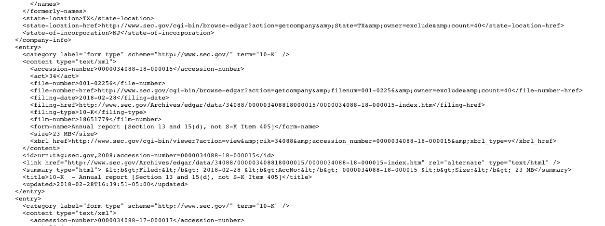
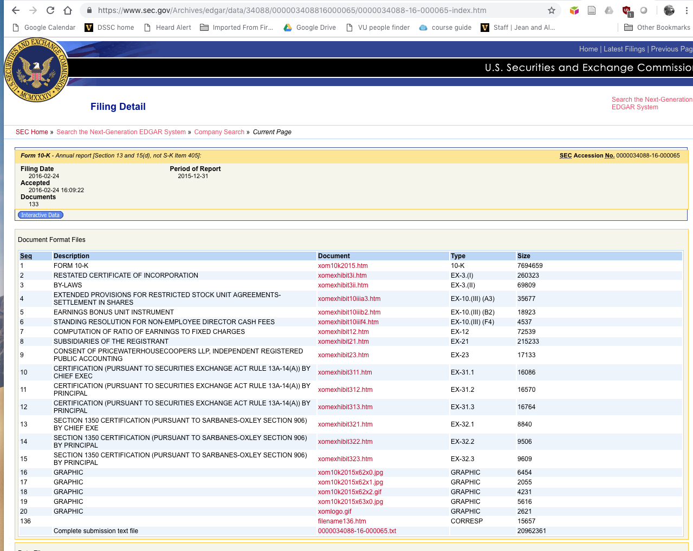
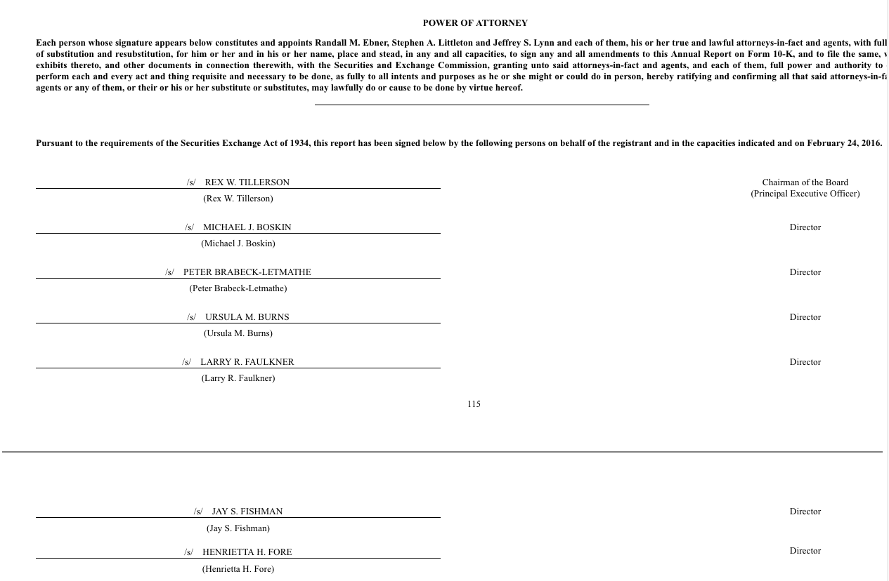

# Web scraping example

This code is freely available under a [Creative Commons CC0 license](https://creativecommons.org/publicdomain/zero/1.0/) 

## Introduction

Web "scraping" is the process of automatically extracting data from web content using a computer program. Scraping can involve automated retrieval of structured data intended to be harvested, but data can also be retrieved from HTML pages intended for human users.  

Scraping an HTML document generally involves examining the tags in the document to find patterns that can be used to infer the meaning of the contents of the tags.  For example, \<tr> and \<td> tags indicate the presence and structure of table rows and cells.

Depending on the terms of use and licensing of a website, scraping a site may be legally restricted in some circumstances.

## Acquiring data from U.S. Securities and Exchange Commission (SEC) documents

As a U.S. federal government agency that makes some of its documents publicly available, the data on the SEC website can be scraped, since in the US, works published by the federal government are in the public domain.  However, the SEC does not provide a very user-friendly API for extracting information.  Some of the data must be obtained by following hyperlinks in human-readable HTML documents.

In this example, three rounds of scraping are used to travers the web of human-readable documents in order to ultimately acquire the names and titles of officers of corporations.

**Example (Python 3)**

The [example](python/scrape-sec.py) uses the [Beautiful Soup](https://pypi.org/project/beautifulsoup4/) Python library to clean up HTML and make it easier to search.  

In the script, lines 1 to 13 load CIK ID numbers for corporations from a text file (one number per row).

Lines 15 to 36 perform [a search](https://www.sec.gov/cgi-bin/browse-edgar?action=getcompany&CIK=0000034088&type=10-K&dateb=&owner=exclude&start=0&count=40&output=atom) for each corporation to find all of the 10-K forms for the years in which the corporation filed the form.  Beautiful Soup functions are used to locate and extract the URLs of the web pages that describe the filings.

Lines 38 to 56 load the [filing detail pages](https://www.sec.gov/Archives/edgar/data/34088/000003408816000065/0000034088-16-000065-index.htm), then search through the HTML to find the links to the actual FORM 10-K webpages.  

Lines 58 through 78 load the [Form 10-K web page](https://www.sec.gov/Archives/edgar/data/34088/000003408816000065/xom10k2015.htm) for each filing.  Beautiful Soup is used to find the signatures table at the bottom of the form and extract the names and titles of the officers.

The example is also presented in the form of a [Python Jupyter notebook](python/scrape-sec.ipynb) (requires [Jupyter notebooks](https://jupyter.org/) to be installed on your computer).
