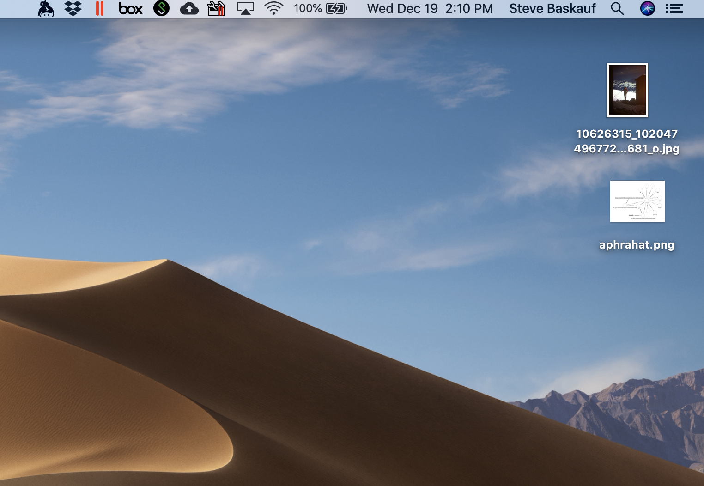
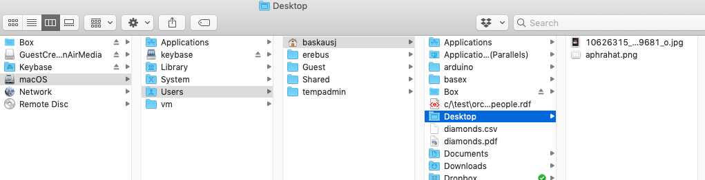
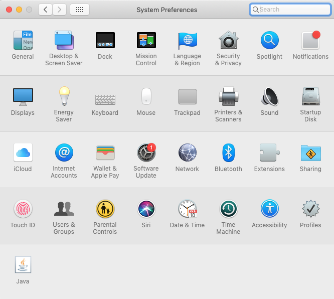
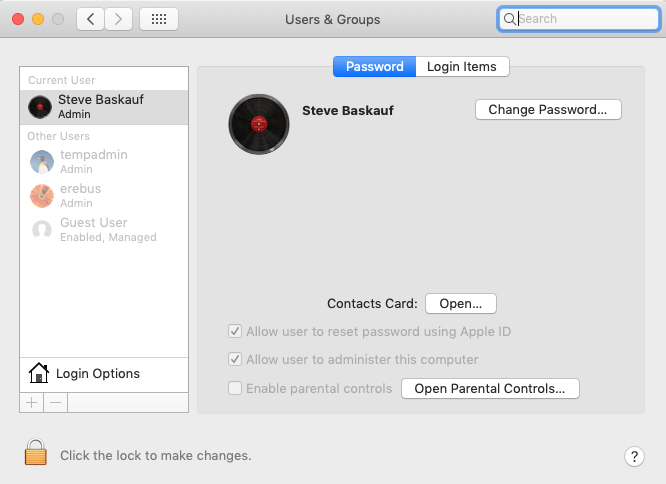
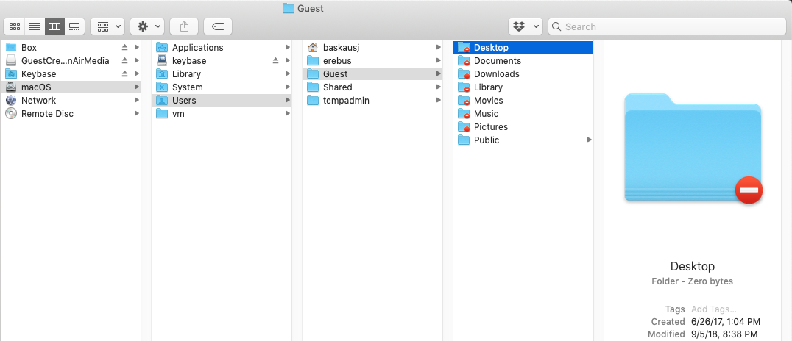

# Understanding my computer - Lesson 1: Files

This is the Mac version of this page.  [Click for the PC version of this page](../files-pc/)

## Your computer assumes that you are an idiot

One of the great advances in computing came about when computers were designed to be simpler and more intuitive.  With the creation of a graphical interface where users could point and click, it became possible for many people to use their computers without any real understanding of what they were doing.  The interface was a "desktop", and word-processing documents were placed in folders whose icons actually looked like little folders. 

As long as everything works as it should, this simplified interface is great and easy to use.  However, when things don't work as they should, your computer often hides the details that you need to be able to see in order to diagnose the problem.  Your computer assumes that if it let you see what was actually going on, you would do something stupid and mess things up.

In this workshop, we assume that you are NOT an idiot and that you should be able to see and understand what's actually going on with your computer without messing it up.  If the situation is not too complicated, you should be empowered to take action yourself.  If the problem is very technical, you should know enough to be able to seek out the help that you need. 

# The illusion of the desktop

When I look at the screen of my computer, I see what appears to be a flat surface.  There are some images that I've "saved to the desktop" and it appears that those little pictures are actually sitting on the surface of my desktop.  However, this is an illusion that my computer creates.

## Where actually is my desktop?

In reality, the two image files are somewhere on the hard drive of my computer.  The hard drive is organized in a hierarchical way, called the directory tree.  A parent directory can contain a number of child directories, and those child directories can be parents of other child directories.  From the diagram above, you can see that there is a directory many layers deep called "Desktop".  That directory is an index that keeps track of the part of the hard drive that actually contains the two image files that I saw on my graphical desktop.  There isn't really anything special about that directory other than that the computer is set up to display its contents in a special graphical way.

## What are users?

Long ago, personal computers could have only one user.  Now personal computers are set up to allow different users to log on and access their own files using personalized settings.  You may do some sort of login when you boot your computer, or your computer may be set up to log you in automatically.  

To see what users are enabled on your computer, drop down the apple menu at the upper left of your screen and select System Preferences.  If necessary, click on the button at the top that contains rows of dots so that you can see the preferences options.  Double click on Users & Groups.

There are several important things that you can see from this window.  You can see who is currently logged on, and whether the current user is an administrator user or not.  If you are using your own computer, you generally should be logged on as an administrator user, otherwise you may be prevented from taking important actions like installing new software.  If you are using a work computer, you may not be an administator user.  In that case there may be some changes that you won't be allowed to make on your computer.

You can also see that there are several other users listed that are not currently logged in.

Here is another view of the directory tree.  In the previous view, the home folder of the logged in user (baskausj) was selected.  I could tell that it was for the logged in user because the user folder icon was a little house.  In this view, the home folder of a non-logged in user (Guest) was selected.  Notice that the Guest user also has a folder called "Desktop".  Most of the Guest user folders have little red "do not" symbols on them.  Since I'm not logged in as the Guest user, I'm not allowed to access them.

Every user on the computer has its own Documents, Downloads, Music, etc. folders.  It can be confusing if you unknowingly log out from your normal user account and log on to a different one.  The graphical desktop and the contents of all of these familiar folders will be different because they aren't actually the same folders as your user folders (even though they have the same names).

# Programs and files

## What is a file?

## What is a program?

## What does it mean for a program to be "running"

# File associations and extensions

## How does my computer know what a file is "for"?

## Get info

## File type associations

## Unhiding file extensions

## Changing file associations

----
Revised 2019-02-27
