[back to the wikibase model](../)

# Deleting statements and references from a wikibase

Any statement or reference in a wikibase can easily be deleted using the graphical interface. But what if you have several or even hundreds of deletions that you need to make? Perhaps your accidentally used the wrong data source for many statements or the source information for many references has changed its URL. In those sorts of situations, it is impractical to make the deletions manually. 

The MediaWiki API provides two modules for making deletions in wikibases: [wbremoveclaims](https://www.wikidata.org/w/api.php?action=help&modules=wbremoveclaims) for removing statements (also known as "claims") and [wbremovereferences](https://www.wikidata.org/w/api.php?action=help&modules=wbremovereferences) for removing references. In both cases, the identifiers for the information to be deleted must be known. (See [this](../#statement-instances) for more on statement identifiers and [this](../#references) for more on reference identifiers.) 

This information isn't typically known if the statements or references were added using the graphical interface. However, if the [VanderBot](http://vanderbi.lt/vanderbot) script was used to [load data into a wikibase](../load/), those identifiers are captured and saved along in the source data CSV. In this tutorial, we'll see how to use a Python script called [VanderDeleteBot](https://github.com/HeardLibrary/linked-data/blob/master/vanderbot/vanderdeletebot.md) to use this saved information to make multiple deletions. 

Before you can use this script, you need to have a credentials for the wikibase in which you want to make the deletions. For more information about this, see the section on [setting up a bot password](../load/#set-up-a-bot-password) in the page about loading data into a wikibase.

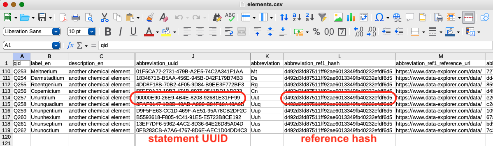

## Identifiers

The screenshot above shows part of a CSV that was used to load information about elements into a wikibase. The `abbreviation` column contains the information that I used to create the `abbreviation` statement visible in the graphical interface:

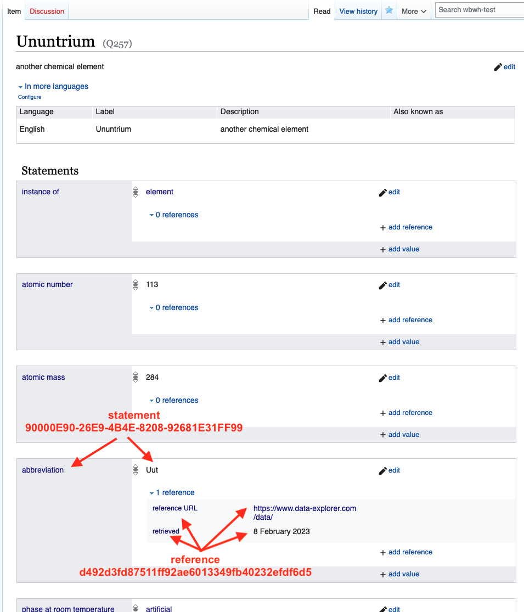

The `abbreviation_uuid` column contains the unique UUID identifiers for each of the statements. The `abbreviation_ref1_hash` column contains the hash identifiers generated from the references. Notice that all of the references that contain the same information (reference URL and retrieved date) have the same identifier.

# Deleting statements

Let's imagine that [IUPAC](https://iupac.org/) has assigned names and abbreviations to the last six elements in the row and I want to delete the abbreviations so that I can upload new ones. I need to provide the VanderDeleteBot script with the list of statement UUIDs and their corresponding Q IDs. The easiest way to do this is to just make a copy of the CSV and call it `deletions.csv`, then delete all of the rows except for the ones containing the statements I want to delete.

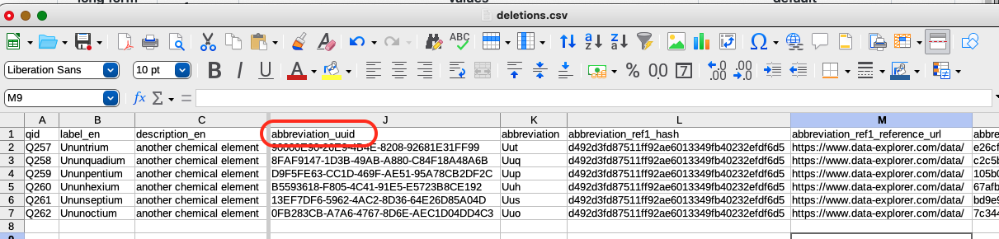

The column containing the UUIDs for the statements to be deleted is called `abbreviation_uuid`.

To perform the deletions, download the script. Go to [its GitHub page](https://github.com/HeardLibrary/linked-data/blob/master/vanderbot/vanderdeletebot.py), then right-click on the `raw` button and select `Save Link As...`. Save the script in the directory where you `deletions.csv` file is located. 

Open a terminal window and navigate to the directory where you saved the script and CSV. Assuming that you used the defaults for naming and saving your credentials file, you can run the script by issuing the following command:

```
python vanderdeletebot.py -N abbreviation_uuid
```

where `abbreviation_uuid` is the name of the column containing the UUID identifiers for the statements you want to delete. (In some instalations it is necessary to use `python3` instead of `python` in the command.)

The script has a default delay of 1.25 seconds between API calls to stay under the rate limit of the Wikidata API. However, if you are writing to your wikibase, there is no rate limit. So you can set the delay to zero seconds by setting the `-A` option:

```
python vanderdeletebot.py -A 0 -N abbreviation_uuid
```

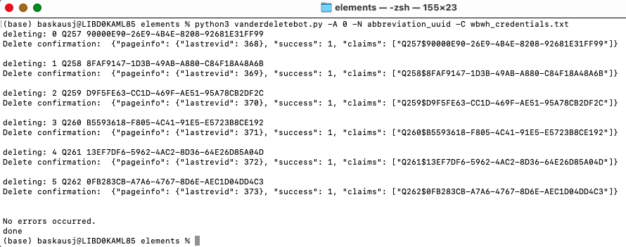

After the script runs, if I refresh the item page, I can see that the abbreviation claim is gone.

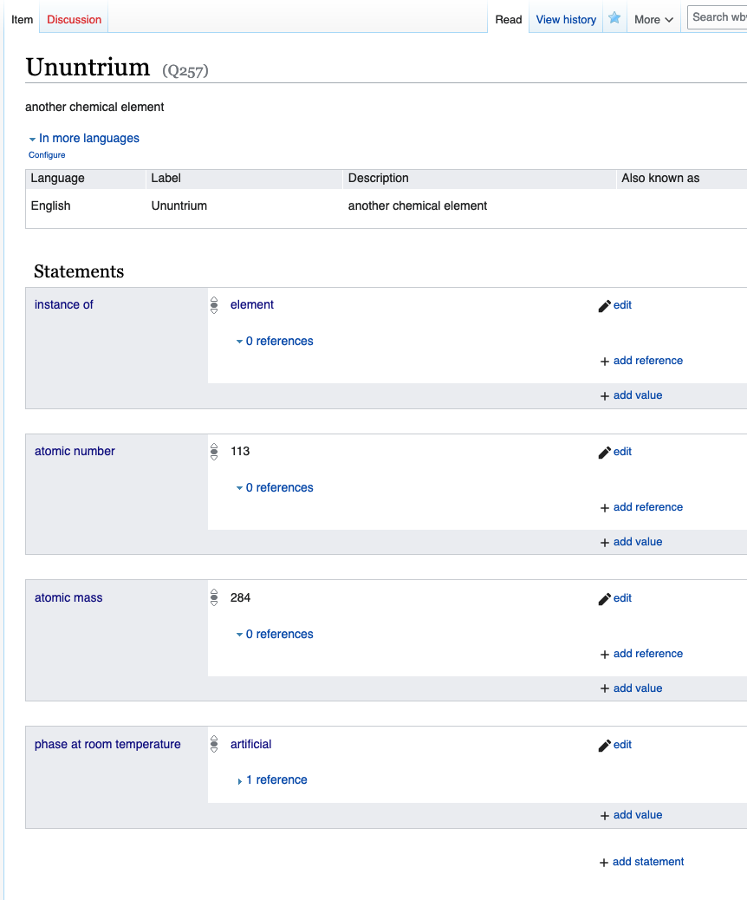

The script doesn't automatically change anything in any CSV files, so you will probably want to delete the information about those statements and their associated references from the original spreadsheet:

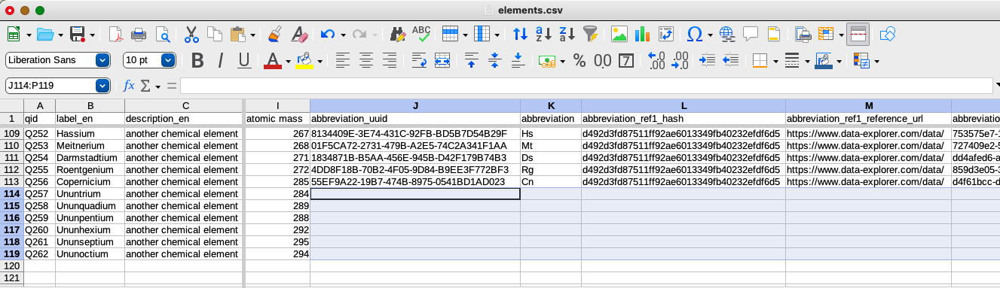


## Deleting references

The process for deleting references is similar to that of deleting statements. Let's imagine that you want to replace some references because the URL for the existing discovery date references were broken and you want to upload new ones.

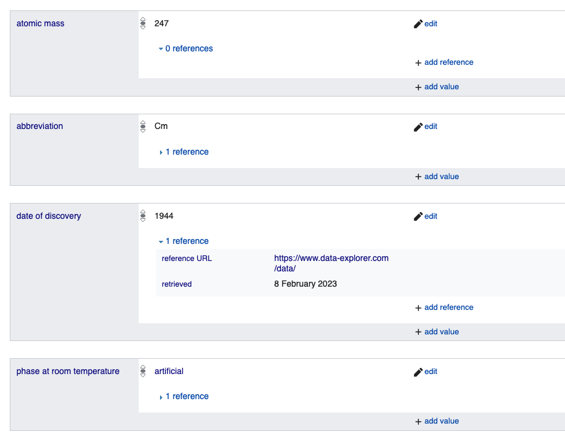

The screenshot above shows the graphical interface with the reference we want to delete.

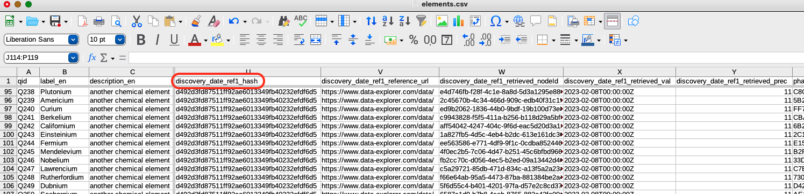

In the table above, you can see the column that contains the identifier for the references: `discovery_date_ref1_hash`. It denotes the reference node that is linked to two sources: the reference URL and the retrieved date. You will notice that the hash is the same for all of the references shown. That's because the sources are exactly the same for each row. Clearly this isn't enough information for the API to know which reference to delete. Therefore, the API requires not only the reference hash, but also the UUID for the statement it's associated with, plus the Q ID column. The content of these three columns specify the reference unambiguously, so all three must be in the table.

The script expects you to supply the name of the reference hash column. Based on having `_hash` in the name, it knows that you want to delete references and it will figure out the name of the corresponding statement UUID column by looking at the descriptive first part of the column name (`discovery_date` in this case). 

As before, I'll create a copy of the CSV and name it `deletions.csv`, then delete all rows except for the ones that contain the references I want to delete:

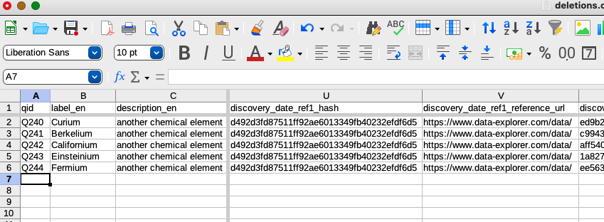

This time I'll issue the command specifying the reference column:

```
python vanderdeletebot.py -A 0 -N discovery_date_ref1_hash
```

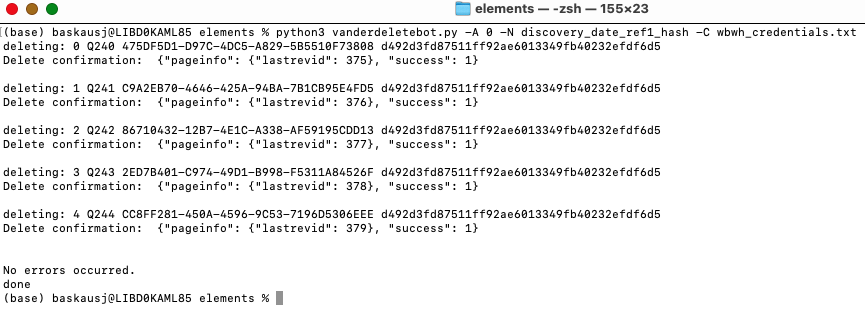

Now if I reload the page, I can see the result of the deletion:

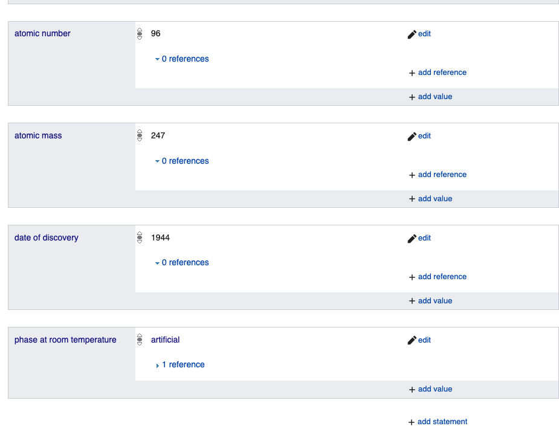

I can see that the `date of discovery` statement now has zero references. As with the deletion of the statements, I should go back to my original data table and delete the section that contains information about the references I deleted:

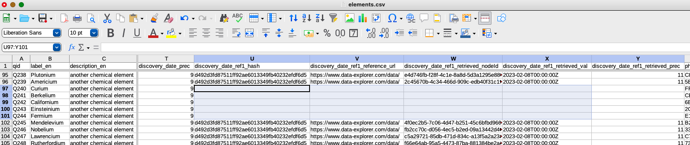

I can then paste in the data for the new references in the `discovery_date_ref1_reference_url` and `discovery_date_ref1_retrieved_val` columns, then run VanderBot to upload the changed references.

----

[back to the wikibase model](../)

[loading data into a wikibase](../load/)

[creating properties using a script](../properties/)

[querying a wikibase with SPARQL](../sparql/)

----
Revised 2023-02-10
