A short link to this page is <http://vanderbi.lt/wikibase> .

# About this tutorial

This totorial is intended to be an introduction to any wikibase instance. That means that it not only applies to the most well-known instance, [Wikidata](https://www.wikidata.org/), but also to [Structured Data on Commons](https://commons.wikimedia.org/wiki/Commons:Structured_data), or any generic wikibase, such as those hosted on [wikibase.cloud](https://www.wikibase.cloud/). (When this was originally written in January of 2020, installing Wikibase was only feasible for most people using a Docker image. That was beyond the technical capabilities of most users, so now that wikibase.cloud is available, I recommend using it since it only takes a few button clicks to set up a wikibase. For historical reasons, I will maintain a link here to lessons on [installing and using Docker](../..//host/docker/) and [Installing Wikibase on your local computer](../install/#using-docker-compose-to-create-an-instance-of-wikibase-on-your-local-computer).)

This tutorial demonstrates how to create a new item and property using the graphical interface, but is focused on the underlying wikibase model. So it shows graph diagrams for each of the parts of the wikibase data model that are involved. Understanding this model will help you to understand what's going on if you do mass uploads and deletions, and will also give you the understanding necessary to carry out SPARQL queries on data in the wikibase.

This tutorial assumes that you have a basic understanding of basic Linked Data, RDF terminology, and SPARQL.  If necessary, review the lessons on [graphs, IRIs, and triples](../graphs/), [serilizations and triplestores](../serialization/), and [SPARQL](../sparql/) before proceeding.

In addition to this general introduction, there are several related tutorials that describe other aspects of interacting with any generic wikibase. They are:

- [Loading large amounts of data into a wikibase using the VanderBot Python script](load/)
- [Deleting many statements or references from a wikibase using the VanderDeleteBot Python script](delete/)
- [Mass creation of properties in a non-Wikimedia wikibase using the VanderPropertyBot Python script](properties/)
- [Querying a generic wikibase using SPARQL](sparql/)
- [Structured Data on Commons as a wikibase instance](sdoc/)


# The Wikibase data model

You may already be familiar with [Wikidata](https://www.wikidata.org/), the database that supports the structured data used in Wikipedia.  Wikibase is the underlying platform on which Wikidata is built.  If you create a wikibase on a platform like wikibase.cloud, you can use it to essentially build your own personal version of Wikidata.  

The wikibase data model is a model that applies to all wikibase instances, including Wikidata.  The [technical details](https://www.mediawiki.org/wiki/Wikibase/DataModel) of the wikidata model are a bit complex, but there is a [data model primer](https://www.mediawiki.org/wiki/Wikibase/DataModel/Primer) that is more accessible.

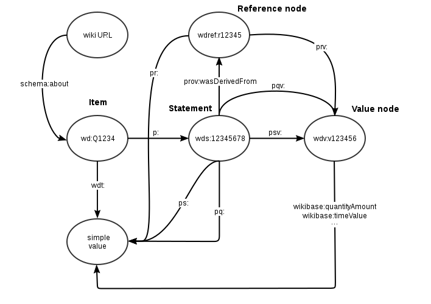

Diagram of the wikibase RDF data model (from <https://www.mediawiki.org/wiki/Wikibase/Indexing/RDF_Dump_Format>)

## Namespaces

The diagram above uses the standard namespace abbreviations that are applied to every wikibase instance. The list below shows IRIs that correspond to the abbreviations in the diagram above. However, the specific IRI that they map to varies among wikibase installations. The domain name `http://wikibase.svc` shown in the IRIs below is used if you install wikibase from a Docker image.

```
PREFIX wd: <http://wikibase.svc/entity/>
PREFIX wds: <http://wikibase.svc/entity/statement/>
PREFIX wdt: <http://wikibase.svc/prop/direct/>
PREFIX wdv: <http://wikibase.svc/value/>
PREFIX wdref: <http://wikibase.svc/reference/>
PREFIX p: <http://wikibase.svc/prop/>
PREFIX pq: <http://wikibase.svc/prop/qualifier/>
PREFIX pr: <http://wikibase.svc/prop/reference/>
PREFIX ps: <http://wikibase.svc/prop/statement/>
PREFIX pqv: <http://wikibase.svc/prop/qualifier/value/>
PREFIX prv: <http://wikibase.svc/prop/reference/value/>
PREFIX psv: <http://wikibase.svc/prop/statement/value/>
```

However, in any particular wikibase installation, the domain name will change. So for example, in Wikidata `wd:` abbreviates `http://www.wikidata.org/entity/`. However, in the custom wikibase set up at <https://wbwh-test.wikibase.cloud/>, `wd:` abbreviates `https://wbwh-test.wikibase.cloud/entity/`. 

The following namespaces are used in the wikibase data model, but do not vary among installations:

```
PREFIX wikibase: <http://wikiba.se/ontology#>
PREFIX schema: <http://schema.org/>
PREFIX rdfs: <http://www.w3.org/2000/01/rdf-schema#>
PREFIX xsd: <http://www.w3.org/2001/XMLSchema#>
PREFIX owl: <http://www.w3.org/2002/07/owl#>
PREFIX prov: <http://www.w3.org/ns/prov#>
```

When discussing linked data triples from a wikibase, we can usually get away with ignoring the exact definition of the namespace abbreviations. And when using the [Wikidata Query Service](https://query.wikidata.org/), we do not have to provide the namespace abbreviations in a prolog of a SPARQL query. However, if we use the Query Service of a custom wikibase, we must provide these namespace abbreviations for any prefixes that we use in our queries (with the correct domain name for the wikibase substituted for `http://wikibase.svc`). 

To run example SPARQL queries from this lesson, you need to first paste in these lines as the prologue of the query.

See the [Wikidata Query Service User Manual](https://www.mediawiki.org/wiki/Wikidata_Query_Service/User_Manual) for even more details.

## Creating a Wikibase "triple"

To create items and properties manually, launch your wikibase graphical interface in a browser.  Depending on your installation, you may see direct links for creating items and properties in the menu on the left. Otherwise, select the `Special pages` link from the menu on the left.  

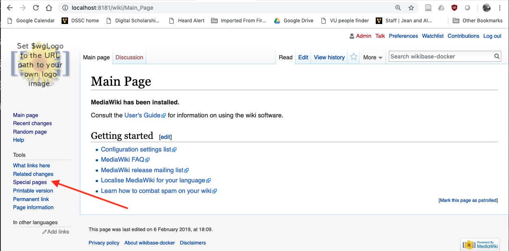

Near the bottom of the page click on the `Create a new property` link.  

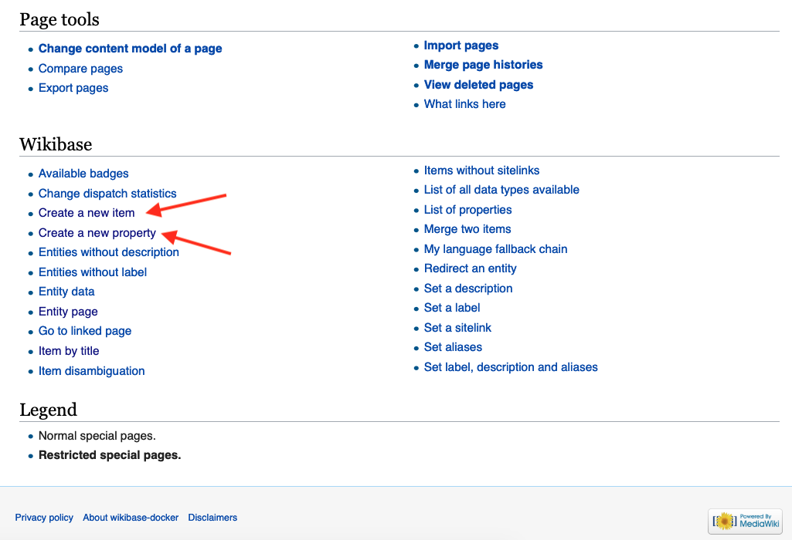

Enter a label and a description of some property that might link two items, and for Data type, pick `Item`.  Return to the Special pages page and select `Create a new item`.  Start by creating an item that will be the value (object) of your statement by entering the label and description.  Then create another item that will be the subject of your statement.  After the subject item has been created, click on the `add statement` link.  For the propery, begin entering the label for the property that you created, then select it from the drop-down list that pops up.  Then in the box to the right, begin entering the label for the value you created and select it from the drop-down list.  You should now see something like this:

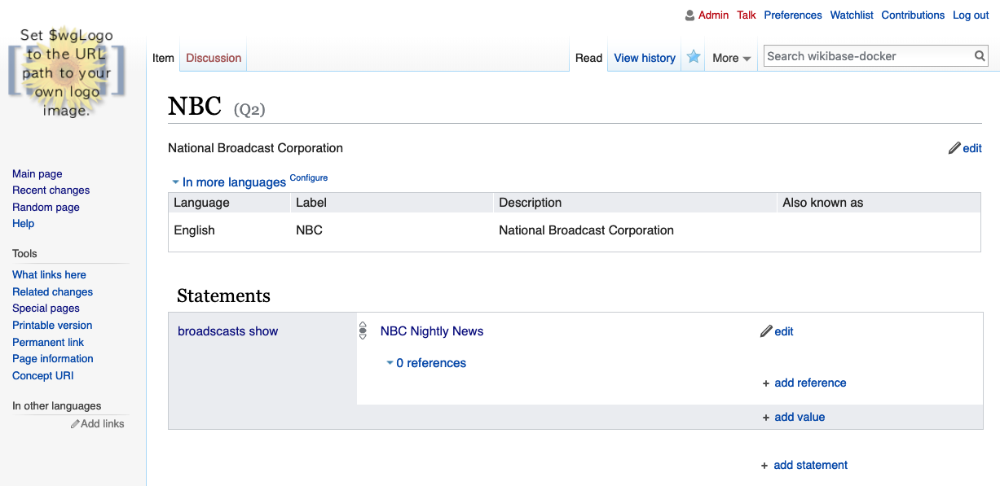

In this example, the statement that we've created is, in English: "NBC broadcasts show NBC Nightly News".  Using abbreviated wikibase IRIs, the statement is the single triple:

```
wd:Q2 wdt:P2 wd:Q3.
```

or in unabbreviated terms:

```turtle
<http://wikibase.svc/entity/Q2> <http://wikibase.svc/prop/direct/P2> <http://wikibase.svc/entity/Q3>.
```

We can diagram this as we typically do for RDF triples:


The predicate of this triple is a Wikidata *direct property* (technically a "truthy" property). That is, it makes a direct connection between a subject and an object.

## Statement instances

There are several potential problems when we make a statement about something using an RDF triple.  One is that we have no way of easily knowing what the triple signifies ("means") without understanding the data model that underlies the triple.  We also do not have any way to know whether what is being asserted is true.  It could be a product of inadequate information, an outright lie, or about a fictional thing that has no basis in the objective world.  

Another deficiency is that there is no direct way in RDF to make statements about statements, such as when the statement was made, who made it, and the supporting evidence behind the statement.  ([Reification](https://www.w3.org/TR/rdf-primer/#reification) is a possibility, but it comes with its own problems.)

Wikidata gets around these problems by the design of its data model.  Wikidata avoids questions of deep meaning by having only two kinds of entities in its model: *items* and *properties*.  The definition of "item" is simply that it is something of interest - in particular, something that we might potentially want to write a Wikipedia article about.  Items form the subjects and objects in Wikidata (and therefore Wikibase) triples.  In contrast to most of the RDF world, Wikidata does not make `rdf:type` assertions about items. (There is a Wikidata property (P31) for "instance of", but the object of a P31 triple is another item, not an `rdfs:Class`.)  

The problem of making statements about statements is handled by creating a "statement" instance for every assertion that is made using a direct property.  (In the wikibase model, statements are also referred to as "claims" and we can consider these two terms to mean the same thing.) Here is a diagram illustrating the situation with the triple we saw above:

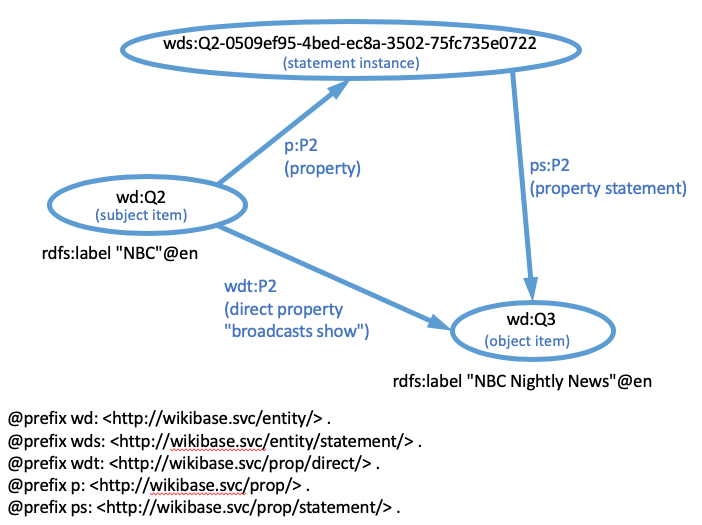

For every direct property attached to a subject item, there is also a simple *property* that connects the subject to a statement instance.  That statement instance is then connected to the object of the direct property by a *property statement*.  The direct property, simple property, and property statement for a particular property all share the same local name (`P2` in this example), but have different namespaces to differentiate them.  

In a nutshell, the [Wikibase model requires](https://www.mediawiki.org/wiki/Wikibase/DataModel/Primer#Statements) "that 'Wikibase will not be about the truth, but about statements and their references.' This means that in Wikibase we do not actually model the items themselves, but statements about them."  As we can see from the structure diagrammed above, Wikibase is more focused in describing and documenting statements than it is describing the somewhat vague "items". 

You can also see that the statement node has been assigned a unique IRI identifier, shown in its bubble in the diagram. That identifier was created by appending a UUID ([Universally unique identifier](https://en.wikipedia.org/wiki/Universally_unique_identifier)) to the `wds:` namespace. Every statement has an associated UUID, which can be used to acquire information about it (using SPARQL) or to delete it using the API associated with the wikibase instance.

## References

Because the statement instance is a IRI-identified resource, we can now say things about it, such as when it was last modified or what references support it.  Supporting references are a key component built in to the Wikidata model.  Under each statement displayed in the Wikibase GUI, there is an "add reference" link that allows a contributor to add reference information to the database.  The generic Wikibase implementation does not come with any built-in reference properties that can be used to link to reference sources, so they must be created as with any other property (i.e. go to Special Pages and Create a new property).  Here is an example of a refence property that we created in our Wikibase instance to mimic the "reference URL" property that already exists in Wikidata:

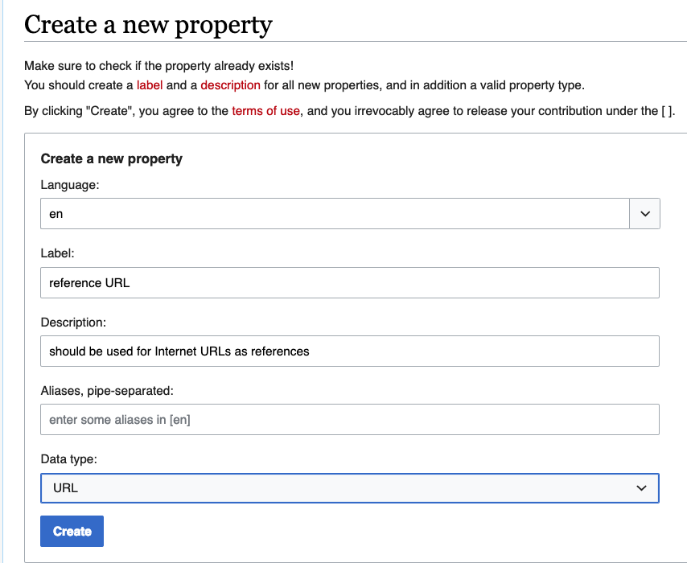

An important feature here is that the Data type of the value for this property is selected as "URL".  That forces the user to enter a URL when providing a value.  As you saw in the dropdown list there are many other possible kinds of values, including strings with various datatypes.

Once the reference property has been created, we can use it.  Returning to our "NBC" item, we click on the add reference link and start typing "reference URL" in the property box, then select it from the dropdown list.  Enter the URL in the value box, and click the "save" link to the right of the statement value.  If you don't enter a URL, it will refuse to save the change. Here's what it looks like when we are finished:

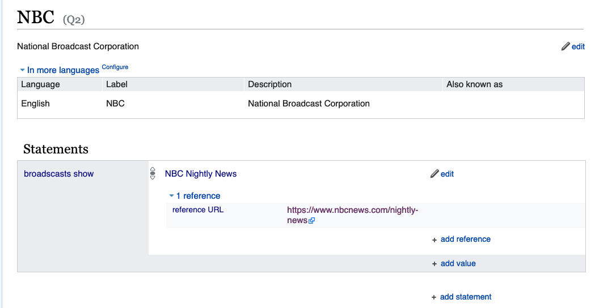

After we have added the reference, here's a diagram of what the RDF looks like:

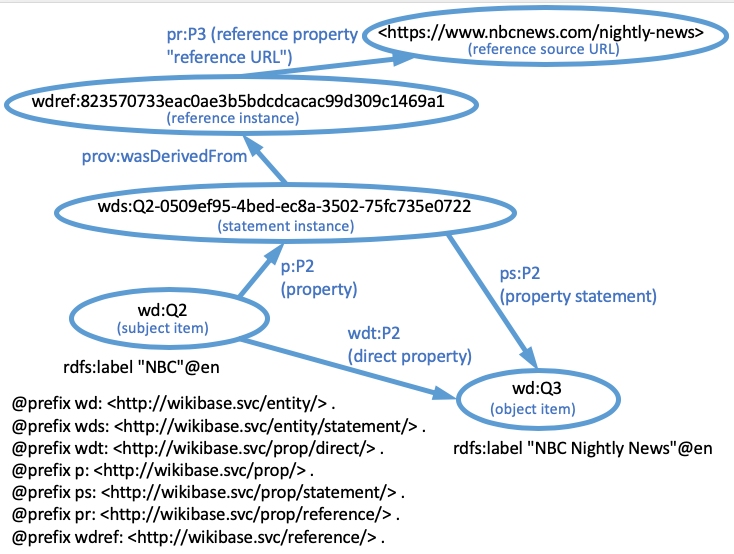

We can see that Wikibase has now created a reference instance that is linked to the statement instance by `prov:wasDerivedFrom` and that it has been assigned an IRI identifier that's shown in its bubble in the diagram. This IRI was created by generating a hash from the information in the reference and appending the hash string to the `wdref:` namespace. Every unique reference has its own hash, which can be used to refer to it unambiguously. However, each use of a reference does not have a unique identifier -- all references that contain the same information have the same hash identifier regardless of which statement they support. Thus "deleting" a reference linked to a statement doesn't really destroy it; it simply de-links the reference from that particular statement. The reference may still be linked to other statements.

Since the reference instance is a IRI identified resource, we can say additional things about it.  The most important thing we want to describe is the source of the reference itself.  That connection is made by the reference property that we created (`P3`, "reference URL").  The connection is made to the URL that we provided as the value of the reference (`https://www.nbcnews.com/nightly-news`).

## Value nodes

Sometimes a value is too complex to be described by a single literal string or item. For example, to be fully described, a date needs the time value, the calendar model (Gregorian, Julian, etc.), and the precision of the measurement (nearest year, nearest month, nearest day, etc.). In these cases, the wikibase model creates an additional node, called a "value node" that is used to link the multiple simple values that are required to describe the complex value. 

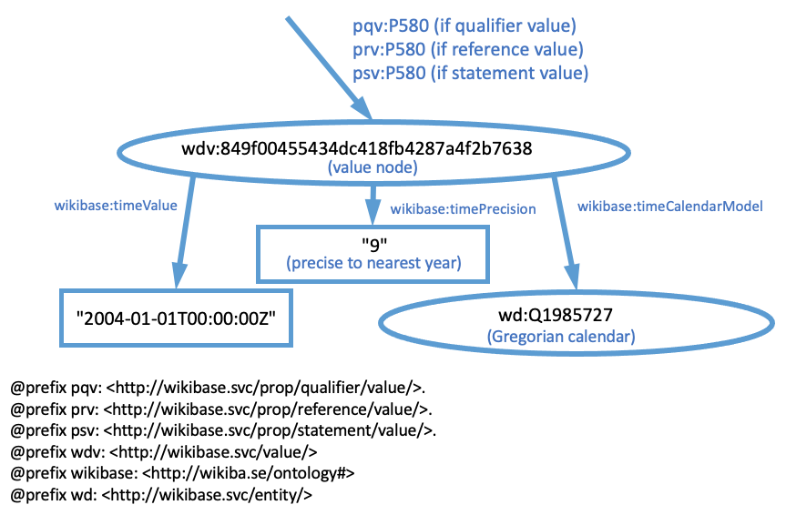

A value node can be linked from either a statement node (as a statement value or qualifier value) or from a reference node (as a reference value). Each of these kinds of links uses a property from a different namespace (`pqv:`, `prv:`, or `psv`).

The value node itself is assigned an identifier, which is a hash string appended to the `wdv:` namespace. That node is linked to the simple values by wikibase ontology properties that are specific for the type of simple value (`wikibase:timeValue`, `wikibase:timePrecision`, and `wikibase:timeCalendarModel` in the example above). In addition to time, other value types that require value nodes are quantity (requiring a magnitude and a unit) and globe coordinates (requiring latitude, longitude, precision, and the target globe such as earth or the moon).

## Qualifiers

The last major piece of the Wikibase model is *qualifiers* that are used to provide non-reference information about the statement instance. 

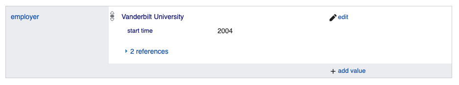

In this example, the Wikidata statement "Brandt F. Eichman employer Vanderbilt University" (wd:Q37371192 wdt:P108 wd:QQ29052.) may be true only for a particular period of time. We can add a qualifier to indicate the starting and ending dates of his employment.  The qualifier property P580 ("start time") is used to indicate the starting time of the employment interval.  

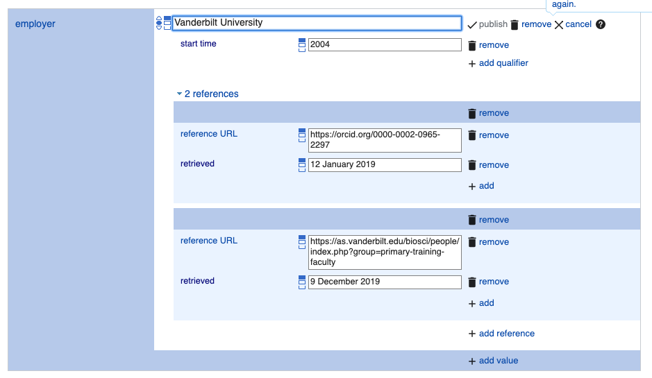

Qualifiers statements are added in the graphical interface directly below the value of the main statement.

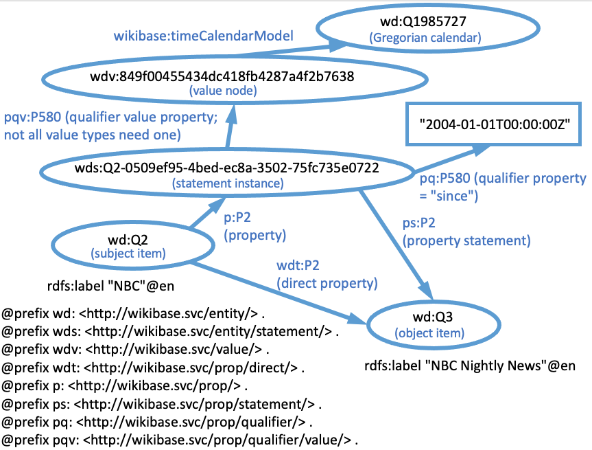

This diagram shows how the qualifier is represented as Linked Data. In this example, the qualifier property for "start time" (P580) should have a date as its value. Since a date is a complex value, there is a `pqv:P580`    link to the value node that joins the simple values needed to fully describe a date (for simplicity, only one simple value, calendar model, is shown here). For ease of querying, there is a simplified value (consisting of only the time string "2004-01-01T00:00:00Z") that is linked by the `pq:` namespace version of the property (`pq:P580`).  

Not every qualifier has a link to a complex value node.  For example, "series ordinal" (P1545) has an integer value that is used to indicate the position in a series. The numeric literal value is sufficient to do that on its own.

There are many other properties associated with entities, statement instances, qualifiers, and reference instances.  For a complete listing for this example, see [this annotated dump](https://github.com/HeardLibrary/digital-scholarship/blob/master/data/rdf/wikibase/wikibase-dump.ttl) of the Wikibase dataset after the items and properties discussed above had been created.  We also are ingoring [statement ranks](https://www.mediawiki.org/wiki/Wikibase/DataModel#Ranks_of_Statements). Statement ranks can be important because they determine whether an indirect statement link also has a direct (truthy) link. Statements with deprecated ranks do not generate direct links and therefore won't be part of the solution of queries that only involve truthy (`wdt:`) properties.

There additional details of the model are beyond the scope of this exercise.  However, there is one more bit that we need to know in order to examine what's going on in our Wikibase database.

## Property labels

Because there are at least three specific kinds of properties (we'll ignore the others for now) that are associated with every generic property, Wikidata defines an instance of an entity that's a generic property, then assoicates that generic property with the specific direct (`wdt:` namespace) and simple (`p:` namespace) properties.  The labels and descriptions are linked to the generic property, so that they don't have to be repeated for all of the other flavors of the property.  Here's an example in Turtle:

```turtle
wd:P2
  a wikibase:Property ;
  wikibase:claim p:P2 ;
  wikibase:directClaim wdt:P2 ;
  wikibase:statementProperty ps:P2;
  schema:description "The value is a news show that is broadcast by the subject network"@en ;
  rdfs:label "broadscasts show"@en .
```

and as a diagram:

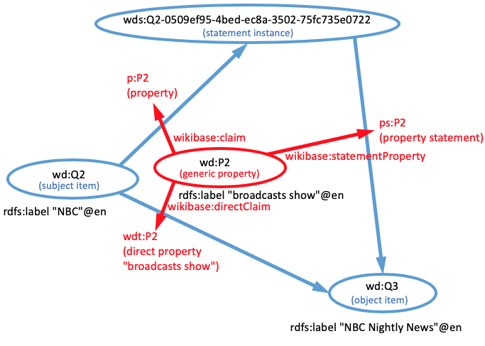

Notice that this is a description about the properties themselves, not any of the items that the properties are being used to describe.

Similarly, reference properties are connected to generic property entities by `wikibase:reference`.  This can be used to find the labels of reference properties.  Here's an example in Turtle:

```turtle
wd:P3
  a wikibase:Property ;
  wikibase:reference pr:P3 ;
  schema:description "should be used for Internet URLs as references"@en ;
  rdfs:label "reference URL"@en ;
```

and as a diagram:

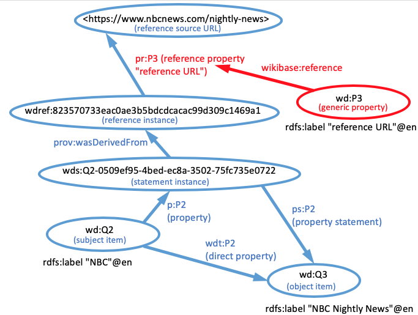

## Using the model to query

In order to construct queries that take advantage of all of the complex information stored in Wikidata or any other wikibase, it is necessary to understand the links within the wikibase model. Each of the triple patterns included in the graph pattern that defines the query represents one link (represented as an arrow in the diagrams on this page). Thus the task in defining a query is to specify the path through the graph model that satisfies the restrictions that you want to place on potential solutions. 

For more information about querying generic wikibase Query Services, visit the [SPARQL queries page](sparql/).

# Example installation of a generic wikibase

In this example, the schema for the Access to Biological Collections Data (ABCD) standard has been loaded into a wikibase.  You can view the data from the [main MediaWiki page](https://wiki.bgbm.org/bdidata/index.php/BDI_Data:Main_Page) or use the [Query Service GUI interface](https://wiki.bgbm.org/bdidata/query/).  Note: the Wikidata namespaces have been mapped to different IRIs - see the [useful queries page](https://wiki.bgbm.org/bdidata/index.php/BDI_Data:Useful_Queries) for the specific prefixes. The data can also be accessed programatically through the endpoint <https://wiki.bgbm.org/proxy/wdqs/bigdata/namespace/bdi/sparql>.

----

[loading data into a wikibase](load/)

[deleting statements and references](delete/)

[creating properties using a script](properties/)

[querying a wikibase with SPARQL](sparql/)

[Structured Data on Commons as a wikibase instance](sdoc/)

----
Revised 2023-03-13
