# Loading data into a Wikibase using the VanderBot tool

[VanderBot](http://vanderbi.lt/vanderbot) is a Python script that can be used to upload CSV data to Wikidata or any other Wikibase instance. There are [several blog posts and tutorials](https://github.com/HeardLibrary/linked-data/blob/master/vanderbot/README.md#how-it-works) that explain how to use VanderBot to write data to the Wikidata test instance and to Wikidata itself. The focus of this page is using VanderBot to write to other Wikibase instances, such as those on [wikibase.cloud](https://www.wikibase.cloud/) or [Structured data on Commons](https://commons.wikimedia.org/wiki/Commons:Structured_data). 

With the advent of wikibase.cloud, the barrier to entry for setting up your own Wikibase instance has been significantly lowered over setting one up yourself using Docker. With only a few button clicks, you can have a fully functioning Wikibase with a functional Query Service to query its data. However, one of the drawbacks of setting up your own Wikibase is that it starts out empty, meaning that you need to create all of the properties and items yourself. The main purpose of this page is to show you how you can quickly create large numbers of items with VanderBot using data in a spreadsheet.

# The MediaWiki API

One of the reasons people like the Wikidata/Wikibase ecosystem so much is that it has a really great graphical interface for editing. However, it requires many button clicks to edit, so for mass editing many users graduate to some other tool like QuickStatements or OpenRefine. These tools all write to the underlying database that supports Wikibase via the [MediaWiki API](https://www.mediawiki.org/wiki/Wikibase/API) that exists for all Wikibase instances. It is quite painful to interact directly with the API without some software tool, but if you are interested in those sorts of details, see "The MediaWiki API" section of [this blog post](http://baskauf.blogspot.com/2019/06/putting-data-into-wikidata-using.html). We will avoid some of that pain by using the VanderBot script, which mediates the interactions with the API for you. (Another alternative is to use the Pywikibot Python library.  For more information about that option and the problems associated with it, see [this page](../pywikibot/))

## Set up a bot password

To write to any Wikibase, you need to have credentials that can be used to give you write permissions. The process of acquiring these credentials is called "creating a bot password" because they are used by people who create autonomous bots to perform automated editing. Even though we aren't performing automated editing, the process of generating those credentials is the same. NOTE: a bot password gives anyone the ability to make edits under your account! So never include the password in code that you publish or push the credentials to a public repository like GitHub. The advantage of using bot password can be revoked if it's compromised without having to shut down your whole account.

**Downloading the template credentials file**

Open [this page](https://github.com/HeardLibrary/digital-scholarship/blob/master/code/wikibase/api/wikibase_credentials.txt) in a new tab in your browser.  Right-click on the `Raw` button in the upper right of the screen and select `Save Link As...`.  Navigate to the directory where you want to put the script and save the file there. These examples assume that you have stored the credentials in your home directory, so save it there unless you have reasons to do otherwise.

Using a text editor (like TextEdit on Mac, Notepad on Windows, or your favorite text or code editor that is NOT Microsoft Word), open the `wikibase_credentials.txt` file that you just downloaded. Leave the file open as you go to the next step.

**Create a bot password**

The screenshots here show how to create a bot on a Wikibase instance that was hosted on AWS (hence the `18.205.159.211:8181` IP address), but they are the same for any Wikibase.  Start by logging into whatever Wikibase you want to interact with. NOTE: API credentials go across the Wikimedia universe, so if you have an account for Wikipedia, Wikimedia Commons, or the real Wikidata, you can use it to log into any of them to create the credentials to write to any of those platforms (and the Wikidata test instance as well).

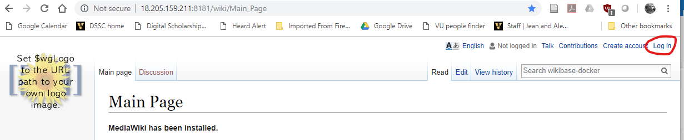

1\. In the upper right, click on the login link. If you've set up an account on wikibase.cloud, as an administrator you should be able to create a user acount that's separate from your administrator account. You should use a regular user account when you set up the bot password. You can also create a user account by clicking on the button under `Don't have an account?`.

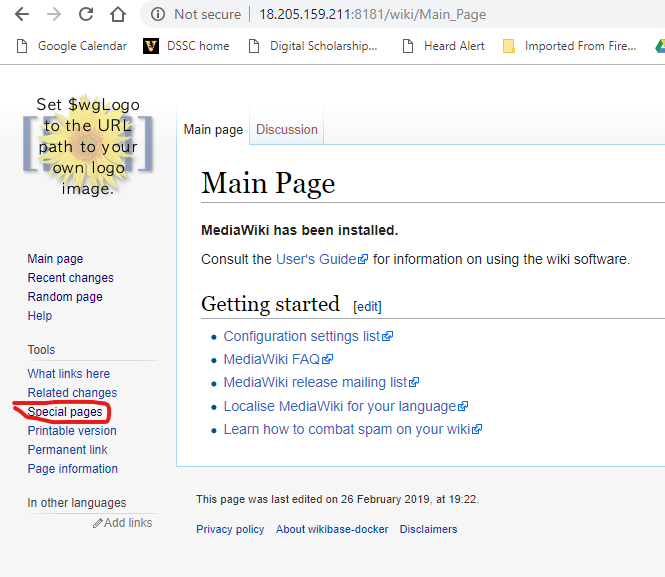

2\. After you have logged in, click on the `Special pages` link in the left menu.

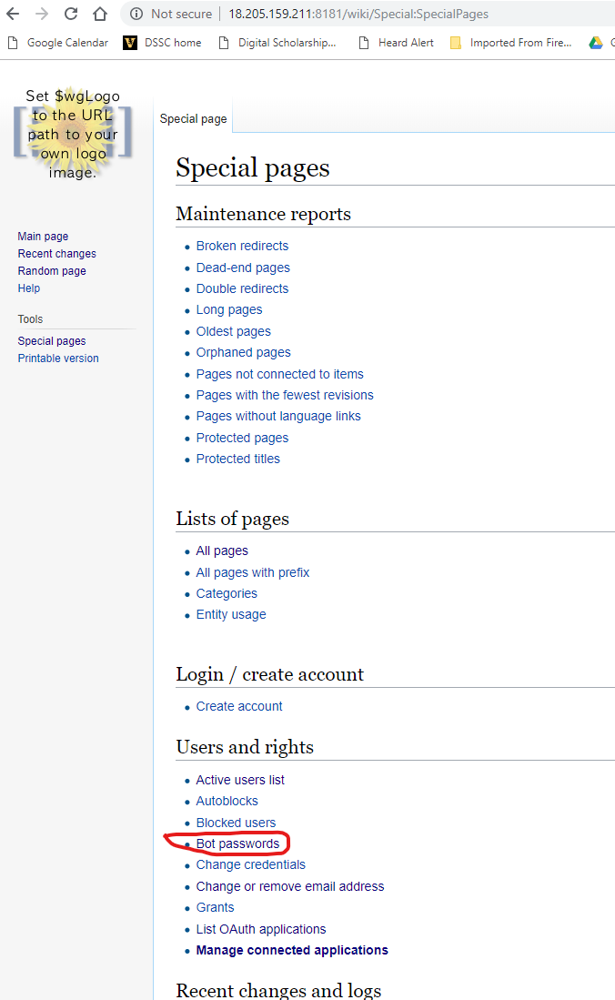

3\. On the Special Pages page, click on the `Bot passwords` link. 

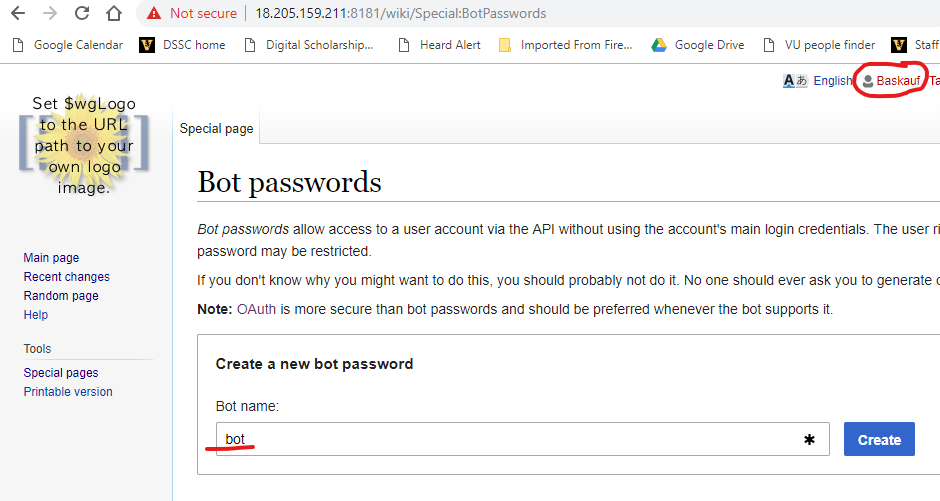

4\. On the Bot passwords page, enter the name of your bot.  It is customary to include the text `bot` somewhere in the bot's name.  You don't need to worry about your bot's name colliding with other bot names because edits will actually be associated with your user account and not the bot name.

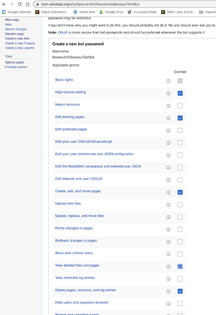

5\. Check the boxes for permissions to give to your bot.  I think the important ones are `Edit existing pages`, `Create, edit, and move pages`, and `Delete pages, revisions, and log entries`. However, just in case, I also selected `High-volume editing`, and `View deleted files and pages` as well. Click on the `Create` button. 

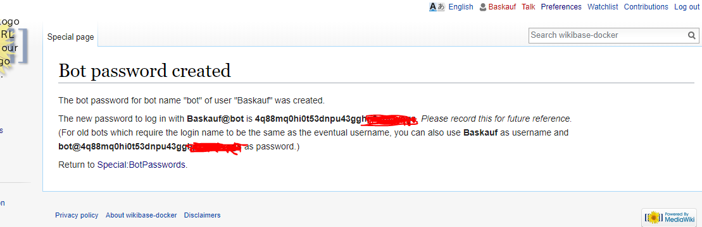

6\. A password will be created for your bot.  As the text indicates, there are actually two versions of the username and password.  Use the first username where the username contains "@", along with its corresponding password.

**Save the credentials**

In the credentials file that you left open before, copy and paste your bot's username in place of `User@bot` in the credentials file.  Copy and paste your bot's password in place of the example password in the credentials file.  Make sure that you don't have any trailing spaces after the username and password, or between the equals sign and the text you pasted in.  Save this file as plain text.  

There is no way to recover credentials once you leave the page, so it might be good to save another copy of the file under a different file name in case you accidentlly write over or delete this one. Of course, you can also just delete this bot password and generate a new one if necessary.

# Properties in the Wikibase

If you are already familiar with properties in Wikidata, you may be annoyed to discover that there is not necessarily any relationship between property P IDs in any particular Wikibase and the familiar P IDs in Wikidata. For example, P31 ("instance of") is one of the most important properties in Wikidata. But a particular Wikibase may have a different P ID for "instance of" or the property may not exist at all.

The development of tools to transfer some or all properties from Wikidata to a Wikibase is a topic of active interest as of 2023-02-07. For now, we will manually create the properties we need using the graphical interface.

To see the available existing properties, go to `Special pages` then `List of properties` in the `Wikibase` section.

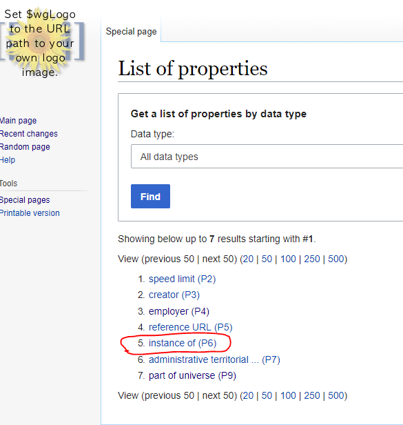

**Adding properties**

If a property that you want to assign to the items that you want to add doesn't exist, you will need to create the property by going to `Special pages`, then `Create a new property` in the Wikibase section. 

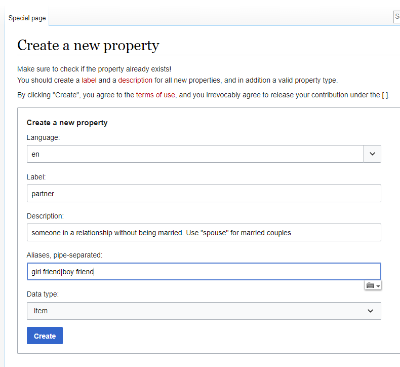

In this example, I created a property to link items for Mickey and Minnie Mouse. Selecting the correct `Data type` is important. The following datatypes are supported by VanderBot: `Item`, `String`, `URL`, `Monolingual text`, `Geographic coordinates`, `Point in time`, and `Quantity`.

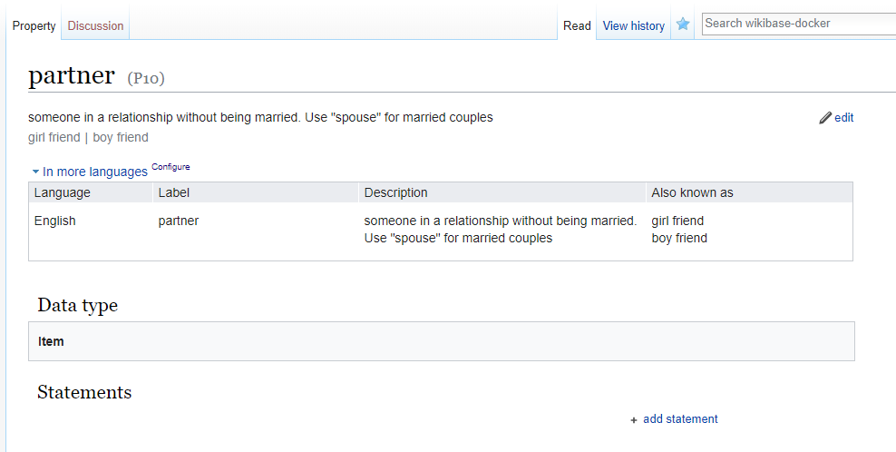

When I click `Create`, I see the page for the newly created property.

## The config.yaml mapping file

The easiest way to create the mappings between the property IDs used to describe items and the columns in the CSV file containing the data is to create a `config.yaml` file. This file can be used both to generate appropriate column headers and to download existing data.

**Describing the property/column header mappings**

Here is an example of a YAML mapping file, which can also be downloaded from [link here]():

```
data_path: ''
item_pattern_file: graph_pattern.txt
item_source_csv: ''
outfiles:
- output_file_name: statues.csv
  label_description_language_list:
  - en
  - fr
  manage_descriptions: true
  # Note: if no columns to ignore, you must omit the "ignore" key or provide an empty list value: []
  ignore: []
  prop_list:
  - variable: instance_of
    value_type: item
    pid: P1
    qual: []
    ref: []
  - variable: artist
    value_type: item
    pid: P2
    qual: 
      - variable: series_ordinal
        value_type: string
        pid: P3
    ref: 
    - variable: reference_url
      value_type: uri
      pid: P4
    - variable: retrieved
      value_type: date
      pid: P8
  - variable: height
    value_type: quantity
    pid: P5
    qual: []
    ref: []
  - variable: gps
    value_type: globecoordinate
    pid: P6
    qual: []
    ref: []
  - variable: title_en
    value_type: monolingualtext
    language: en
    pid: P7
    qual: []
    ref: []
```

This example includes examples of all of the datatypes supported by VanderBot. For more details about formatting these files, see [this page](https://github.com/HeardLibrary/linked-data/blob/master/vanderbot/convert-config.md). For now, we can ignore the first three lines of the script. The mapping configuration file can support mapping multiple CSV files, but in this simplified example we are only using one (`statues.csv`). The important part here is the `prop_list` section, which describes a list of statement properties, each indicated with a dash. The `variable` key provides the root name for columns associated with that property. The `value_type` indicates which of the seven supported value types is required for that property. Depending on the type, there could be one to several columns necessary to fully describe the value. The `pid` is the P identifier that is appropriate for that particular Wikibase, which may differ from the P ID in Wikidata. No P ID can be represented more than once among the statement properties. 

Each property may have zero to many qualifier and reference properties associated with it. Although it is possible to have multiple reference per statement (corresponding to a property here), for simplicity this mapping system only supports one reference per property. If a given statement property has no qualifier properties or no reference properties, an empty array (`[]`) must be given as the value. 

**Generating column headers and the csv-metadata.json file**

Once the `config.yaml` file has been created, it can be used to generate two files needed to do the upload to the API. One file is the more complex `csv-metadata.json` file used to describe the table according the the W3C [Generating RDF from Tabular Data on the Web](https://www.w3.org/TR/csv2rdf/) Recommendation. This file is require by VanderBot. The other file is the CSV that contains the data. Both the `csv-metadata.json` file and column headers for the CSV can be generated from the `config.yaml` file using the script [convert_config_to_metadata_schema.py](convert_config_to_metadata_schema.py) described [here](https://github.com/HeardLibrary/linked-data/blob/master/vanderbot/convert-config.md). 

Running that script with the example file above generates the `csv-metadata.json` file and the file `hstatues.csv`. The latter file name differs from the file name given for the `output_file_name` in the `config.yaml` file by having an "h" (for headers) prepended to the name. This is to avoid overwriting any existing data files with the same name. If you are starting a new file, just remove the "h" from the name.

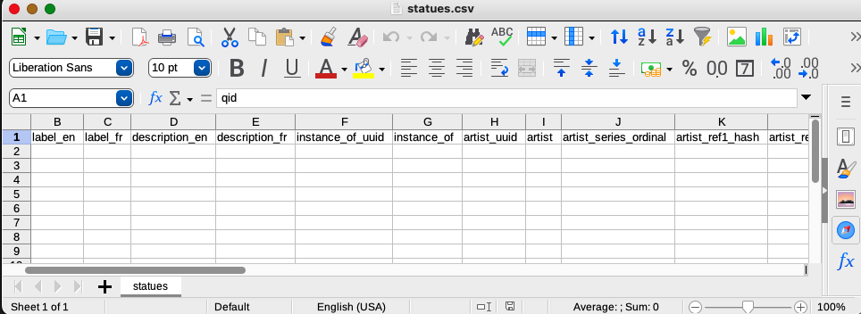

When I open the file with a reliable CSV editor (like [Libre Office](https://www.libreoffice.org/) which for technical reasons is the only one I recommend to use), I see that the left side of the spreadsheet has columns for labels and descriptions in the languages I specified. In addition to the `instance_of` and `artist` columns that I specified, there are two columns used to store the statement UUID identifiers that will be generated when the data are uploaded to the API. The `artist_series_ordinal` column holds the value for the series ordinal qualifer that I associated with the `artist` property.

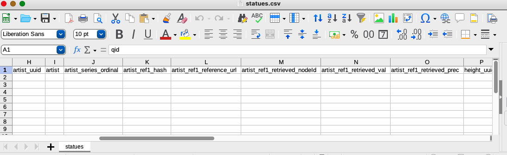

The column headers associated with the artist reference that I described in the mapping configuration are more complicated because the API generates an identifier specifically for the reference (`artist_ref1_hash`), and because the datatype (date) is a complex value type that requires two values (`artist_ref1_retrieved_val` and `artist_ref1_retrieved_prec`) to describe the time and precision of the date. A node ID (`artist_ref1_retrieved_nodeId`) for the complex value will be filled in by the script. 

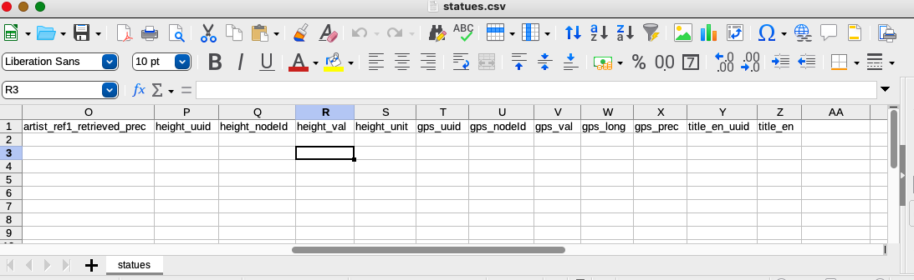

Values for the `height` and `gps` properties are similarly complex, requiring two values to describe the magnitude and units for height and three values for gps (to describe the latitude, longitude, and precision). 

**Entering the data**

The raw data can now be entered in the CSV


Values that are items must be given as Q IDs (including the "Q").

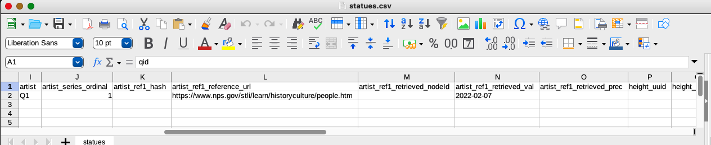

Dates should be given as ISO 3601 dates in either YYYY-MM-DD, YYYY-MM, or YYYY format. The precision can be left blank and VanderBot will figure it out from the format you use. 

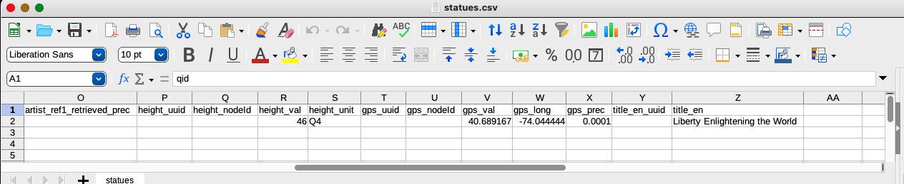

Quantity value types must include a unit value given as a Q ID. That Q ID must be from the Wikibase being written to and not the Wikidata Q ID for the unit. The language of monolingual text values is not specified in the data CSV because it's given in the mapping file.

# Uploading the data

Once the data have been entered into the spreadsheet, make sure that it, the `csv-metadata.json` file, and the [VanderBot python script](https://github.com/HeardLibrary/linked-data/blob/master/vanderbot/vanderbot.py) are in the same directory. Open a terminal window and navigate to the directory where you put the files.

VanderBot uses the SPARQL

If you used the default file names and if your credentials are in your home directory, you can just run the script in a termal window (changed to the directory in which the files are located) using the command

```
python vanderbot.py
```

In some installations, it may be necessary to use `python3` instead of `python` in the above statement. If you deviated from any of the defaults or put the credentials file somewhere else, use [command line options](https://github.com/HeardLibrary/linked-data/blob/master/vanderbot/README.md#command-line-options) as necessary.

If the write to the API is successful, a new item will be created:

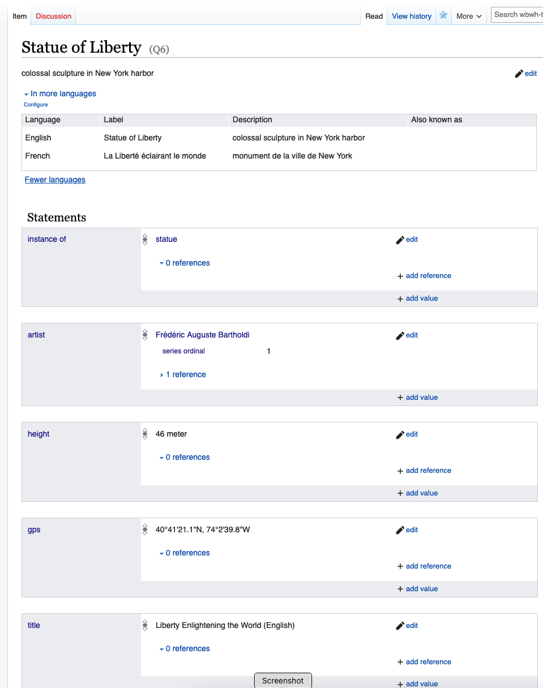

If we re-open the CSV, we can see that the VanderBot script has filled in many IDs that were assigned by the API


----
Revised 2023-02-07
