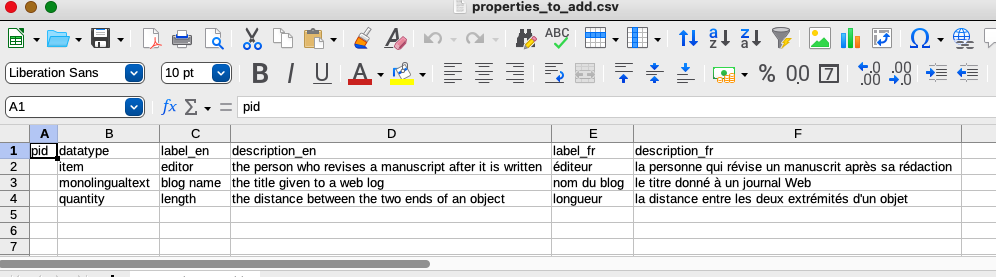

[back to the wikibase model](../)

# Adding properties to a non-Wikimedia wikibase

One issue with using a custom wikibase is not only that it starts with no items, but also that it does not initially have any properties. So before any item data can be added, it is necessary to create any properties that will be used to create statements about the new items. In a custom wikibase, this can be done using the graphical interface, but it is tedious and requires many button clicks.

An alternative to creating the properties manually is to create them via the API using the [wbeditentity](https://wbwh-test.wikibase.cloud/w/api.php?action=help&modules=wbeditentity) module, which allows you to create the property and set labels for it in any number of languages in a singal step. The script `VanderPropertyBot` reads data about properties from a CSV spreadsheet and uses the MediaWiki API associated with the wikibase to create the properties described in the CSV.

Before you can use this script, you need to have credentials for the wikibase to which you want to add properties. For more information about this, see the section on [setting up a bot password](../load/#set-up-a-bot-password) in the page about loading data into a wikibase.

## About datatypes

Each property is restricted to one of several types of values that can be used with it to create a statement. The possible value datatypes can be seen in the dropdown list in the editing screen when a new property is created using the graphical interface. These same datatypes also have a controlled value string that must be passed to the API when it is used to create a property. 

| label in dropdown | controlled value string | controlled value in a VanderBot mapping configuration file<sup>*</sup> |
| ------------------| ----------------------- |
| String | `string` | `string` |
| Monolingual text | `monolingualtext` | `monolingualtext` |
| Quantity | `quantity` | `quantity` |
| Point in time | `time` | `date` |
| Geographic coordinates | `globe-coordinate` | `globecoordinate` |
| Item | `wikibase-item` | `item` |
| URL | `url` | `uri` |
| External identifier | `external-id` | |
| Mathematical expression | `math` | |
| Tabular data | `tabular-data` | |
| Commons media file | `commonsMedia` | <sup>**</sup> |
| Geographic shape | `geo-shape` | |
| Musical notation | `musical-notation` | |

<sup>*</sup> Datatypes having no value in this column are not currently supported by VanderBot.

<sup>**</sup> Supported by VanderBot, but under special conditions. See the [VanderBot documentation](https://github.com/HeardLibrary/linked-data/blob/master/vanderbot/README.md#the-wikidata-image-property-p18-and-image-file-identification) for more information.

# The source CSV file

The source CSV file must have two columns with specific names and additional columns for labels and descriptions. 

One column must be named `pid`. That column must be empty in order to write the property to the wikibase using the API. Once the property is created, the API response will indicate the P ID assigned to the new property and the script will capture that P ID and insert it into the table. This is useful if the script is interrupted, or if additional new properties are added to the table after a previous upload -- the rows for existing properties will be ignored because their `pid` column is not empty.

A second column must be named `datatype`. That column must contain one of the controlled value strings from the table above. If no value is provided, or if the value provided doesn't match any of the known types, that row will be skipped.

The remaining columns should contain pairs consisting of a label column and a description column for a particular language. At least one pair must be present. Additional pairs are optional. In each pair of label/description columns, the name of the label column must begin with `label_` followed by the [ISO 639-1 two letter code](https://en.wikipedia.org/wiki/List_of_ISO_639-1_codes) for the language of the label. For example, an English label column would be named `label_en`. The corresponding description column for that language must begin with `description_` followed by the same language code as the label in the pair. For example, the column for the English description paired with the English label would be named `description_en`. 

Here is an example of a correctly labeled table with labels and descriptions in English and French:



The default name of the table is `properties_to_add.csv`. If you use a different name, you need to specify it using the `--file` (or `-F`) option when you run the script. You can download an example file [here](https://github.com/HeardLibrary/linked-data/blob/master/vanderbot/properties_to_add.csv).

It is not required that every property have a value for every language. However, at least one label must be provided in at least one language for each property.

# Running the script

To run the script, download the `VanderPropertyBot` script from [this download page](https://github.com/HeardLibrary/linked-data/blob/master/vanderbot/vanderpropertybot.py). Right-click on the `Raw` button and select `Save Link As ...`, then save the file in the same directory where the source CSV file is located. 

Open a console window and navigate to the directory where you saved the script. Enter the following command:

```
python vanderpropertybot.py
```

In some installations of Python, you need to enter `python3` instead of `python`. 

Note: the script does not do any checking for duplicate names. Also, I do not think it is possible to change the datatype of a property once it is created. It is possible to change the labels and descriptions, but not using this script, so those changes would need to be done manually. For these reasons, check the CSV file carefully before doing the upload.


When the script was run, it skipped the first row because the datatype should have been `wikibase-item` instead of `item`. If we check the CSV after running the script, we see that it added the P IDs for the two properties it created:


We can now check the property page for new property P34:


We can see that the labels were added in the languages we chose and that the correct datatype was assigned. 

If we want to fix the problem with the first property, we can just correct the error in the datatype column and run the script again. The lines for the previously uploaded properties will be ignored because their values in the `pid` column are not empty.

----

[back to the wikibase model](../)

[loading data into a wikibase](../load/)

[deleting statements and references](../delete/)

[querying a wikibase with SPARQL](../sparql/)

[interacting with Structured Data on Commons](../sdoc/)

----
Revised 2023-02-11
