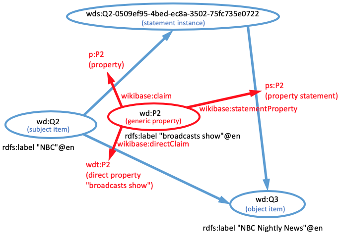
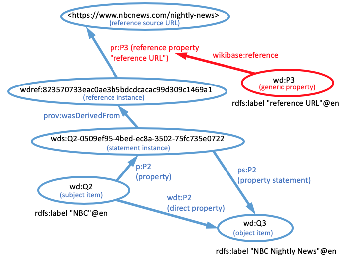

# SPARQL queries to a generic wikibase

You can retrieve information about statements and references in a wikibase using the Query Service interface that is built-in to the wikibase application. There is usually a link to the Query Service in the left panel of each page.

## Namespace prolog

When using the [Wikidata Query Service](https://query.wikidat.org/), the standard namespaces used with properties are pre-defined to use the `http://query.wikidat.org/` namespace. Therefore, you can use abbreviated IRIs in your queries without defining the prefix abbreviations in a prolog to the query. However, for generic wikibases, the standard namespaces are not predefined.

```
PREFIX wd: <http://wikibase.svc/entity/>
PREFIX wds: <http://wikibase.svc/entity/statement/>
PREFIX wdt: <http://wikibase.svc/prop/direct/>
PREFIX wdv: <http://wikibase.svc/value/>
PREFIX wdref: <http://wikibase.svc/reference/>
PREFIX p: <http://wikibase.svc/prop/>
PREFIX pq: <http://wikibase.svc/prop/qualifier/>
PREFIX pr: <http://wikibase.svc/prop/reference/>
PREFIX ps: <http://wikibase.svc/prop/statement/>
PREFIX pqv: <http://wikibase.svc/prop/qualifier/value/>
PREFIX prv: <http://wikibase.svc/prop/reference/value/>
PREFIX psv: <http://wikibase.svc/prop/statement/value/>
PREFIX wikibase: <http://wikiba.se/ontology#>
PREFIX schema: <http://schema.org/>
PREFIX rdfs: <http://www.w3.org/2000/01/rdf-schema#>
PREFIX xsd: <http://www.w3.org/2001/XMLSchema#>
PREFIX owl: <http://www.w3.org/2002/07/owl#>
PREFIX prov: <http://www.w3.org/ns/prov#>
```

If you are using your own wikibase, you will need to paste the namespace abbreviations, listed above, into the query text box as a query prolog.  Replace the domain name `http://wikibase.svc` with the domain name of your wikibase. For example, if you've set up a wikibase at wikibase.cloud named `wbwh-test`, you would replace the domain name with `https://wbwh-test.wikibase.cloud/entity/`.

You actually only need to include the prefixes that you are using in your query, but it doesn't hurt anything to paste them all in.  

## Querying for label information

It is relatively simple to acquire the labels associated with items. However, since there are many namespace variants for properties, there are not separate labels associated with each variant. Rather, there is a single multilingual set of labels associated with a generic property entity in the `wd:` namespace. By extension, that set of labels applies to all of the namespace variants. This relationship can be seen in the following diagram:



Here is a query that asks what properties are associated with the "NBC" item in the diagram:

```sparql
SELECT DISTINCT ?directProp ?label
WHERE {
  wd:Q2 ?directProp ?value.
  ?prop wikibase:directClaim ?directProp.
  ?prop rdfs:label ?label.
  }
  ```

  Notice that in order to differentiate between the direct property that I care about and other flavors of properties, I include the triple pattern:

  ```sparql
    ?prop wikibase:directClaim ?directProp.
  ```

  which only applies to direct properties.  That also serves the purpose of including in my graph pattern a link to the generic property so that I can access the property label.

  

  ## Querying for references

  Here is a query that returns all of the references associated with a particular kind of statement made about NBC. The link to the generic property makes it possible to list the names of the reference properties that were used to define the reference.

  ```sparql
SELECT DISTINCT ?refInstance ?refProp ?label ?value
WHERE {
  wd:Q2 p:P2 ?statementInstance.
  ?statementInstance prov:wasDerivedFrom ?refInstance.
  ?refInstance ?refProp ?value.
  ?refEntity wikibase:reference ?refProp.
  ?refEntity rdfs:label ?label.
  }
  ```


----
Revised 2023-02-09

