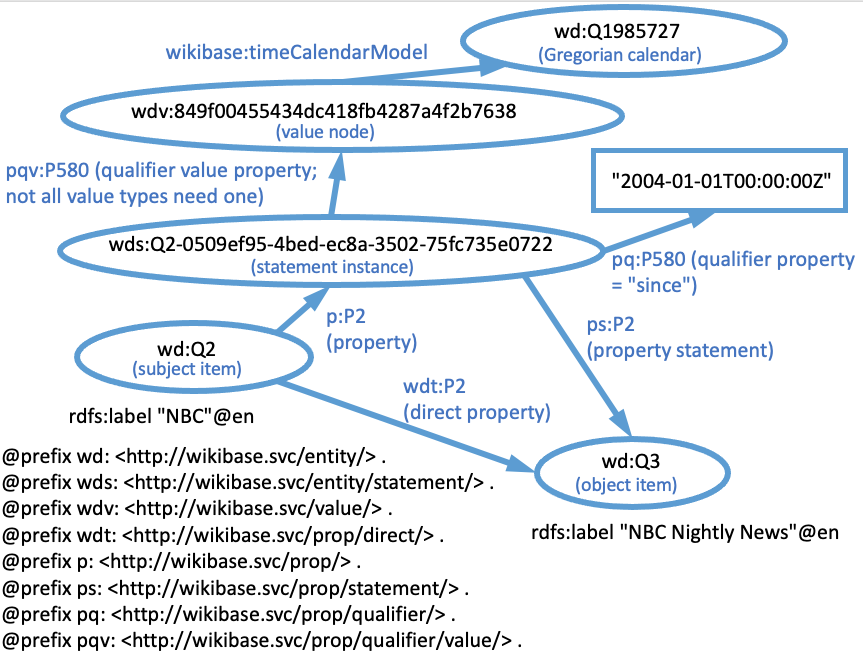
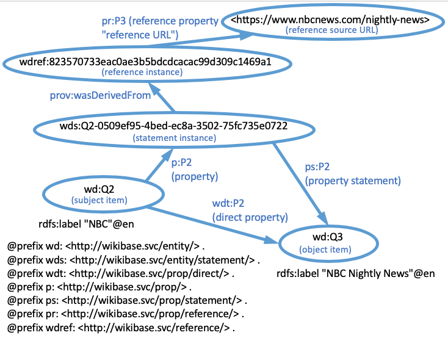

[back to the wikibase model](../)

# SPARQL queries to a generic wikibase

You can retrieve information about statements and references in a wikibase using the Query Service interface that is built-in to the wikibase application. There is usually a link to the Query Service in the left panel of each page. 

It is also possible to perform SPARQL queries programatically using the SPARQL endpoint associated with the Query Service. The endpoint URI is formed by adding `sparql` to the end of the URL of the Query Service. So for example, the Query Service URL for the custom wikibase <https://wbwh-test.wikibase.cloud/> is <https://wbwh-test.wikibase.cloud/query/>. So the SPARQL endpoint URL for that Query Service would be `https://wbwh-test.wikibase.cloud/query/sparql`.

## Namespace prolog

When using the [Wikidata Query Service](https://query.wikidat.org/), the standard namespaces used with properties are pre-defined to use the `http://query.wikidat.org/` namespace. Therefore, you can use abbreviated IRIs in your queries without defining the prefix abbreviations in a prolog to the query. However, for generic wikibases, the standard namespaces are not predefined.

```
PREFIX wd: <http://wikibase.svc/entity/>
PREFIX wds: <http://wikibase.svc/entity/statement/>
PREFIX wdt: <http://wikibase.svc/prop/direct/>
PREFIX wdv: <http://wikibase.svc/value/>
PREFIX wdref: <http://wikibase.svc/reference/>
PREFIX p: <http://wikibase.svc/prop/>
PREFIX pq: <http://wikibase.svc/prop/qualifier/>
PREFIX pr: <http://wikibase.svc/prop/reference/>
PREFIX ps: <http://wikibase.svc/prop/statement/>
PREFIX pqv: <http://wikibase.svc/prop/qualifier/value/>
PREFIX prv: <http://wikibase.svc/prop/reference/value/>
PREFIX psv: <http://wikibase.svc/prop/statement/value/>
PREFIX wikibase: <http://wikiba.se/ontology#>
PREFIX schema: <http://schema.org/>
PREFIX rdfs: <http://www.w3.org/2000/01/rdf-schema#>
PREFIX xsd: <http://www.w3.org/2001/XMLSchema#>
PREFIX owl: <http://www.w3.org/2002/07/owl#>
PREFIX prov: <http://www.w3.org/ns/prov#>
```

If you are using your own wikibase, you will need to paste the namespace abbreviations, listed above, into the query text box as a query prolog.  Replace the domain name `http://wikibase.svc` with the domain name of your wikibase. For example, if you've set up a wikibase at wikibase.cloud named `wbwh-test`, you would replace the domain name with `https://wbwh-test.wikibase.cloud`.

You actually only need to include the prefixes that you are using in your query, but it doesn't hurt anything to paste them all in.  

# Wikibase SPARQL graph pattern variants

Performing a successful SPARQL query often depends on constructing a graph pattern that connects resources based on some path through nodes whose relationship is defined by the underlying graph model for the dataset. In the case of wikibase queries, that means understanding how various entities are linked within the wikibase graph model. If you aren't familiar with the wikibase graph model, it may be beneficial to review the [graph model tutorial](../) associated with this lesson series. If you aren't familiar with SPARQL queries and the terminology associated with it, you may wish to study [this tutorial](../../sparql/) or one of the many other resources available on the subject. 

In the following examples, be aware that they omit the prolog statements that define the namespace abbreviations. See the previous section for detatils.

## Querying via direct properties


This simplest way to query a wikibase is to follow links that are defined by direct properties (also known as "truthy" properties). Direct properties begin with the namespace abbreviation `wdt:`. Based on the diagram above, here is a simple query that finds all news shows broadcast by the NBC network:

```
select distinct ?show where {
    wd:Q2 wdt:P2 ?show.
}
```

The graph pattern is the part of the query between the curly braces.

If shows were linked to their anchors by an "anchor" property, P25, we could find all anchors that work for NBC by adding another triple pattern (representing a link) to the graph pattern:

```
select distinct ?show ?anchor where {
    wd:Q2 wdt:P2 ?show.
    ?show wdt:P20 ?anchor.
}
```

The result would produce the Q IDs for all of the anchors along with the Q IDs of the shows they were associated with.

## Querying via statement nodes


We can also create a graph pattern that connects two resources through an indirect path that connects the resources through a statement node. For example, the first query in the previous section could also be written:

```
select distinct ?show where {
    wd:Q2 p:P2 ?statement.
    ?statement ps:P2 ?show.
}
```

The results would be the same as before. Why would we want to use this more complicated path? There are three circumstances where this might be necessary. 

Statements can have "ranks": `preferred`, `normal`, and `deprecated`. Truthy (direct) links are not generated for statements with deprecated ranks. So for example, there may be an incorrect statement asserting that a show was broadcast by NBC. Although it is incorrect, it may have been asserted by someone and documented with a reference. In that case, the statement could be assigned a rank of `deprecated`. In that case, the results of a query using direct properties would not include that show in the results, whereas a query through the statement node would.



Another situation where one needs to query via the statement node is if a qualifier of the statement is involved in the query. For example, one might query for authors (P50) of a work, but only be interested in first authors. In Wikidata, the order of authorship is indicated using a series ordinal qualifier (P1545). Since qualifiers are attached to the statement node, we would need to construct the query with a graph pattern including the statement node like this:

```
select distinct ?work ?author where {
    ?work p:P50 ?statement.
    ?statement pq:P1545 "1".
    ?statement ps:P50 ?author.
}
```

## Querying references



The third situation where you may need to construct a query through a statement node is in the case where you want information about references associated with the statement. For example, if you want to know all of the references that support the assertion that the NBC Nightly News is broadcasted by NBC, you could use this query:

```
select distinct ?reference where {
    wd:Q2 p:P2 ?statementNode.
    ?statement prov:wasDerivedFrom ?reference.
    ?statement ps:P2 wd:Q3.
}
```

The result of this query would be the identifiers for the references, composed of the `wdref:` namespace and the hash identifier for the reference. Since this identifier is opaque, this query isn't probably very helpful. However, if we add an additional link to reference URLs that are linked to the reference, the query results would produce the source URLs, which would be much more useful.

```
select distinct ?url where {
    wd:Q2 p:P2 ?statementNode.
    ?statement prov:wasDerivedFrom ?reference.
    ?reference pr:P3 ?url.
    ?statement ps:P2 wd:Q3.
}
```

## Queries that involve value nodes


Certain value types are more complex than others. Dates, quantities, and geocoordinates cannot be represented as a single simple value. For example, in the wikibase model, completely describing a date requires not only the time, but the precision of that time, and the calendar model for the date. 

Here is a query to determine the date on which the artwork "The Farmhouse by the Water" by Anthonie Waterloo ([Q102974173](https://www.wikidata.org/wiki/Q102974173)) was created. The property "inception" (P571) is used to link to the date an artwork was created. We can use the following query to discover the date:

```
select distinct ?date where {
    wd:Q102974173 wdt:P571 ?date.
}
```

The result is `1700-01-01T00:00:00Z`. However, this query does not tell us whether it is 1 January 1700, the year 1700, or the 17th century. All of those dates are represented by the same value in the wikibase model.

We could also perform the query via the statement node, using the `p:` and `ps:` property links as we did in the previous queries:

```
select distinct ?date where {
    wd:Q102974173 p:P571 ?statement.
    ?statement ps:P571 ?date.
}
```

However, this isn't an improvement, because it still only links to the time value and not to the other information about the date. To find those simple values, we need to link through the value node that groups the simple date values. Here's what that query would look like:

```
select distinct ?date ?precision where {
  wd:Q102974173 p:P571 ?statement.
  ?statement psv:P571 ?valueNode.
  ?valueNode wikibase:timeValue ?date.
  ?valueNode wikibase:timePrecision ?precision.
}
```

This query provides `1700-01-01T00:00:00Z` for the date, as before, but also indicates that the precision is "7", the value used in the wikibase model to indicate precision to the nearest century. If you view the [Wikidata page for Q102974173](https://www.wikidata.org/wiki/Q102974173), you will see that it displays the date as "17. century".

Other datatypes that require value nodes include quantities (linked to `wikibase:quantityAmount` and `wikibase:quantityUnit`) and geocoordinates (linked to `wikibase:geoLatitude`, `wikibase:geoLongitude`, and `wikibase:geoPrecision`).

## Querying for label information

It is relatively simple to acquire the labels associated with items. However, since there are many namespace variants for properties, there are not separate labels associated with each variant. Rather, there is a single multilingual set of labels associated with a generic property entity in the `wd:` namespace. By extension, that set of labels applies to all of the namespace variants. This relationship can be seen in the following diagram:


Here is a query that asks what properties are associated with the "NBC" item in the diagram:

```sparql
SELECT DISTINCT ?directProp ?label
WHERE {
  wd:Q2 ?directProp ?value.
  ?prop wikibase:directClaim ?directProp.
  ?prop rdfs:label ?label.
  }
  ```

  Notice that in order to differentiate between the direct property that I care about and other flavors of properties, I include the triple pattern:

  ```sparql
    ?prop wikibase:directClaim ?directProp.
  ```

  which only applies to direct properties.  That also serves the purpose of including in my graph pattern a link to the generic property so that I can access the property label.

  

  ## Querying for references

  Here is a query that returns all of the references associated with a particular kind of statement made about NBC. The link to the generic property makes it possible to list the names of the reference properties that were used to define the reference.

  ```sparql
SELECT DISTINCT ?refInstance ?refProp ?label ?value
WHERE {
  wd:Q2 p:P2 ?statementInstance.
  ?statementInstance prov:wasDerivedFrom ?refInstance.
  ?refInstance ?refProp ?value.
  ?refEntity wikibase:reference ?refProp.
  ?refEntity rdfs:label ?label.
  }
  ```

[back to the wikibase model](../)

[deleting statements and references](../delete/)

[loading data into a wikibase](../load/)

[creating properties using a script](../properties/)

----
Revised 2023-02-11

