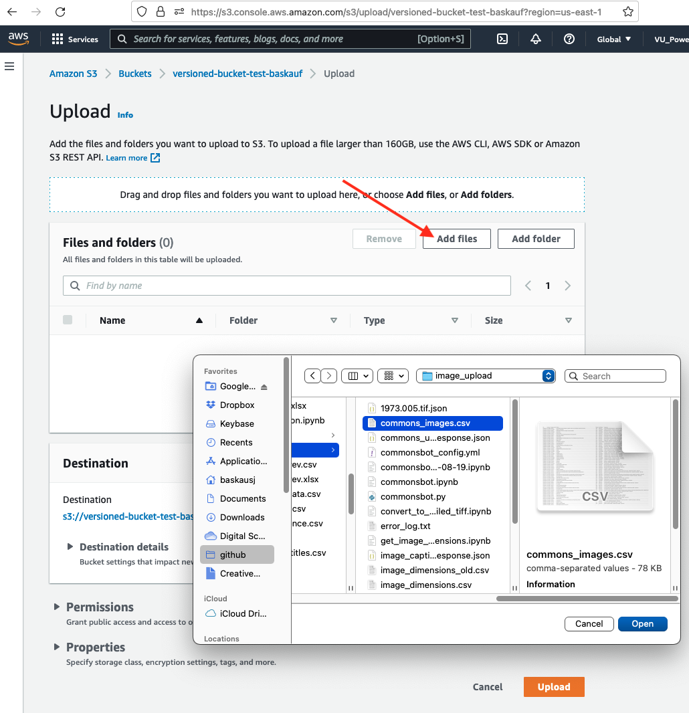
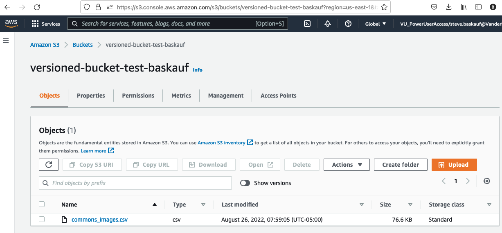
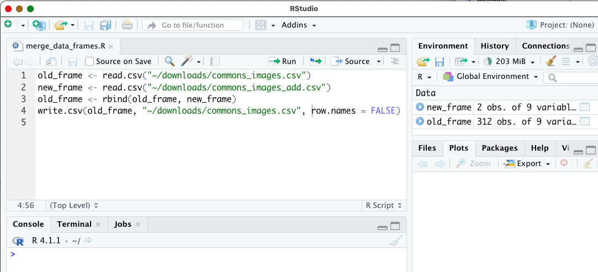
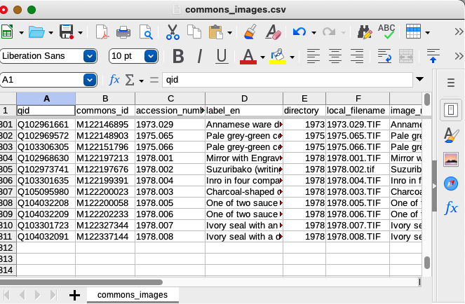
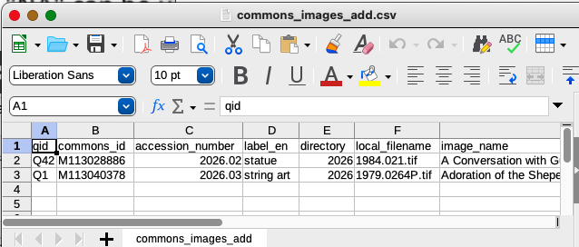
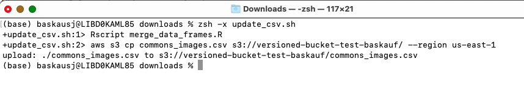
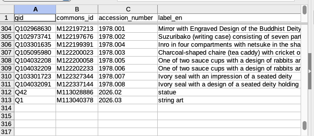
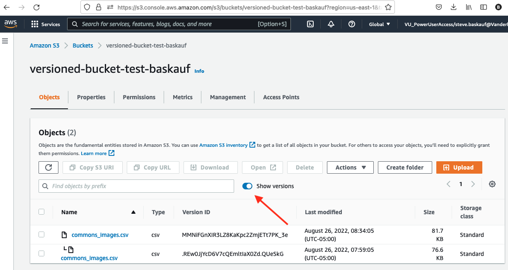
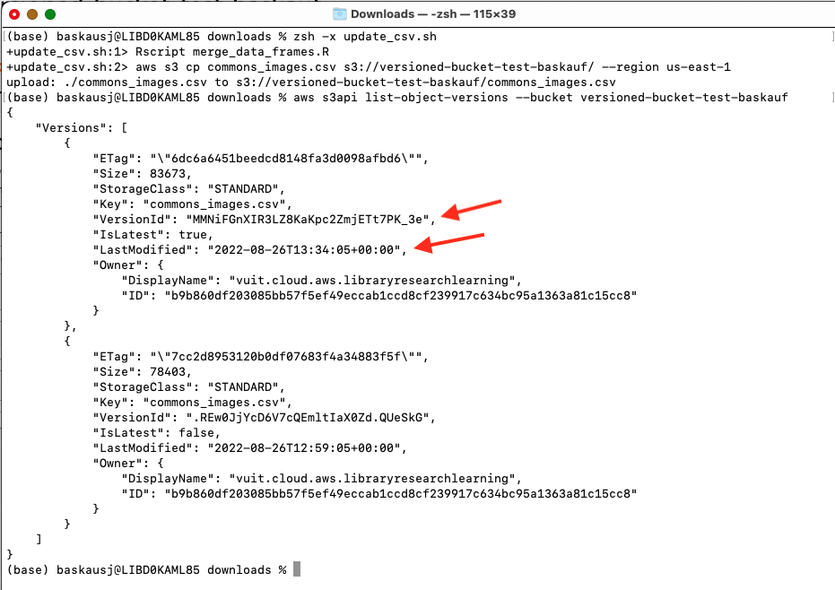

# Backing up files using AWS S3 buckets

Amazon Web Services (AWS) provides a Simple Storage Service (S3) by provisioning "buckets" into which files can be stored. Files placed in these buckets can be versioned, making it possible to maintain a history of files over time. For details about versioning in S3 buckets, see [this page](https://docs.aws.amazon.com/AmazonS3/latest/userguide/Versioning.html).

In this lesson, we'll set up a bucket with versioning, then use the AWS Command Line Interface (CLI) to move files into the bucket as part of a regular data pipeline.

## Setting up the bucket

1\. From the AWS console go to the S3 service and click `Create bucket`. 

2\. Give the bucket a unique name and choose an AWS region.


3\. Under `Bucket Versioning`, select `Enable`. Then click `Create bucket`.

4\. After the bucket is created, click on its link, then click `Upload`. 



5\. We'll uplad the initial version of the file we are managing: a CSV spreadsheet. Click `Add files`, then select the file to upload and clicke `Upload`. After the upload completes, close the status window.



The newly uploaded file should be visible on the console. 

## Seting up the merge script

In this example, an R script is used to append additional rows to the CSV that's being managed. The additional rows are in another CSV file with identical column headers to the managed CSV.



1\. Use RStudio to create the script, which we will call `merge_data_frames.R`. In this example, we used `read.csv()` to read in the CSV as a vanilla data frame. Alternatively, it could have been read in as a tibble, or could have been read in from an Excel file. For details on these variations, see [this lesson](https://heardlibrary.github.io/digital-scholarship/script/codegraf/012/). Note that there are variations on how data typing and missing values are handled depending on the exact function used to load the table. See the `Missing data` section of [this lesson](https://heardlibrary.github.io/digital-scholarship/script/codegraf/013/) for details and make sure that your data is read in as expected.

2\. The full script is:

```
old_frame <- read.csv("~/downloads/commons_images.csv")
new_frame <- read.csv("~/downloads/commons_images_add.csv")
old_frame <- rbind(old_frame, new_frame)
write.csv(old_frame, "~/downloads/commons_images.csv", row.names = FALSE)
```

In the third line, the `rbind()` function is used to append the new data frame to the end of the original one. In the last line, it's important to set the `row.names` to a value of FALSE to ensure that the columns in the output table are the same as in the original file.

3\. To invoke this script from the command line, we can use:

```
Rscript merge_data_frames.R
```

when the R script is in the current working directory. 

## Uploading the merged table

To upload the file, we will use the AWS command line interface (CLI). Before using it, you need to create an access key and download the CLI software. (more directions needed here)

1\. Once the CLI is set up, the following command will upload the table we are managing:

```
aws s3 cp commons_images.csv s3://versioned-bucket-test-baskauf/ --region "us-east-1"
```

## Creating the shell script to run the pipeline

1\. The commands to do the merge and upload the file should be placed in a plain text file with an `.sh` extension. We'll call ours `update_csv.sh`. 

2\. Our shell script only has two stages, but it could have additional processing steps.

```
Rscript merge_data_frames.R
aws s3 cp commons_images.csv s3://versioned-bucket-test-baskauf/ --region "us-east-1"
```

Using a code or text editor, save these lines as plain text in the same directory as the R script. 

## Running the pipeline

The original file looks like this:



The lines to be added looks like this:



1\. In a console window (Terminal on Mac), change to the directory where the shell and R scripts are saved.

2\. If you are using the bash shell, issue this command:

```
bash -x update_csv.sh
```

If you are using Z shell, issue this command:

```
zsh -x update_csv.sh
```

The `-x` argument will display each command in the script as it is executed.



When the script runs successfully, there should be an `upload:` response saying that the CSV file was uploaded.



3\. When we open the modified file that we are archiving, we can see that the new rows have been added to the end.



4\. Return to the S3 console and on the bucket screen, turn on the `Show versions` switch. Two versions of the file should now be visible, each with its own Version ID and Last modified time. 

5\. We can also use the following CLI command to acquire version information in JSON format:

```
aws s3api list-object-versions --bucket versioned-bucket-test-baskauf
```

The same version ID and time information is available in the results JSON:



and it can be read into a Python or R script to facilitate version management. For more information about listing version information see [this page](https://docs.aws.amazon.com/AmazonS3/latest/userguide/list-obj-version-enabled-bucket.html).


## Recovering or restoring previous versions

For information about retrieving versioned files from the S3 bucket, see [this page](https://docs.aws.amazon.com/AmazonS3/latest/userguide/RetrievingObjectVersions.html). For information about restoring an older version, see [this page](https://docs.aws.amazon.com/AmazonS3/latest/userguide/RestoringPreviousVersions.html). 

----
Revised 2022-08-26
