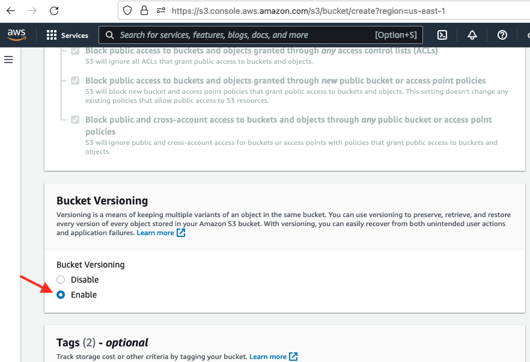

# Backing up files using AWS S3 buckets

Amazon Web Services (AWS) provides a Simple Storage Service (S3) by provisioning "buckets" into which files can be stored. Files placed in these buckets can be versioned, making it possible to maintain a history of files over time. 

In this lesson, we'll set up a bucket with versioning, then use the AWS Command Line Interface (CLI) to move files into the bucket as part of a regular data pipeline.

## Setting up the bucket

1\. From the AWS console go to the S3 service and click `Create bucket`. 

2\. Give the bucket a unique name and choose an AWS region.

3\. Under `Bucket Versioning`, select `Enable`.

----
Revised 2022-08-26
