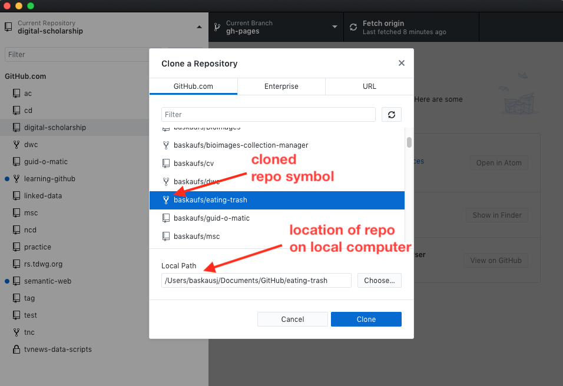
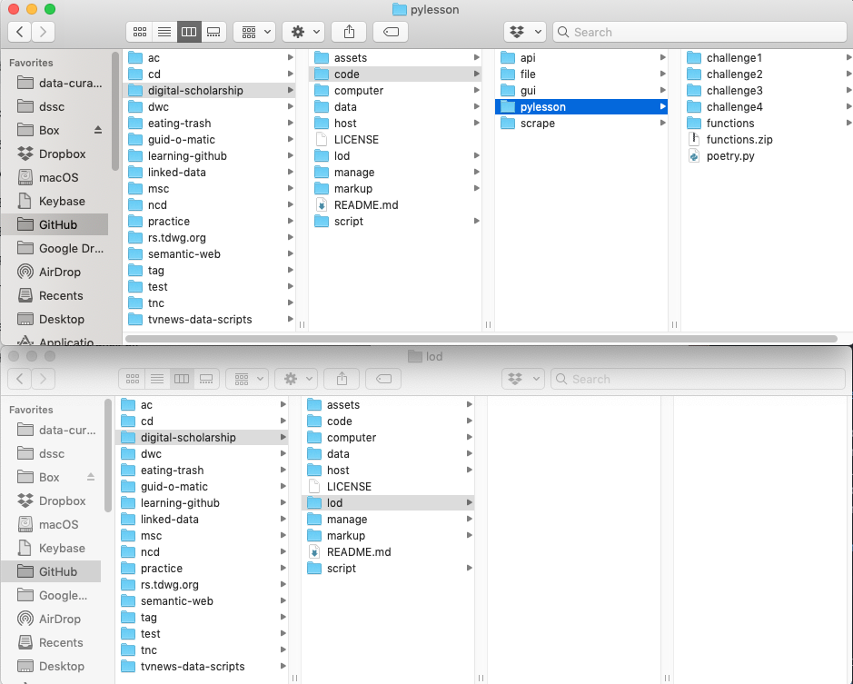

## Workshop II: GitHub for Intermediate Users

## Working with a Forked Repository

## Cloning a repository using the desktop client

**See Ramona's page for screenshots (PC???) and alternate instructions**

In addition to cloning a repository from the website side, you can also clone from your local computer using the GitHub desktop client.  The process described here will work for cloning one of your own repositories, a repository that you've forked to your account from elsewhere, or another repository that you don't own, but to which you have been given write access.

Drop down the Current Repository menu in the upper left of the window.  Click on the Add dropdown and select "Clone Repository...".

You'll be presented with a list of repositories at Github.com to which you have access.  Repos that you own or to which you have write access will show up with little book icons.  Repos that are clones of some other repo will have a little "fork" symbol.  Click on the name of the repo you want to clone and you'll have an opportunity to select where you want the local copy of the repo to live on your computer.  Once you've selected a location, the desktop client will default to that location the next time you clone.

## Working with cloned files

After you've finished the cloning process, in the left column of the client, you'll see either changed files or the commit history, depending on which tab you've selected.  

By dropping down the Current Repository list, you can switch to a different cloned repository, including one that you cloned from the GitHub website side. By default, the desktop client chooses the master branch of a newly cloned repo.  However, you can change from the master branch to another existing branch by dropping down the middle "Current Branch" menu at the top of the window.  

When you select a default branch in this dialog, we say that your are "checking out" that branch. Checking out a branch literally changes the files that are present on your local computer. For example, when I selected the master branch as my current branch, here's what several directories looked like:

You can see that the pylesson directory has a lot of files in it and the lod directory doesn't.  If I change to the "gh-pages" branch:

then I'm checking out a different set of files.  Here's what the directories look like now:

Some files have disappeared, like the ones in the pylesson directory, and other files have appeared in the lod directory.  The content of the files themselves may also change.  So it's important before you start working on files that you are clear what branch you currently have checked out.  

## Deciding how to work

Although Github is designed for collaboration, it can be a useful tool even if you are working on something by yourself.  It provides a way to track your editing progress by versioning and makes it possible to revert to an earlier version if you really mess something up.  It's also a way to access your work on different computers.  Things get more complicated when you are working with others.

There are several ways you can work in your own repository or when collaborating in a shared repository.  There are additional options if you are working on an open source project where contributors don't have write access to the repository, but we'll talk about them in the next session.

If you are working by yourself creating a new document, or if you are making trivial changes, you may opt to edit the master branch directly.  However, if you are on a team and making substantial changes, or if you are working by yourself and are concerned that the changes you are making may not work out, it's better to create a separate branch and work on that.  Similarly, if changes are extensive and it will take a while to finish them, you will probably want to leave the master branch in a stable state until you've finished the changes.  You can then merge them into the master branch all at once to create a new version of it.  

In any case, before you can edit an existing document, you will need to decide on a branching strategy.   The number of branches also can influence the probability of creating merge conflicts when edits are made to a version that isn't the most recent one. When there are few branches with many people working on them, merge conflicts are more likely.  If there are more branches with fewer people working on each one, merge conflicts of this sort are less likely to arise.

## Work cycle

When you are editing files using GitHub desktop, it is important to have a disciplined work cycle to make sure that your work gets saved to the hub without merge conflicts. After you've decided what branch you need to work on, it's very important to make sure at the start that you are working on the most recent version of it by pulling any changes from Github. Click on the Fetch origin button at the upper right of the window.  If there are changes that need to be downloaded, you'll see a small number by a downward pointing arrow.  Click the button (now labeled "Pull origin") again to download those changes.

If you forget to update your local copy of the branch, you risk creating a conflict, since you may be working on a copy that isn't the most recent one.

Let's open a text editor (Use Notepad today, but I recommend installing ATOM, [https://atom.io/](https://atom.io/), for your personal use).  Navigate to the location where you checked out the repo.  Make some changes to the _**TakeAways.md**_ file, then save it.  If you click on the Changes tab at the upper left of the window, you should see the files that changed since the last update and clicking on a filename will show the kind of changes at the right of the screen.  

Commit your changes.  You'll then see the new commit in the history and as a change that's ready to push up to GitHub.

 Click on the **Push origin** button to push your changes from the desktop client to GitHub.com.
