# Introduction to Git and GitHub

On this page, we'll talk about opening a GitHub account, creating a repo, and making editing commits.

# #Opening a GitHub account

You can open a free GitHub account by going to <https://github.com/>. The process is relatively simple - for detailed instructions, see [this workshop handout](https://github.com/Ramona2020/learning-github/blob/master/Workshop%20I-III%20Handouts/Workshop-GitHubBasics.md).  With a GitHub account, you can create an unlimited number of public repositories.  You can also create private repositories, but they are limited to three collaborators.

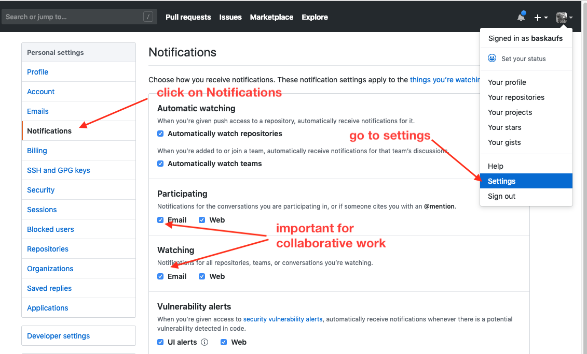

## Creating a Repository

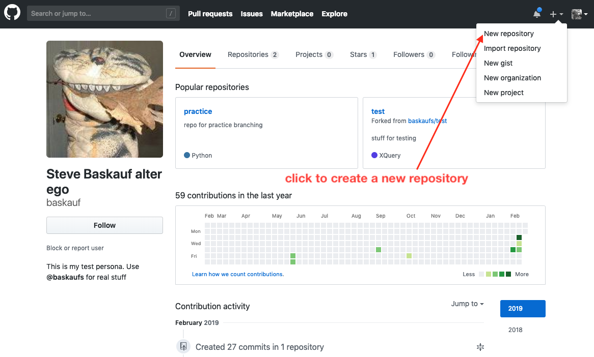

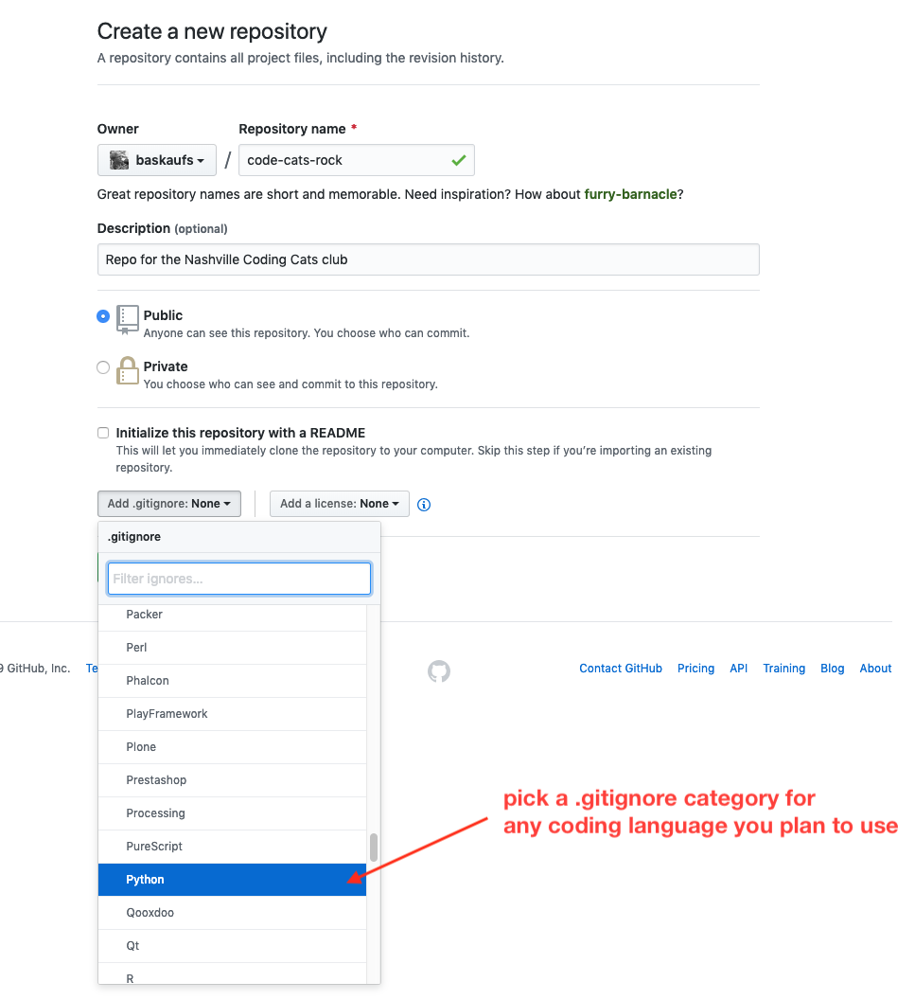

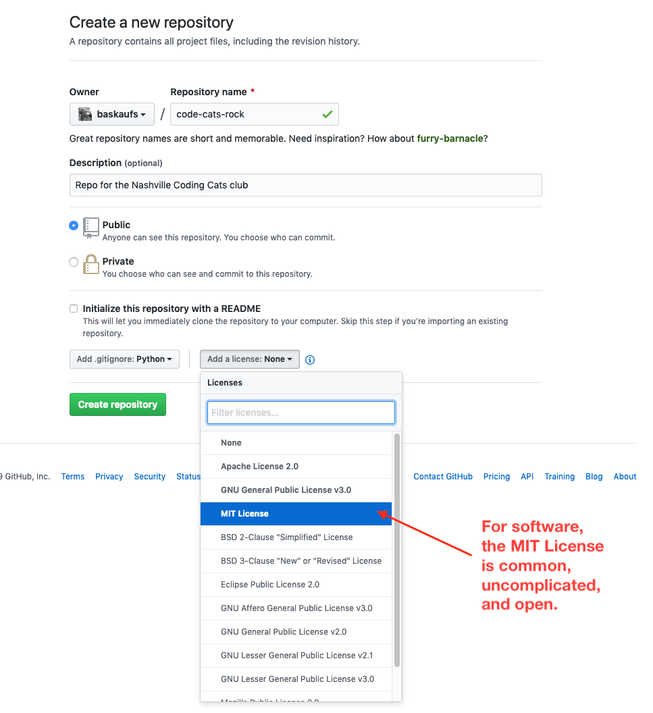

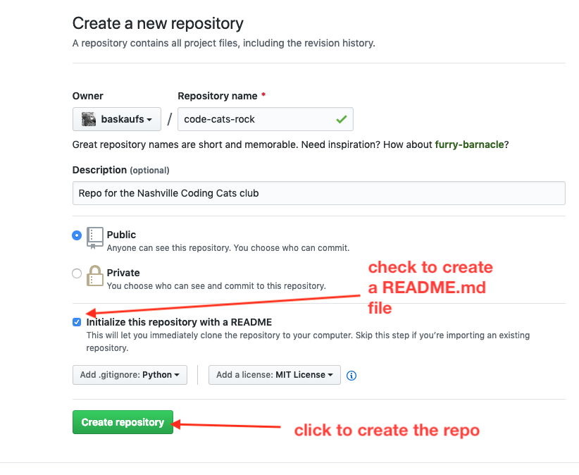

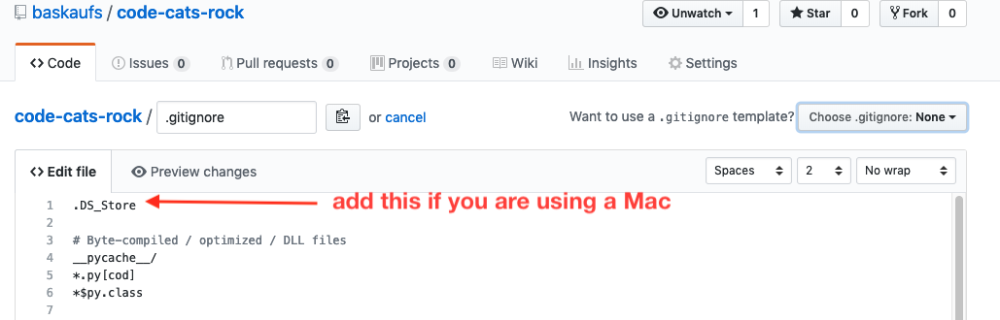

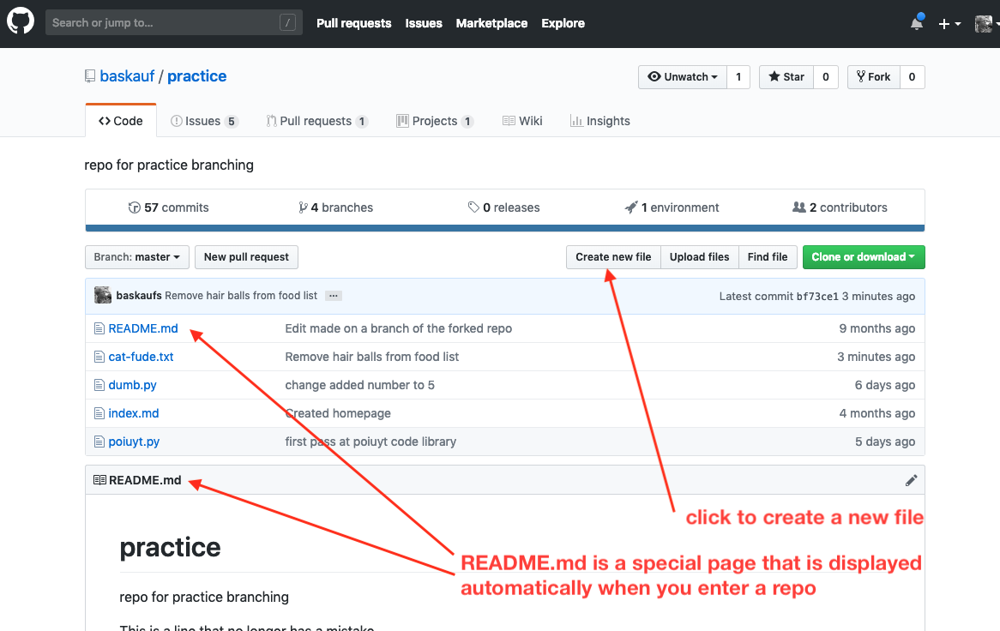

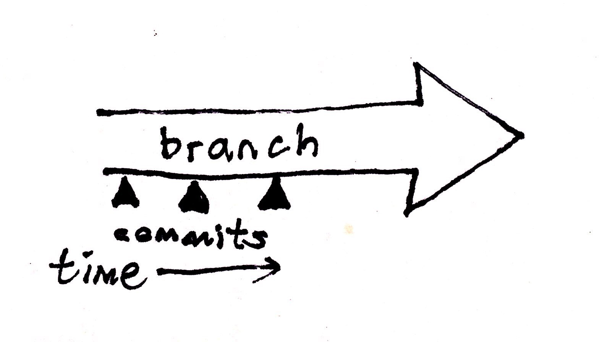

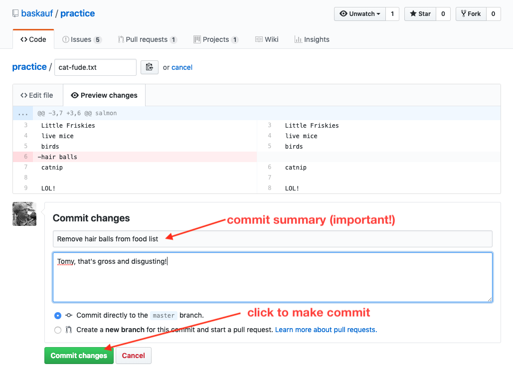

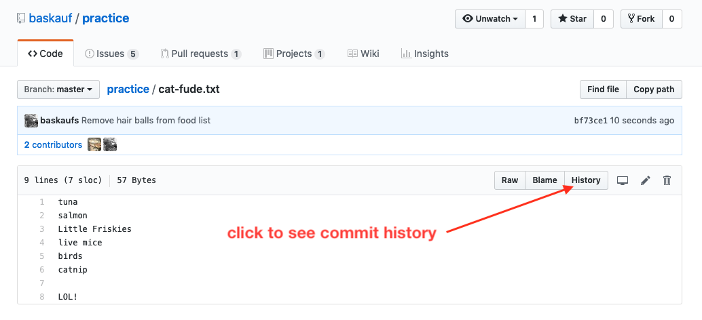

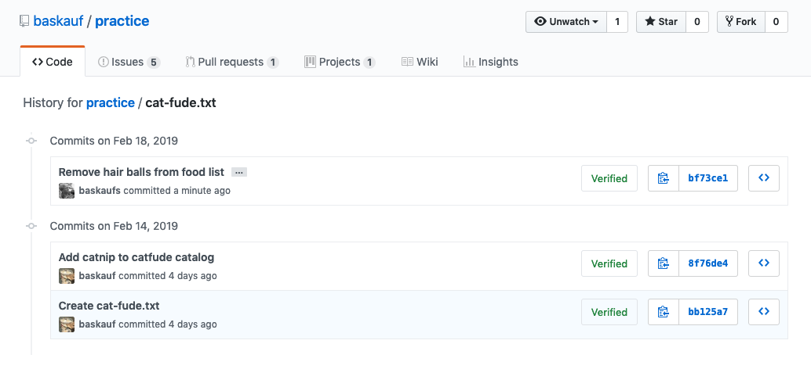

[next page: branching](../branch/)

----
Revised 2019-02-18
