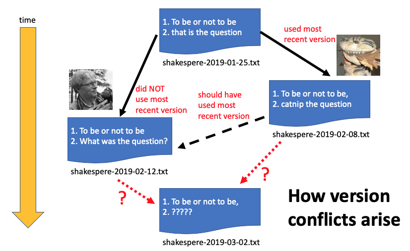

# Version Control

## What is version control?

*Version control* (also known as *source control*) is a system to record changes to files over time.  It makes it possible to track changes in a project over time and to revert back to a previous version if something goes wrong. A good version control system also helps prevent version conflicts (the situation where a collaborator makes edits to a version that is not the most recent version) and provides mechanisms for identifying and fixing version conflicts. Version control systems are also frequently packaged within systems designed to manage collaboration among multiple contributors to a project.

# Version control systems

## A simple manual version control systems

You can simulate a simple version control system by following some file naming and maintenance procedures.  A typical system is to append an [ISO 8601 date](https://en.wikipedia.org/wiki/ISO_8601) to the end of a file name.  Each day during which a file is worked on, the editor saves a copy of the most recent version with today's date appended to the filename.  Older versions of the file are not deleted (at least until the project is completed).  The files are kept in a shared space where every collaborator can find the most recent version.

This serves as a version control system because the order of the versions is made clear by the date in the filename and it is easy to go back to an earlier version to recover material by simply opening up the older file.  This system works relatively well if only a single person works on a file during a given day, and as long as the files are stored in a centralized repository that is accessed by all collaborators.  (If users save their work on the local drive of their computer, they do not have any way to know if another collaborator saved a more recent version somewhere else.)

Here is an example of how a version conflict could arise in this system.  A new file was created on Jan. 25.  On Feb. 8, the first collaborator made an edit to the file and saved it using that date in the filename.  On Feb. 12, the second collaborator made edits to the file, but did not use the most recent version.  That could have happened several ways.  The files may have all been in the shared storage space, but the second collaborator might have not noticed that a revised file was created on Feb. 8.  The first collaborator might have created the file on his local computer, but forgot to move it to the shared space.  Or the second collaborator might have been working on his local computer with an outdated copy of the work that was on the shared storages space.  

In any case, the second collaborator made changes that affected the first collaborator's changes.  If he had been working with the most recent copy, he would have made the changes intentionally, perhaps after consultation with the first collaborator.  However, if the collaborators work on the document on Mar. 2, it is not clear what document really should be the most recent version.  If the second collaborator's Feb. 12 version were used, the changes made by the first collaborator on Feb. 8 would be lost, possibly without the first collaborator's knowledge.  

This is the kind of situation that a good version control system will help avoid.  A good system will also have tools to recognize that a version conflict has arisen and to help resolve it.

## Git and GitHub

One of the most commonly used version control systems is [Git](https://git-scm.com/).  Git is a system that operates on your computer to control interactions between it and a server that centrally manages the version control.

[Software Carpentry lessons on Git](http://swcarpentry.github.io/git-novice/)

Basic Git is a free, open-source system that is typically used via the command line. It's not particularly friendly for beginners, but it can be used in any system.

[GitHub](https://github.com/) is a commercial website and web service that provides a place for groups to manage their projects using Git.  When used for open projects, GitHub is available for free (private repositories require a paid subscription).  GitHub has a free graphical user tool called [GitHub Desktop](https://desktop.github.com/) that enables users to manage their files on GitHub in a simple and relatively intuitive fashion, without requiring the use of command line Git.  However, it can only be used to communicate with GitHub and not other Git-based repository systems.

[DiSC GitHub lessons](github/)

[go to GitHub](https://github.com/)

[view notes from a Vanderbilt Libraries workshop on GitHub](http://heardlibrary.github.io/workshops/tech/2016/01/22/github-ed-tech.html)

## Open Science Framework (OSF)

The Open Science Framework is a permanent data repository.  However, it also includes version control for its native files and enables a form of version control for commonly used tools like Dropbox and Box.  

[read about version control at OSF](http://help.osf.io/m/projectfiles/l/524182-file-revisions-and-version-control)

## Other version control systems

There are other version control systems in use besides Git.  Another commonly used system is [Subversion](https://subversion.apache.org/), an open source system supported by the Apache Software Foundation.  [Jira](https://www.atlassian.com/software/jira), a commonly used project-management system, supports version control with Subversion.  [Mercurial](https://www.mercurial-scm.org/) is another well-known system.

----
Revised 2020-08-31
