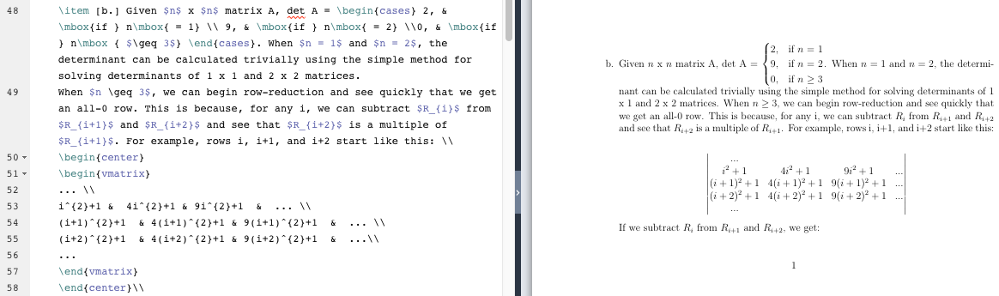
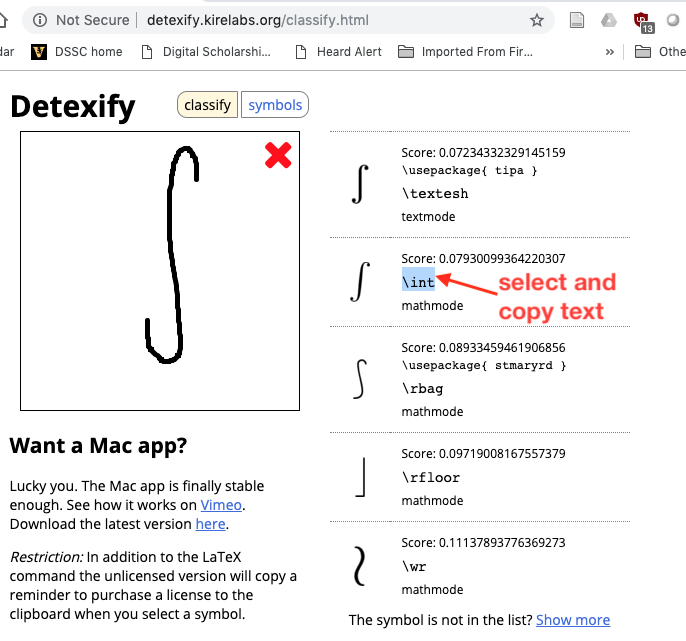

# Document markup

Marking up text documents is an increasingly popular method of encoding information in a way that is both comprehensible to humans, but also machine-processable.  

In their simplest form, markup languages can be used to include processing instructions for text - to indicate how the text should be displayed, for example.  But markup languages can also be used to encode information about the text, making it possible to have a greater understanding of the meaning of the text. 

Because the marked-up documents reside in simple text files, it is relatively easy to open and view them in a text editor.  They are also less likely to become obsolete and unreadable, particularly if the markup language follows a standard.

## Markup languages

There are several commonly used markup languages.  In some cases, the markup languages themselves have been expanded to more specific purposes.  The sections below link to additional information about some common markup systems.

# LaTeX

LaTeX is a markup system generating print quality output with an emphasis on rendering math expressions.

There are several LaTeX editors the provide an editing pane and a WYSIWYG preview pane.  A popular online editor is [Overleaf](https://www.overleaf.com/).  With a free account, you can save documents in the cloud and collaborate with others.  The output is rendered as a PDF that can be downloaded to your local computer.

[TeXworks](http://www.tug.org/texworks/) is a free application for editing LaTeX offline.  It features markup and preview. [MiKTeX](https://miktex.org/) is a processor that includes TeXworks as its front end.

[Detexify](http://detexify.kirelabs.org/classify.html) is a tool that allows you to hand-draw symbols, then choose from its best attempt to match your drawing with known symbols encoded as LaTeX.  The code you choose can be copied and pasted into your LaTeX editor.

## LaTeX Resources

A free online tutorial is available from [ShareLaTeX](https://learn.sharelatex.com/learn/Free_online_introduction_to_LaTeX_(part_1)).

# Markdown

Markdown is increasingly popular as a lightweight way to include formatting in text documents.  It is the markup system used by the popular GitHub repository system.

# XML

XML provides a powerful way to encode complex information in a text document.  It can also be used to impose structure to data.  As a W3C standard, its use is common across the Internet in forms such as XHTML web pages and SVG graphics.  There are also standards for accessing and manipulating XML data, such as XPath, XSLT, and XQuery.

If you are interested in learning more about technology related to XML, check out the [XQuery working group](https://heardlibrary.github.io/xquery-working-group/).

## Basics of XML

[Basic introduction to XML (slides)](resource/adventures-in-xml.pdf) Includes introduction to TEI.

[XPath (slides)](resource/xpath.pdf)

[Validating with schemas (slides)](resource/validating-with-schemas.pdf)

[eXist, a digital platform for XML documents (slides)](resource/exist.pdf)

## Text Encoding Initiative (TEI)

TEI is commonly used in the Digital Humanities to mark up text documents for processing and data extraction.  The Music Encoding Initiative (MEI) is a similar system that is used to mark up text that denotes musical scores.

[Introduction to TEI (slides)](resource/text-encoding-initiative.pdf)

[Exploring Text Encoding Initiative (TEI) markup with XQuery](https://github.com/CliffordAnderson/XQuery4Humanists/blob/master/02-Exploring-TEI-with-XQuery.md) from [XQuery4Humanists](https://github.com/CliffordAnderson/XQuery4Humanists). 

[Critical editions with TEI (slides)](resource/critical-editions-with-tei.pdf)

## XSLT

Extensible Stylesheet Language Transformations (XSLT) is a language for transforming XML documents into other XML documents.

[XSLT presentation (slides)](resource/xslt.pdf)

## XQuery

XQuery is a powerful functional programming language that can operate on XML.  For further information, follow the XQuery links on the [Scripting and Programming Languages page](../script/)

[XQuery presentation (slides)](resource/xquery.pdf)

# JSON

JSON is an increasingly popular way to transmit data in a structured way.  It is probably the most common way that data are provided to software and web pages via APIs.  

----
Revised 2019-09-08