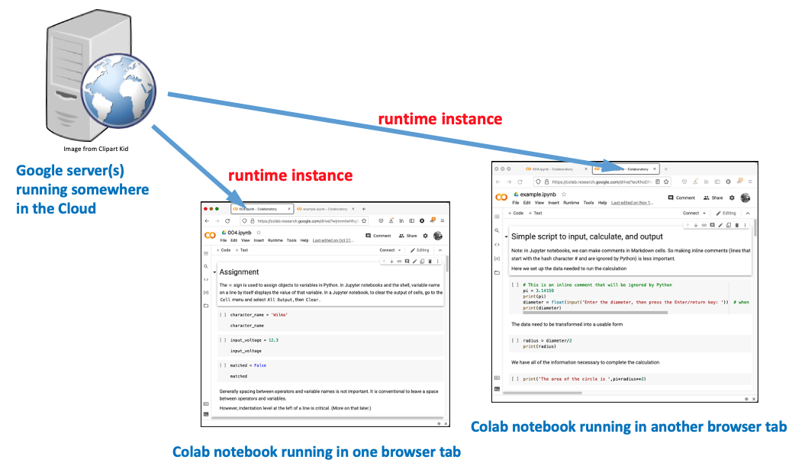

Previous lesson: [Programming environments](../002)

# Quickstart guide for running Python in a Colab notebook

This lesson is for people who want to get started programming Python as quickly as possible using a Colab notebook with no installation required. 

**Learning objectives** At the end of this lesson, the learner will:
- create and edit a blank Colab notebook.
- open someone else's Colab notebook and save their own copy.

Total video time: 

## Links

[Example Colab notebook](https://colab.research.google.com/drive/1ecKhoDFevC_M9mFSDPDu0fGujyQH43Iu)

# Running notebooks in the cloud

Technically, Colab notebooks are not exactly the same as Jupyter notebooks, but they are similar enough that we will consider them to be the same thing. A Jupyter notebook can be uploaded to Colab and a Colab notebook can be downloaded as a Jupyter notebook.

NOTE: If for some reason you cannot use Colab notebooks (e.g. you can't get a Google account or don't have regular access to the Internet), you can run all of the lesson exercises using a local Jupyter notebook installation. See [Installing a programming environment](../003) for more information on this option.

## Running your own Jupyter notebook in Colab (4m22s)

<iframe width="1120" height="630" src="https://www.youtube.com/embed/XbUtlOa-gFQ" frameborder="0" allow="accelerometer; autoplay; encrypted-media; gyroscope; picture-in-picture" allowfullscreen></iframe>

[Google Colaboratory landing page](https://colab.research.google.com/). If presented with an options screen, you can click New Notebook to create a blank notebook or cancel to open an actual Colab notebook that will run. See the next section for information about how to copy this notebook to your own Google Drive. 

Once you have stored your own notebooks, you can select a Recent notebook, or open notebooks from your Google Drive.

----

## Running someone else's Colab notebook (3m35s)

<iframe width="1120" height="630" src="https://www.youtube.com/embed/fxrFqoOsa2w" frameborder="0" allow="accelerometer; autoplay; encrypted-media; gyroscope; picture-in-picture" allowfullscreen></iframe>

[Example notebook in Colab](https://colab.research.google.com/drive/1ecKhoDFevC_M9mFSDPDu0fGujyQH43Iu). The link will open the notebook in read-only mode. To run the notebook without saving, click `Open in playground`, and agree to the warning. Click the play button at the left of each cell in order to run the script. 

In order to be able to save any changes you've made to the script, you need to copy it to your own Google Drive by clicking the `Copy to Drive` link at the upper left, or select `Save a copy in Drive` from the file menu.

To open a notebook cloned to your own Google Drive, go to your Drive, click on the `Colab Notebooks` folder, then a notebook name. Then click on the `Open with Google Colaboratory` button at the top of the screen to open the notebook at the `colab.research.google.com` site. 

# Colab architecture

Because Colab notebooks are running in the cloud, nothing is actually happening on your local computer except that your browser is showing you what's happening on the Colab server. The instance of Python that's running on the server and being displayed in the notebook is called a `runtime`. The runtime can be reset or restarted using the notebook controls but it's terminated by closing the browser window, or after a certain amount of inactivity. (To compare this with how Jupyter notebooks work, see the Jupyter architecture section below.)

----

Next Python lesson: [Python programming basics](../004)

----
Revised 2022-01-07
