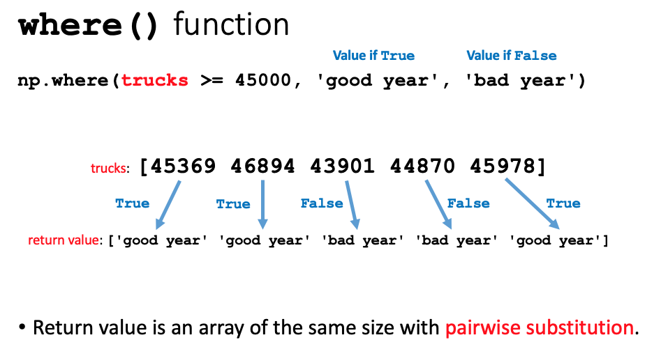

Previous lesson: [Loops](../006b)

# NumPy arrays

Vectorized computing is introduced in this lesson by working with NumPy arrays. NumPy arrays are a data structure that consists of a single type of data and can be one, two, or many-dimensioned. The lesson shows how to specify single elements and slices of the array and how to carry out several simple types of calculations. Image manipulations are used as a practical example to illustrate these principles. 

**Learning objectives** At the end of this lesson, the learner will:
- compare vectorized computing with procedural computing.
- write the standardized import statement for numpy.
- use the numpy `array()` function to generate an ndarray from a list.
- multiply an array by a constant or add two arrays of the same size.
- refer to an element of a one- or two-dimensional array using its indices.
- generate a new array by transforming another array using the numpy `where()` function.
- perform a simple transformation of an image using by operating on an ndarray.

Total video time: 52m 45s

## Links

[Lesson Jupyter notebook at GitHub](https://github.com/HeardLibrary/digital-scholarship/blob/master/code/codegraf/007/007.ipynb)

[Lesson Colab notebook](https://colab.research.google.com/drive/1rH9KIAchnd7ez9YnKpfuEpm-zJHfYpnx)

[CodeGraf project at Azure](https://notebooks.azure.com/steve-baskauf/projects/codegraf) notebook: `007.ipynb`

[Lesson slides](../slides/lesson007.pdf)

Recommended reference: Python for Data Analysis, 2nd Edition by Wes McKinney [via Vanderbilt's catalog](https://catalog.library.vanderbilt.edu/permalink/01VAN_INST/6ll2l/alma991043601866403276) / [direct link to O'Reilly (VUNet login required)](https://learning.oreilly.com/library/view/python-for-data/9781491957653/)


# Vectorized computing with NumPy arrays

## Review of looping through a list (3m10s)

<iframe width="1120" height="630" src="https://www.youtube.com/embed/6cYjQq1usJ8" frameborder="0" allow="accelerometer; autoplay; encrypted-media; gyroscope; picture-in-picture" allowfullscreen></iframe>

Code example:

```
price_list = [3.89, 14.78, 20.01, 99.62, 0.47]
euro_conversion_factor = 0.93

# Use a for loop to multiply each item by the conversion factor
euro_list = []
for price in price_list:
    euro_list.append(price * euro_conversion_factor)

print(euro_list)
```

----

## Introduction to vectorized computing (7m34s)

<iframe width="1120" height="630" src="https://www.youtube.com/embed/qCwY0cxOz_Q" frameborder="0" allow="accelerometer; autoplay; encrypted-media; gyroscope; picture-in-picture" allowfullscreen></iframe>

[Direct link to Chapter 4 of Python for Data Analysis, "NumPy Basics: Arrays and Vectorized Computation" (VUNet login required)](https://learning.oreilly.com/library/view/python-for-data/9781491957653/ch04.html#numpy)

Code example:

```
import numpy as np
price_list = [3.89, 14.78, 20.01, 99.62, 0.47]
euro_conversion_factor = 0.93

euro_array = price_array * euro_conversion_factor
print(euro_array)
```

The procedural approach requires the operation to be applied to each item one at a time.

The vectorized approach automatically applies the operation to all elements of the array.

Operations on NumPy arrays are carried out 10 to 100 times faster than on "normal" Python lists.


----

# NumPy ndarrays

## Array dimensions (3m52s)

<iframe width="1120" height="630" src="https://www.youtube.com/embed/Fq6sft8rtrY" frameborder="0" allow="accelerometer; autoplay; encrypted-media; gyroscope; picture-in-picture" allowfullscreen></iframe>

One dimension is like a list:
```
[ 3.89 14.78 20.01 99.62 0.47]
```

Two dimensions are like a table:
```
[[34506 35446 40190 43824 46456]
 [45369 46894 43901 44870 45978] 
 [21554 28745 34369 43593 53982]]
```

More than two dimensions are possible

Code example:
```
annual_sales_cars = [34506, 35446, 40190, 43824, 46456]
annual_sales_trucks = [45369, 46894, 43901, 44870, 45978]
annual_sales_suvs = [21554, 28745, 34369, 43593, 53982]

annual_sales_array = np.array([annual_sales_cars, annual_sales_trucks, annual_sales_suvs])
print(annual_sales_array)

print(annual_sales_array.ndim)
print(annual_sales_array.shape)
print(annual_sales_array.dtype)
```


----

## Array indices and slices (4m46s)

<iframe width="1120" height="630" src="https://www.youtube.com/embed/JTjCBWGOnLE" frameborder="0" allow="accelerometer; autoplay; encrypted-media; gyroscope; picture-in-picture" allowfullscreen></iframe>


Image from "Python for data analysis: data wrangling with pandas, NumPy, and IPython" by Wes McKinney, Chapter 4

Example:

```
print(annual_sales_array)
print(annual_sales_array[0, 2])
print(annual_sales_array[0])
print(annual_sales_array[:, 2])
```

----

## Array-based calculations (5m47s)

<iframe width="1120" height="630" src="https://www.youtube.com/embed/W9q_sz9vPTI" frameborder="0" allow="accelerometer; autoplay; encrypted-media; gyroscope; picture-in-picture" allowfullscreen></iframe>

Code examples:

```
# Convert annual sales to daily sales
daily_sales_array = annual_sales_array/365
print(daily_sales_array)
```



```
assessment = np.where(trucks >= 45000, 'good year', 'bad year')
print(assessment)
```

----

# Images

## Representing images as ndarrays (5m54s)

<iframe width="1120" height="630" src="https://www.youtube.com/embed/vzKFTJlRLtg" frameborder="0" allow="accelerometer; autoplay; encrypted-media; gyroscope; picture-in-picture" allowfullscreen></iframe>

Code example:

```
import skimage.data as data
import matplotlib.pyplot as plt

camera = data.camera()
print(type(camera)
print(camera)
plt.imshow(camera, cmap='gray')
plt.show();
```

----

## Manipulating images (8m15s)

<iframe width="1120" height="630" src="https://www.youtube.com/embed/UI5_myx3HxI" frameborder="0" allow="accelerometer; autoplay; encrypted-media; gyroscope; picture-in-picture" allowfullscreen></iframe>

Code examples:

```
# Negative
inverse_camera = 255 - camera
plt.imshow(inverse_camera, cmap='gray')
plt.show();

# Threshold (black and white)
threshold_camera = data.camera()

# Method 1: Set pixels less than mid-gray to black
threshold_camera[threshold_camera < 128] = 0
# Set remaining pixels to white
threshold_camera[threshold_camera > 0] = 255
plt.imshow(threshold_camera, cmap='gray')
plt.show();

# Method 2: Screen pixels using np.where()
threshold_camera = np.where(camera < 128, 0, 255)
plt.imshow(threshold_camera, cmap='gray')
plt.show();
```

Thanks to Sanjay Mishra for these examples of making simple manipulations to images using NumPy.

----

# Practice

1. Create a one-dimensional numpy array containing only the annual SUV sales.
2. Create a one-dimensional array of annual car sales, then calculate the difference between car and SUV sales for each year.
3. Calculate the total sales for cars, trucks, and SUVs for the second year (index 1) using the `np.sum()` function, which take an array as its argument.
4. Generalize the function for lightening a photo by any number of grayscale units. Ask the user for input, then display the picture. 

## Practice live coding

**Practice problem 1** (1m28s)

<iframe width="1120" height="630" src="https://www.youtube.com/embed/IpPmHfSKveI" frameborder="0" allow="accelerometer; autoplay; encrypted-media; gyroscope; picture-in-picture" allowfullscreen></iframe>


----

**Practice problem 2** (2m28s)

<iframe width="1120" height="630" src="https://www.youtube.com/embed/n6I6XcY8V1Y" frameborder="0" allow="accelerometer; autoplay; encrypted-media; gyroscope; picture-in-picture" allowfullscreen></iframe>


----

**Practice problem 3** (3m00s)

<iframe width="1120" height="630" src="https://www.youtube.com/embed/5BiYvt8DVEY" frameborder="0" allow="accelerometer; autoplay; encrypted-media; gyroscope; picture-in-picture" allowfullscreen></iframe>


----

**Practice problem 4** (7m01s)

<iframe width="1120" height="630" src="https://www.youtube.com/embed/cWndTYPEXE0" frameborder="0" allow="accelerometer; autoplay; encrypted-media; gyroscope; picture-in-picture" allowfullscreen></iframe>


----


Next lesson: [Pandas data frames](../008)


----
Revised 2020-05-15
