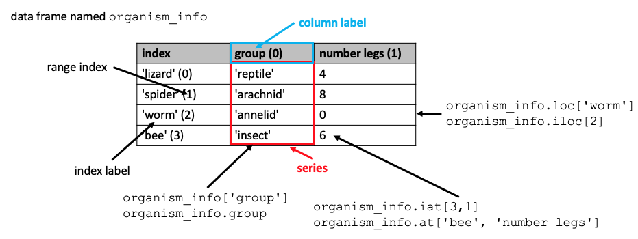

Previous lesson: [NumPy arrays](../007)

# Pandas data frames

This lesson introduces the [pandas library for Python](https://pandas.pydata.org/) and the two data structures that it introduces: *series* and *data frames*. Series are one-dimensional objects built from NumPy arrays. Data frames are spreadsheet-like data structures whose columns are built from series. Data frames can be built from scratch, but more often they are created by loading data from spreadsheets or other tabular data sources. In this lesson, we will see how to load data into a data frame from an Excel file in your local file system and a CSV file using a URL for a file on GitHub.

**Learning objectives** At the end of this lesson, the learner will:
- import the pandas module using the conventional statement.
- describe how pandas series are related to NumPy arrays.
- instantiate a series from a list and assign labels to its index.
- refer to a series item using either its index integer or label.
- write the expression for a slice of a series using either integers or labels.
- describe the relationship between a data frame and the series of which it is made.
- describe how the idex of the data frame is related to positions of the column series.
- display the first five lines of a data frame.
- refer to a column of a data frame by its label.
- refer to a row of a data frame using `.loc[]` and `.iloc[]`.
- refer to the cell of a data fram using `.at[]` and `.iat[]`.
- load data into a data frame from an Excel or CSV file using the file system (local or cloud).
- set the index label values of a data frame after it's loaded from a spreadsheet.
- load data into a data frame using a URL.

Total video time: 61 m 17s

## Links

[Lesson Jupyter notebook at GitHub](https://github.com/HeardLibrary/digital-scholarship/blob/master/code/codegraf/008/008.ipynb)

[Lesson Colab notebook](https://colab.research.google.com/drive/1no93zzR5OhXATB1phsyCSxUSlQu7VCzF)

[CodeGraf project at Azure](https://notebooks.azure.com/steve-baskauf/projects/codegraf) notebook: `008.ipynb`

[Lesson slides](../slides/lesson008.pdf)

# Series

## Introduction to Pandas (2m56s)

<iframe width="1120" height="630" src="https://www.youtube.com/embed/tQ1kXMkpKhM" frameborder="0" allow="accelerometer; autoplay; encrypted-media; gyroscope; picture-in-picture" allowfullscreen></iframe>

The conventional import statement for pandas is:
```
import pandas as pd
```

All of the examples in the rest of this lesson assume that you've executed this statement and assigned pandas to the abbreviation `pd`.

----

## Creating series (7m31s)

<iframe width="1120" height="630" src="https://www.youtube.com/embed/Cp-RxkYrCvY" frameborder="0" allow="accelerometer; autoplay; encrypted-media; gyroscope; picture-in-picture" allowfullscreen></iframe>

Pandas *series* are created from a NumPy array with an index composed of an integer range and optional string labels.

The form of the statement to create a series with item labels is:

```
series_name = pd.Series(values_list, index = labels_list)
```

If the `index = labels_list` argument is omitted, the series will have only integer indices.

----

## Referring to parts of series (3m36s)

<iframe width="1120" height="630" src="https://www.youtube.com/embed/F1ak-vMzaz4" frameborder="0" allow="accelerometer; autoplay; encrypted-media; gyroscope; picture-in-picture" allowfullscreen></iframe>

Series values can be referred to by either their integer index or their index label:
```
labeled_groups[1]
labeled_groups['bee']
```

Series slices can be denoted using either integer indices or labels:
```
labeled_legs[1:3]
labeled_groups['lizard': 'worm']
```

Slices denoted by numbers do not include the last numbered item, but slices denoted by labels include the last labeled item. Slices can also be denoted by a list of item labels:

```
labeled_groups[['worm', 'spider', 'lizard']]
```


----

# Data frames

## Creating a data frame from scratch (3m35s)

<iframe width="1120" height="630" src="https://www.youtube.com/embed/d1Z-SI8uU-M" frameborder="0" allow="accelerometer; autoplay; encrypted-media; gyroscope; picture-in-picture" allowfullscreen></iframe>

The form of the statement to create a data frame with row labels is:

```
dataframe_name = pd.DataFrame(data_dictionary, index = label_list)
```

For more information about the Python dictionary data structure, see [this lesson](https://heardlibrary.github.io/digital-scholarship/script/python/json/).

----

## Referring to parts of a data frame (4m14s)

<iframe width="1120" height="630" src="https://www.youtube.com/embed/hK5Gn5EYfCc" frameborder="0" allow="accelerometer; autoplay; encrypted-media; gyroscope; picture-in-picture" allowfullscreen></iframe>

Columns of a data frame can be referred to by their label in two ways:

```
organism_info['group']
organism_info.group
```

The "dot notation" can only be used if the column label is a valid Python object name (i.e. can't have spaces). The resulting object is a series whose values are the values in the column indexed by the row indices.

Rows in a data frame can be referred to by either their integer index (using `.iloc[]`) or their index label (using `.loc[]`):

```
organism_info.loc['worm']
organism_info.iloc[0]
```

The resulting object is a series whose values are the values in the row indexed by the column headers.

Cells in a data frame can be referred to by either their row, column integers (using `.iat[]`) or row, column labels (using `.at[]`):

```
organism_info.iat[2, 1]
organism_info.at['spider', 'group']
```

The resulting object has the type of the cell value.

----

## Review of data frames (1m33s)

<iframe width="1120" height="630" src="https://www.youtube.com/embed/oJKj58dxyrE" frameborder="0" allow="accelerometer; autoplay; encrypted-media; gyroscope; picture-in-picture" allowfullscreen></iframe>



----

# Loading files from your file system

Of the next five videos, you should watch only the one(s) that are appropriate for the environment in with you are running Jupyter notebooks.

## Loading a data file in Azure notebooks (4m00s)

<iframe width="1120" height="630" src="https://www.youtube.com/embed/_SYsbg512NU" frameborder="0" allow="accelerometer; autoplay; encrypted-media; gyroscope; picture-in-picture" allowfullscreen></iframe>


----

## Loading a data file in Google Colabs (5m08s)

<iframe width="1120" height="630" src="https://www.youtube.com/embed/hfOAyJw8Xfw" frameborder="0" allow="accelerometer; autoplay; encrypted-media; gyroscope; picture-in-picture" allowfullscreen></iframe>


----

## Variation in the behavior of mounting Google Drive in Colab (3m05s)

<iframe width="1120" height="630" src="https://www.youtube.com/embed/zYHVzPV3djs" frameborder="0" allow="accelerometer; autoplay; encrypted-media; gyroscope; picture-in-picture" allowfullscreen></iframe>


----

## Loading a data file into a local Jupyter notebook under Mac OS (4m54s)

<iframe width="1120" height="630" src="https://www.youtube.com/embed/pedaEJGIYI8" frameborder="0" allow="accelerometer; autoplay; encrypted-media; gyroscope; picture-in-picture" allowfullscreen></iframe>


----

## Loading a data file into a local Jupyter notebook under Windows OS (5m54s)

<iframe width="1120" height="630" src="https://www.youtube.com/embed/MWONQtQHPzk" frameborder="0" allow="accelerometer; autoplay; encrypted-media; gyroscope; picture-in-picture" allowfullscreen></iframe>


----

The remaining videos apply to all environment types.

## Creating a data frame from an Excel file (5m44s)

<iframe width="1120" height="630" src="https://www.youtube.com/embed/mTRm-DNfa7I" frameborder="0" allow="accelerometer; autoplay; encrypted-media; gyroscope; picture-in-picture" allowfullscreen></iframe>

Example script to load an Excel file from your file system:
```
import os
working_directory = os.getcwd()
print(working_directory)
filename = 'co2_state_2016_fuel.xlsx'
path = working_directory + '/data/' + filename
fuel_type = pd.read_excel(path)
print(fuel_type)
```

----

## Review of data frame attributes and methods (0m47s)

<iframe width="1120" height="630" src="https://www.youtube.com/embed/nB3Plmz3b7E" frameborder="0" allow="accelerometer; autoplay; encrypted-media; gyroscope; picture-in-picture" allowfullscreen></iframe>

Use the `.head()` method to view only the first few lines of a data frame (default is 5 if `number_of_lines` argument omitted):
```
dataframe.head(number_of_lines)
```

The `.index` attribute contains the index labels. To set the values of a data frame's index labels after it's created, assign a list or list-like thing (e.g. a series) to the value of the `.index` attribute.

----

## Summary of functions to read from and write to files (1m07s)

<iframe width="1120" height="630" src="https://www.youtube.com/embed/IZeWvmtmvgk" frameborder="0" allow="accelerometer; autoplay; encrypted-media; gyroscope; picture-in-picture" allowfullscreen></iframe>


The following functions can be used to load data from a file into a data frame or vice-versa:

`pd.read_csv()` to read from a CSV file into a data frame.

`pd.to_csv()` to write from a data frame to a CSV file.

`pd.read_excel()` to read from an Excel file into a data frame.

`pd.to_excel()` to write from a data frame to an Excel file.

The read functions can be performed using a web URL as an alternative to a file path.

There are many additional functions to read and write from other table-like data sources such as tab-separated values files, APIs, and databases. See [Section 6.1 of Python for Data Analysis (2nd ed.)](https://learning.oreilly.com/library/view/python-for-data/9781491957653/ch06.html)  or Chapter 3 of [pandas: powerful Python data analysis toolkit](https://pandas.pydata.org/docs/pandas.pdf) for many options.


----

# Loading files from a URL

## Loading a data file into a Jupyter notebook from a URL (any platform) (3m07s)

<iframe width="1120" height="630" src="https://www.youtube.com/embed/GiyTFQ2F3rI" frameborder="0" allow="accelerometer; autoplay; encrypted-media; gyroscope; picture-in-picture" allowfullscreen></iframe>

Note: when loading files via a URL, be sure that the URL delivers the raw file, not an HTML representation of the file.

For more information about working with CSV files and about their structure, see [this lesson](https://heardlibrary.github.io/digital-scholarship/script/python/inout/#csv-files). CSV files can be created and opened using Microsoft Excel. However, for serious work with CSV files, [LibreOffice](https://www.libreoffice.org/) or [OpenOffice](https://www.openoffice.org/) is recommended.

----

## Reading a CSV file from a URL (2m03s)

<iframe width="1120" height="630" src="https://www.youtube.com/embed/UTazGZrXTc0" frameborder="0" allow="accelerometer; autoplay; encrypted-media; gyroscope; picture-in-picture" allowfullscreen></iframe>

Note: `NaN` ("not a number") is an object used by pandas to indicate missing data in a data frame. When data are loaded from a spreadsheet, empty cells are converted to `NaN` values.

----

## View vs. copy (4m21s)

<iframe width="1120" height="630" src="https://www.youtube.com/embed/L_1rOWe-wvo" frameborder="0" allow="accelerometer; autoplay; encrypted-media; gyroscope; picture-in-picture" allowfullscreen></iframe>

Assigning a slice of a dataframe to a variable creates a "view" of the dataframe, not a copy. Editing the view can affect the original dataframe and can sometimes have unpredictable consenquences. To create a copy rather than a view, use the `.copy()` method (no arguments). See [this page](https://pandas.pydata.org/pandas-docs/stable/user_guide/indexing.html#returning-a-view-versus-a-copy) for technical details. 


----
Revised 2020-05-19
