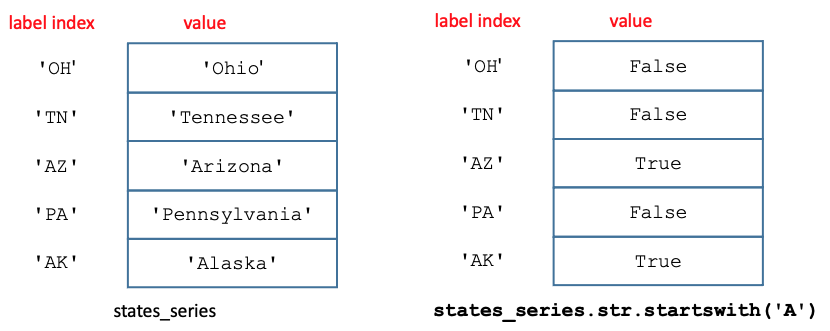
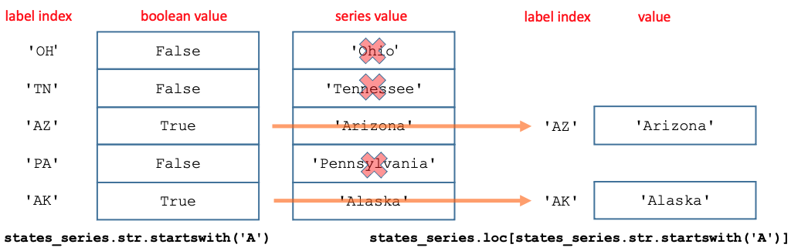

Previous lesson: [Reading and writing CSV files](../022) or

[optional lesson on NumPy arrays](../007)

# Pandas series

This lesson introduces the [pandas library for Python](https://pandas.pydata.org/) and one of the data structures that it introduces: *Series*. Series are one-dimensional objects built from NumPy arrays. This lesson covers the way that Series items are designated and how Series are sliced using `.loc()` and `.iloc()`. It also discusses the distinction between views and copies, and ways that changes to Series can be made to persist.

**Learning objectives** At the end of this lesson, the learner will:
- import the pandas module using the conventional statement.
- instantiate a Series from a dictionary.
- refer to a Series item using either its label index or integer position using `.loc[]` and `.iloc[]`.
- describe how pandas Series are related to NumPy arrays.
- write the expression for a slice of a Series by specifying a range of label indices or integer positions using `.loc[]` and `.iloc[]`.
- use a boolean condition to slice a Series.
- describe the difference between a *view* and a *copy* of a Series.
- force the result of a slicing operation to produce a copy of the slice rather than a view.
- list three ways to make the result of an operation on a Series persist rather than just being displayed.

Total video time: 33m 36s

## Links

[Lesson Jupyter notebook at GitHub](https://github.com/HeardLibrary/digital-scholarship/blob/master/code/codegraf/008/008.ipynb)

[Lesson Colab notebook](https://colab.research.google.com/drive/)

[Lesson slides](../slides/lesson008.pdf)

[pandas user guide](https://pandas.pydata.org/docs/user_guide/)

# Series

## Introduction to Pandas (2m50s)

<iframe width="1120" height="630" src="https://www.youtube.com/embed/HFLSlryCqxU" frameborder="0" allow="accelerometer; autoplay; encrypted-media; gyroscope; picture-in-picture" allowfullscreen></iframe>

The conventional import statement for pandas is:
```
import pandas as pd
```

All of the examples in the rest of this lesson assume that you've executed this statement and assigned pandas to the abbreviation `pd`.

----

## Review of one-dimensional Python data structures (1m32s)

<iframe width="1120" height="630" src="https://www.youtube.com/embed/Kqjn7FbDwzg" frameborder="0" allow="accelerometer; autoplay; encrypted-media; gyroscope; picture-in-picture" allowfullscreen></iframe>

Dictionaries are addressable by key:

```
states_dict = {'OH': 'Ohio', 'TN': 'Tennessee', 'AZ': 'Arizona', 'PA': 'Pennsylvania', 'AK': 'Alaska'}
print(states_dict['TN'])
```

Lists are addressable by integer index:

```
animal_list = ['lizard', 'spider', 'worm', 'bee']
print(animal_list[2])
```

----

## Introduction to pandas Series (5m59s)

<iframe width="1120" height="630" src="https://www.youtube.com/embed/RXFjPbUWH6I" frameborder="0" allow="accelerometer; autoplay; encrypted-media; gyroscope; picture-in-picture" allowfullscreen></iframe>

The form of the statement to create a Series from a Python dictionary is:

```
series_name = pd.Series(values_dictionary)
```

pandas *Series* are similar to both lists and dictionaries since they can be indexed by either a label index (similar to a dictionary key) or an integer position index (similar to the index of a list). 

```
states_series = pd.Series(states_dict)
print(states_series[2])
print(states_series['TN'])
```

**NOTE:** As with other Python indexing, the integer position index is zero-based (counting starts with zero). So an integer index of 2 locates the 3rd item in the Series.

To avoid ambiguity, the indexing system can be made explicit by indexing using `.loc[]` for label indices and `.iloc[]` for integer position indexing:

```
states_series.loc['TN']
states_series.iloc[2]
```

Do not associate the "i" in `.iloc[]` with the word "index", since "index" is used generically to describe the label index. It's better to think of the "i" as representing "integer".

A pandas Series is composed of a NumPy array with an associated label index object. Basing the Series data structure on a NumPy array allows the Series to be used in vectorized operations and provides better performance than with basic Python data structures like lists and dictionaries.

The `.values` attribute of a Series returns the NumPy array and the `.index` attribute returns the label index. Both are iterable.

----

# Extracting parts of Series

In addition to specifying a particular item in a series, `.loc[]` and `.iloc[]` can be used to extract a part of the series (a "slice") based on one of several mechanisms. The resulting slice is also a pandas Series, and the label indices from the original Series are maintained in the slice.

## Slicing pandas Series by index (5m07s)

<iframe width="1120" height="630" src="https://www.youtube.com/embed/5Wu8HFdz9Gg" frameborder="0" allow="accelerometer; autoplay; encrypted-media; gyroscope; picture-in-picture" allowfullscreen></iframe>

Series slices can be denoted using a range of either label indices or integer positions:
```
states_series.loc['TN':'PA']
states_series.iloc[1:4]
```

Slices denoted by integer position do not include the last numbered item, but slices denoted by labels include the last labeled item. In the examples above, the item with the index `PA` will be included in the first slice but the item in position 4 will not be included in the second slice.

Slices can also be denoted by a list of labels or integers:

```
states_series.loc[ ['TN', 'AK', 'OH'] ]
states_series.iloc[ [1, 3, 0] ]
```

The order of items in the slice will be the order of the indices in the list and all listed indices will be included.

----

## Slicing pandas Series by boolean conditions (3m30s)

<iframe width="1120" height="630" src="https://www.youtube.com/embed/M1YFlf6OLpU" frameborder="0" allow="accelerometer; autoplay; encrypted-media; gyroscope; picture-in-picture" allowfullscreen></iframe>

The items to be included in a slice can also be selected using a boolean Series passed into `.loc[]`. The label indices of the boolean series should match the label indices of the Series to be sliced on an item by item basis. This is usually accomplished by generating the boolean Series by performing a vectorized operation that produces a boolean on the Series to be sliced. 

For example, the method `.startswith()` will produce a Series of booleans based on whether each corresponding string value from a source Series begins with the string passed in as an argument. The following expression generates a Series of booleans with a `True` value when the string value starts with the character `A`:

```
states_series.str.startswith('A')
```



If the resulting boolean Series is passed into `.loc[]`, the resulting slice will include each item in the source Series for which the condition is `True`.



The label indices are maintained for the values in the resulting slice.

----

## Slices vs. copies (10m15s)

<iframe width="1120" height="630" src="https://www.youtube.com/embed/n6A_g2Dukn0" frameborder="0" allow="accelerometer; autoplay; encrypted-media; gyroscope; picture-in-picture" allowfullscreen></iframe>

When a slice is generated from a Series, its values are not independent from the values in the original Series. The slice is a `view` of the original Series and making changes to the slice can affect the original series. (This is a general behavior of Python objects that are derived from other mutable Python objects.) 

If we want the slice to be independent from the original series we can use the `.copy()` method to make the slice an actual copy of the original series rather than a view of it.

```
states_slice_view = states_series.loc['TN':'PA']

states_slice_copy = states_series.loc['TN':'PA'].copy()
```

----

# Making changes to pandas data objects permanent (4m23s)

<iframe width="1120" height="630" src="https://www.youtube.com/embed/N7L7ezG7vJA" frameborder="0" allow="accelerometer; autoplay; encrypted-media; gyroscope; picture-in-picture" allowfullscreen></iframe>

If we execute a slicing operation or some other operation that acts on a Series, such as `.sort_values()`, a view is returned and will be displayed below the cell in the notebook. However, that action does not result in any permanent change, since the result is simply being displayed. This is different from the behavior of the `.sort()` list method, which results in a change to the original list when it is executed.

There are three ways that we can make the change generated by the operation persist:

1\. Create a copy and assign a new name to the resulting object:

```
sorted_series = states_series.sort_values().copy()
```

2\. Assign the resulting object to the name of the original object. Since the new object replaces the old one, it is not necessary to use the `.copy()` method.

```
state_series = states_series.sort_values()
```

3\. Use an `inplace=True` argument in the method. When using this strategy, nothing is returned by the method, so no assignment operator is necessary. The result of the method replaces the original object.

```
states_series.sort_values(inplace=True)
```

NOTE: as of October 2022, there is some discussion of deprecation the `inplace` argument since it is considered to have some unintended pitfalls. So it is probably better to use the second strategy.

**Additional notes about sorting Series:**

- The `.sort_index()` method can be used to sort the series by the label index instead of by the value.
- An `ascending=False` argument can be used to sort in descending order instead of the default ascending order. When the series items are strings, this produces reverse alphabetical order.


----

# Series without explicit label indices (optional)

If a Series is created from an object without assigned labels (e.g. a list or NumPy array), pandas will generate label indices from a sequence of integers starting with zero. 

```
animal_list = ['lizard', 'spider', 'worm', 'bee']
animal_series = pd.Series(animal_list)
```

In the initial Series, the label index and integer (position) index will be the same for every item. However, if the Series is modified by sorting or slicing, the originally assigned integer label indices will remain associated with their values, but the integer position index will start with 0 for the first item. 

Since this situation can be confusing, it is desirable to assign some kind of unique label identifier to the items when the Series is created. This can be done using an `index` argument.

```
id_animal_series = pd.Series(animal_list, index=['a', 'b', 'c', 'd'])
```


----

# Practice exercises

The following exercises use data queried from Wikidata. To acquire the data, run the first cell in the example notebook: 

```
import requests

def get_wikidata():
    query_string = '''select distinct ?qid ?label where {
  ?qid wdt:P195 wd:Q18563658. # must be in the collection Vanderbilt University Fine Arts Gallery
  ?qid wdt:P18 ?image. # item must be depicted in Wikimedia Commons
  ?qid rdfs:label ?label. # get the label
  filter(lang(?label)='en') # filter the labels to include only English
  }'''
    
    response = requests.get('https://query.wikidata.org/sparql', params={'query' : query_string}, headers={'Accept': 'application/sparql-results+json'})
    data = response.json()
    results = data['results']['bindings']
    
    urls = []
    labels = []
    for result in results:
        urls.append(result['qid']['value'])
        labels.append(result['label']['value'])
    return urls, labels

urls, labels = get_wikidata()
```

The result is a list of URLs and labels for artworks, which can be used to generate a series using the code in the second cell in the example notebook:

```
import pandas as pd
labels_series = pd.Series(labels, index=urls)
labels_series.head()
```

**NOTE:** In the notebook environment, the URLs should be hyperlinked. So you should be able to click on them to see what the artworks look like.

1\. Determine how many items are in the series using the `len()` function. Display the first 10 and the last 10 items in the Series.

2\. Use `.loc[]` to display the item that has the label index `http://www.wikidata.org/entity/Q105096111`. 

3\. Use `.iloc[]` to slice the Series to include the 4th through 6th items in the series (should include 3 results). Pay attention to the fact that counting starts with zero and that the list integer index you specify isn't included in the range.

4\. Slice the Series by boolean condition to include only labels that contain the word `jar`. The method for doing this is similar to the `.startswith()` method used in the examples: `.contains()`. You need to apply it to the `.str` attribute, like this: `.str.contains('jar')`. 

5\. Make the results case insensitive by passing in a `case=False` argument into the `.contains()` method. How many additional results does this produce?

6\. Create a copy of the slice and assign it the name `jars`. Sort the Series of jars by index and by value.

7\. Create a script that allows the user to enter the string they would like to search for within the labels. Try your script with `soba` and `virgin`. 

----


Next lesson: [DataFrame manipulation](../009a)


----
Revised 2022-11-01
