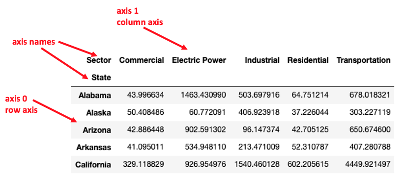

Previous lesson: [Pandas data frames](../008)

# Data wrangling

Preparing data for analysis and visualization can involve cleaning, reformatting, summarizing, and changing the organization of the data. This lesson introduces a number of basic data manipulations that may be required to "wrangle" your data into a usable form. It provides background for additional exploration of the data wrangling capabilities of pandas.

**Learning objectives** At the end of this lesson, the learner will:
- create row index labels from a generic column containing text strings using the `.set_index()` method.
- move row index labels to a generic column using the `.reset_index()` method.
- make changes to a source data frame using the `inplace=` argument.
- define *axis* and associate the two pandas DataFrame axes with rows and columns.
- remove rows or columns using the `.drop()` method.
- replace missing values in a DataFrame or column using the `.fillna()` method.
- sort DataFrame rows using the `.sort_vlaues()` method.
- select rows for a view using the `.notnull()` or `.isnull()` methods.
- select rows for a view using boolean conditions as index selectors.
- slice rows or columns by index labels using the `.loc()` method.
- slice rows or columns by index integers using the `.iloc()` method.
- transpose a DataFrame using the `.transpose()` (`.T`) method.
- use grouping to view a subset of a dataframe using `.groupby()` and `.get_group()`.
- generate summary data using `.sum()` or `.mean()` with or without `.groupby()`.
- transform a series having a grouping variable index label to a "wide" DataFrame using `.unstack()`.
- change a "wide" DataFrame to a "long" DataFrame using the `melt()` function.
- change a "long" DataFrame to a "wide" DataFrame using the `.pivot()` method.
- merge two DataFrames by an inner or outer join using the `merge()` function.

Total video time: 75m 7s

## Links

[Lesson Jupyter notebook at GitHub](https://github.com/HeardLibrary/digital-scholarship/blob/master/code/codegraf/009/009.ipynb)

[Lesson Colab notebook](https://colab.research.google.com/drive/1UoNY7aGelHGzICvrz-RRw0_R2XivD9MD)

[CodeGraf project at Azure](https://notebooks.azure.com/steve-baskauf/projects/codegraf) notebook: `009.ipynb`

[Lesson slides](../slides/lesson009.pdf)

# Basic DataFrame manipulation

## Introduction to data wrangling (2m04s)

<iframe width="1120" height="630" src="https://www.youtube.com/embed/G_eKb8zsKTA" frameborder="0" allow="accelerometer; autoplay; encrypted-media; gyroscope; picture-in-picture" allowfullscreen></iframe>


----

## Setting labels (4m45s)

<iframe width="1120" height="630" src="https://www.youtube.com/embed/uXTpu-366QU" frameborder="0" allow="accelerometer; autoplay; encrypted-media; gyroscope; picture-in-picture" allowfullscreen></iframe>

The `.set_index()` method changes one of the columns into the row index. 

The `.reset_index()` method changes a row index into a regular column.

Example:
```
state_co2_sector.set_index('State', inplace=True)
```

----

## Making changes persist (5m09s)

<iframe width="1120" height="630" src="https://www.youtube.com/embed/yRWjJHXPW0w" frameborder="0" allow="accelerometer; autoplay; encrypted-media; gyroscope; picture-in-picture" allowfullscreen></iframe>

**Options for making changes to a DataFrame:**

Assign to a named view using the assignment operator `=`:
```
sorted_view = state_co2_fuel.sort_values(by='Total mmt')
```

Assign to a named copy using the `.copy()` method:
```
sorted_copy = state_co2_fuel.copy().sort_values(by='Total mmt')
```

Perform operation *inplace* using the `inplace=` argument:
```
state_co2_fuel.sort_values(by='Total mmt', inplace=True)
```


----

## Removing rows and columns (4m52s)

<iframe width="1120" height="630" src="https://www.youtube.com/embed/wQwMnWUr-aQ" frameborder="0" allow="accelerometer; autoplay; encrypted-media; gyroscope; picture-in-picture" allowfullscreen></iframe>

Summary of axes terminology:



`.drop()` method examples:

```
# drop a single row
state_co2_sector.drop('Total')

# drop a list of rows
state_co2_sector.drop(['Virginia', 'West Virginia', 'Wyoming'])

# drop a column
state_co2_sector.drop('Total', axis='columns')
```

----

## Missing data (5m44s)

<iframe width="1120" height="630" src="https://www.youtube.com/embed/tdMpI_FPSlA" frameborder="0" allow="accelerometer; autoplay; encrypted-media; gyroscope; picture-in-picture" allowfullscreen></iframe>

Replacing missing values examples:

```
# replace all missing values in the DataFrame with the same value: the empty string ('')
schools.fillna({'', inplace=True)

# replace missing values on a single column with the same value: the number zero (0)
schools.fillna({'Native Hawaiian or Other Pacific Islander': 0}, inplace=True)
```

Selecting rows that do not have missing values in a particular column of the DataFrame:

```
schools[schools['Grade PreK 3yrs'].notnull()]
```

----

## Sorting rows (2m49s)

<iframe width="1120" height="630" src="https://www.youtube.com/embed/Izd4LGJ9hHE" frameborder="0" allow="accelerometer; autoplay; encrypted-media; gyroscope; picture-in-picture" allowfullscreen></iframe>

Examples:

```
# Ascending sort (smallest to largest):
state_co2_fuel.sort_values(by='Total mmt', inplace=True)

# Descending sort (largest to smallest):
state_co2_fuel.sort_values(by='Total mmt', ascending=False, inplace=True)
```

----

# Subsetting data

## Slicing rows and columns (6m12s)

<iframe width="1120" height="630" src="https://www.youtube.com/embed/q9LxaBz6GZ8" frameborder="0" allow="accelerometer; autoplay; encrypted-media; gyroscope; picture-in-picture" allowfullscreen></iframe>

Slicing the first four rows of a DataFrame using the integer index:

```
top_state_co2_fuel = state_co2_fuel.iloc[:4]
```

Note that it is only necessary to include one index (the first one) to slice rows.

Slicing a sequence of cloumns of a DataFrame using index labels:

```
state_co2_fuel_fractions = state_co2_fuel.loc[:, 'Coal fraction': 'Natural Gas fraction']
```

Note that `:` in the first index position selects every row.

----

## Selecting rows (8m42s)

<iframe width="1120" height="630" src="https://www.youtube.com/embed/2bZqQq5TIys" frameborder="0" allow="accelerometer; autoplay; encrypted-media; gyroscope; picture-in-picture" allowfullscreen></iframe>

Example of selecting rows based on a boolean condition in one column:

```
state_co2_industrial = state_co2[state_co2['Sector']=='Industrial']
```

----

# Rearranging data

## Transpose (1m50s)

<iframe width="1120" height="630" src="https://www.youtube.com/embed/e0G41_XbuVY" frameborder="0" allow="accelerometer; autoplay; encrypted-media; gyroscope; picture-in-picture" allowfullscreen></iframe>

Transpose (switch rows and columns) using the `.transpose()` method (abbreviated `.T`):

```
top_state_co2_fuel_fraction.transpose()
```

or

```
top_state_co2_fuel_fraction.T
```

----

## Grouping and group operations (5m13s)

<iframe width="1120" height="630" src="https://www.youtube.com/embed/bSwEZPl92ps" frameborder="0" allow="accelerometer; autoplay; encrypted-media; gyroscope; picture-in-picture" allowfullscreen></iframe>

Examples:

```
# Group by a column, then view one of the grouping values:
co2_state_grouped = state_co2.groupby(['State'])
co2_state_grouped.get_group(('Texas'))

# Group by a column, then create a collapsed view by summing the values by group:
co2_sector_grouped = state_co2.groupby(['Sector'])
total_co2_sector = co2_sector_grouped.sum()
```


----

## Unstacking long data frames (6m15s)

<iframe width="1120" height="630" src="https://www.youtube.com/embed/O-7MCGSdJUI" frameborder="0" allow="accelerometer; autoplay; encrypted-media; gyroscope; picture-in-picture" allowfullscreen></iframe>

Example of summing rows, then unstacking to form a "wide" DataFrame:

```
# Load the data
url = 'https://github.com/HeardLibrary/digital-scholarship/raw/master/data/codegraf/co2_data.xlsx'
state_co2 = pd.read_excel(url)

# Change two generic columns to row index labels
double_label = state_co2.copy().set_index(['Sector', 'State'])

# Collapse the remaining columns by summing their values
year_total = double_label.sum(axis='columns')

# Generate the "wide" DataFrame by unstacking the values and creating columns based on the Sector value
column_df = year_total.unstack('Sector')
```

----

## Switching between long and wide table forms (6m06s)

<iframe width="1120" height="630" src="https://www.youtube.com/embed/UVOGbyGrzjM" frameborder="0" allow="accelerometer; autoplay; encrypted-media; gyroscope; picture-in-picture" allowfullscreen></iframe>

Example of changing a "wide" DataFrame to a "long" DataFrame using the `melt()` function:

```
long = pd.melt(wide, ['State'])
```

Notes:
- The DataFrame name is the first argument
- The columns to remaing as grouping variables (not data) are specified as a list in the second argument.

Example of changing a "long" DataFrame to a "wide" DataFrame using the '.pivot()` method:

```
state_wide = long.pivot('State', 'Sector', 'value')
```

Notes:
- The first argument is the name of the column to be used as the row index labels
- The second argument is the name of the column to be used as the column index labels
- The third argument is the name of the column that contains the data that will fill the cells of the new columns.


----

# Combining data

## Data table joins (3m25s)

<iframe width="1120" height="630" src="https://www.youtube.com/embed/zmrsmJBMvqw" frameborder="0" allow="accelerometer; autoplay; encrypted-media; gyroscope; picture-in-picture" allowfullscreen></iframe>

The result of an *inner join* merge includes only rows where the key exists in both tables.

The result of a *full outer join* includes every row in either table. If one of the tables is missing a key value, the values of columns from that table are filled in with missing data markers (`NaN`) in the resulting row for that key.

Inner joins include only rows where all data are available in both tables. Full outer joins preserve all of the data in the original tables.


----

## Merges in pandas (12m01s)

<iframe width="1120" height="630" src="https://www.youtube.com/embed/b_wEfCdG-hY" frameborder="0" allow="accelerometer; autoplay; encrypted-media; gyroscope; picture-in-picture" allowfullscreen></iframe>

Example:
```
state_data_outer = pd.merge(state_co2_sector, state_population, on=['State'], how='outer')
```

Notes:
- The first two arguments are the DataFrames to be merged.
- The third argument is the name of the columns containing the keys.
- The fourth argument is the type of join (`inner` or `outer`).


----


Next lesson: [Introduction to plotting](../010)

----
Revised 2020-05-23
