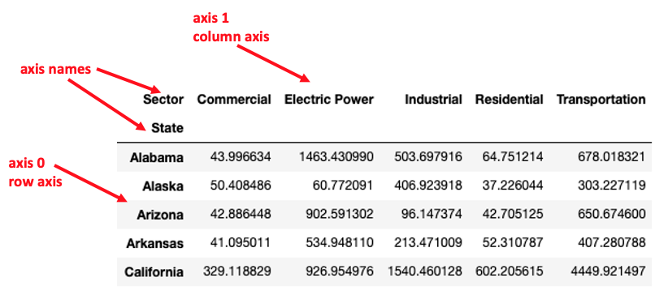
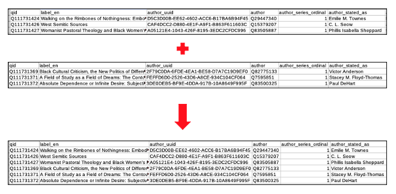

Previous lesson: [pandas Series](../008)

# pandas DataFrame

A DataFrame is the workhorse data object in pandas. In this lesson we will learn about the basic characteristics of DataFrames, how to load them from files, and how to perform basic manipulations of them.

**Learning objectives** At the end of this lesson, the learner will:
- select a column by specifying its label.
- select a row by label index using the `.loc()` method.
- select a row by integer position using the `.iloc()` method.
- load an Excel or CSV file into a DataFrame using the one of the read methods.
- save a DataFrame as an Excel or CSV file using one of the write methods.
- display the first or last several lines of a DataFrame.
- state the name of the missing data indicator in pandas and list two situations where they are generated.
- create row index labels from a generic column containing text strings using the `.set_index()` method.
- perform a vectorized calculation to create a new table column.
- sort DataFrame rows using the `.sort_values()` method.
- define *axis* and associate the two pandas DataFrame axes with rows and columns.
- remove rows or columns using the `.drop()` method.
- concatenate the rows of two DataFrames having the same column headers.
- join two DataFrames using the `.merge()` method.
- describe the difference between an inner and outer merge.

Total video time: 55m 44s

## Links

[Lesson Jupyter notebook at GitHub](https://github.com/HeardLibrary/digital-scholarship/blob/master/code/codegraf/009/009a.ipynb)

[Lesson Colab notebook](https://colab.research.google.com/drive/)

[Lesson slides](../slides/lesson009a.pdf)

# DataFrames

## Introduction to DataFrames (0m55s)

<iframe width="1120" height="630" src="https://www.youtube.com/embed/GOGKX7v3Lf0" frameborder="0" allow="accelerometer; autoplay; encrypted-media; gyroscope; picture-in-picture" allowfullscreen></iframe>


----

## pandas DataFrame structure (6m28s)

<iframe width="1120" height="630" src="https://www.youtube.com/embed/zOk1LyaQOTo" frameborder="0" allow="accelerometer; autoplay; encrypted-media; gyroscope; picture-in-picture" allowfullscreen></iframe>

Columns of a data frame can be referred to by their label in two ways:

```
states_df['capital']
states_df.capital
```

The "dot notation" can only be used if the column label is a valid Python object name (i.e. can't have spaces). The resulting object is a series whose values are the values in the column labeled by the row label indices.

Rows in a data frame can be referred to by either their index label (using `.loc[]`) or their integer position (using `.iloc[]`):

```
states_df.loc['AZ']
states_df.iloc[1]
```

The resulting object is a series whose values are the values in the row labeled by the column headers.

Cells in a data frame can be referred to by their row, column labels (using `.loc[]`):

```
states_df.loc['PA', 'population']
```

The resulting object has the type of the cell value.


----

# Loading a DataFrame from a file

All users should watch the two videos. The remaining videos in this section demonstrate how to load files from three different file systems. Select the one(s) that applies to your situation if you want to load files directly from your file system. 

## Loading a spreadsheet via a URL (3m02s)

Functions for reading and writing from spreadsheets to pandas DataFrames:

`pd.read_csv()` read from a CSV file into a data frame.

`pd.to_csv()` write from a data frame to a CSV file.

`pd.read_excel()` read from an Excel file into a data frame.

`pd.to_excel()` write from a data frame to an Excel file.

For details about reading from particular sheets in an Excel file, delimiters other than commas, etc. see the [pandas User Guide](https://pandas.pydata.org/docs/user_guide/io.html).

<iframe width="1120" height="630" src="https://www.youtube.com/embed/JVwKj7H8QU0" frameborder="0" allow="accelerometer; autoplay; encrypted-media; gyroscope; picture-in-picture" allowfullscreen></iframe>

Note: when loading files via a URL, be sure that the URL delivers the raw file, not an HTML representation of the file.

**Examining the DataFrame**

Use the `.head()` method to view only the first few lines of a DataFrame (default is 5 if `number_of_lines` argument omitted):
```
dataframe.head(number_of_lines)
```

The `.tail()` method is similar, but shows the last few lines of a DataFrame

The `.shape` attribute returns a tuple of the number of rows and number of columns. 

The `.columns` attribute returns the column names as a pandas Index object. Use the `list()` function to convert into a simple Python list.

The `.index` returns the row label indices as a pandas Index object. Use the `list()` function to convert into a simple Python list.

----

## Data types in DataFrames and missing values (4m39s)

<iframe width="1120" height="630" src="https://www.youtube.com/embed/3PNgkdfpeZs" frameborder="0" allow="accelerometer; autoplay; encrypted-media; gyroscope; picture-in-picture" allowfullscreen></iframe>

pandas tries to guess the datatype of a column based on the values it contains. To force it to load all cells as strings, use the `dtype=str` argument:

```
schools_df = pd.read_csv(url, dtype=str)
```

`NaN` ("not a number") is an NumPy object used by pandas to indicate missing data in a data frame. When data are loaded from a spreadsheet, by default empty cells are converted to `NaN` values.

To force pandas to read empty cells in as empty strings (`''`) rather than `NaN`, use an `na_filter=False` argument. This can be combined with a `dtype=str` argument to read everything in as strings (including empty strings):

```
schools_df = pd.read_csv(url, na_filter=False, dtype=str)
```

----

**Loading a file from your file system**

Variations on the following script are used in the next four videos to show how to load a spreadsheet from your local file system into a pandas DataFrame. The value of `working_directory` will be the directory from which the notebook was loaded. In the example, the data are in a subdirectory of the working directory called `data`.

```
import os
working_directory = os.getcwd()
print(working_directory)
filename = 'co2_state_2016_fuel.xlsx'
path = working_directory + '/data/' + filename
fuel_type = pd.read_excel(path)
print(fuel_type)
```


----

## Loading into a local Jupyter notebook - Mac OS (4m54s)

<iframe width="1120" height="630" src="https://www.youtube.com/embed/pedaEJGIYI8" frameborder="0" allow="accelerometer; autoplay; encrypted-media; gyroscope; picture-in-picture" allowfullscreen></iframe>


----

## Loading into a local Jupyter notebook - Windows OS (5m54s)

<iframe width="1120" height="630" src="https://www.youtube.com/embed/MWONQtQHPzk" frameborder="0" allow="accelerometer; autoplay; encrypted-media; gyroscope; picture-in-picture" allowfullscreen></iframe>


----

## Loading a data file in Google Colab (5m08s)

<iframe width="1120" height="630" src="https://www.youtube.com/embed/hfOAyJw8Xfw" frameborder="0" allow="accelerometer; autoplay; encrypted-media; gyroscope; picture-in-picture" allowfullscreen></iframe>


----

## Variation in mounting Google Drive (3m05s)

<iframe width="1120" height="630" src="https://www.youtube.com/embed/zYHVzPV3djs" frameborder="0" allow="accelerometer; autoplay; encrypted-media; gyroscope; picture-in-picture" allowfullscreen></iframe>


----

## Setting the row label index of a DataFrame (3m09s)

<iframe width="1120" height="630" src="https://www.youtube.com/embed/wiTiHR8leAU" frameborder="0" allow="accelerometer; autoplay; encrypted-media; gyroscope; picture-in-picture" allowfullscreen></iframe>

The `.set_index()` method changes one of the columns into the row label index. 

The `.reset_index()` method changes a row label index into a regular column.

Example:
```
state_co2_sector = state_co2_sector.set_index('State')
```

In the example above, the original DataFrame was replaced by the new one with the index set. 

----

# Manipulating DataFrames

## Creating a calculated column (2m09s)

<iframe width="1120" height="630" src="https://www.youtube.com/embed/AZMlQlamTLM" frameborder="0" allow="accelerometer; autoplay; encrypted-media; gyroscope; picture-in-picture" allowfullscreen></iframe>

Examples:

```
# Create a new column whose values are the sum of two columns
schools_df['total'] = schools_df['Male'] + schools_df['Female']

# Replace a column with its absolute values converted to percent
schools_df['Limited English Proficiency'] = schools_df['Limited English Proficiency'] / schools_df['total'] * 100
```

----

## Simple column methods (5m12s)

<iframe width="1120" height="630" src="https://www.youtube.com/embed/-TrWy3q20LM" frameborder="0" allow="accelerometer; autoplay; encrypted-media; gyroscope; picture-in-picture" allowfullscreen></iframe>

Sorting examples:

```
# Ascending sort (smallest to largest):
schools_df.sort_values(by=['Limited English Proficiency'])

# Descending sort (largest to smallest):
schools_df.sort_values(by=['Limited English Proficiency'], ascending=False)
```

Summary of axes terminology:




Simple statistical methods:

`.sum()` calculate the sum of a row or column

`.mean()` calculate the average of a row or column

`.std()` calculate the standard deviation of a row or column

To specify whether to calculate the sum of the row values or the column values, use an `axis=rows` or `axis=columns` argument. Alternatively, the axis number can be used: `axis=0` .


----

## Dropping and transposing (1m39s)

<iframe width="1120" height="630" src="https://www.youtube.com/embed/4GZmPQj6hz0" frameborder="0" allow="accelerometer; autoplay; encrypted-media; gyroscope; picture-in-picture" allowfullscreen></iframe>


`.drop()` method examples:

```
# drop a single row
state_co2_sector.drop('Total')

# drop a list of rows
state_co2_sector.drop(['Virginia', 'West Virginia', 'Wyoming'])

# drop a column
state_co2_sector.drop('Total', axis='columns')
```

To switch rows and columns, use the `.transpose()` method. As a shortcut, you can also use `.T` to transpose rows and columns.

```
state_co2_sector.transpose()
```

----

## Combining DataFrames (4m45s)

<iframe width="1120" height="630" src="https://www.youtube.com/embed/DsvkZfFF5H4" frameborder="0" allow="accelerometer; autoplay; encrypted-media; gyroscope; picture-in-picture" allowfullscreen></iframe>

**Concatenating two DataFrames**



To stack one DataFrame on top of another having the same column labels, use the `.concat()` method. The argument of the method is a list of the DataFrames to concatenate.

```
authors = pd.concat([authors1, authors2])
```

**Joining two DataFrames**

To join two DataFrames by matching a values from a column in each, use the `.merge()` method. 

Specify the columns to be used in the matching with a `left_on` and `right_on` arguments. The value of the arguments is a list of columns.

To only include rows that have matching values (an inner join), use the `how=inner` argument. 

```
state_data_inner = pd.merge(state_populations_2020, state_co2_sector, left_on=['NAME'], right_on=['State'], how='inner')
```

To include all rows and fill non-matching rows with missing data (`NaN`) values, use the `how=outer` argument.

```
state_data_outer = pd.merge(state_populations_2020, state_co2_sector, left_on=['NAME'], right_on=['State'], how='outer')
```

----

# Example workflow (3m12s)

<iframe width="1120" height="630" src="https://www.youtube.com/embed/kw10CWo_oe4" frameborder="0" allow="accelerometer; autoplay; encrypted-media; gyroscope; picture-in-picture" allowfullscreen></iframe>

Example script:

```
url = 'https://github.com/HeardLibrary/digital-scholarship/raw/master/data/codegraf/co2_state_2016_sector_nototals.xlsx'
state_co2_sector = pd.read_excel(url)
state_co2_sector = state_co2_sector.set_index('State')
state_co2_sector['total'] = state_co2_sector.sum(axis='columns')
url = 'https://github.com/HeardLibrary/digital-scholarship/raw/master/data/codegraf/population_by_state_2020.csv'
state_populations_2020 = pd.read_csv(url)
# The label index can be used as an "on" column
state_data_inner = pd.merge(state_populations_2020, state_co2_sector, left_on=['NAME'], right_on=['State'], how='inner')
state_data_inner['per_capita'] = state_data_inner['total'] * 1000000 / state_data_inner['POP_2020']
state_data_inner = state_data_inner.set_index('NAME')
state_data_inner.sort_values('per_capita', ascending=False)
state_data_inner.to_excel('state_data.xlsx')
```

----

# Practice exercises

under construction

----


Next lesson: [Extracting and changing values in a DataFrame](../009b)

----
Revised 2022-11-08
