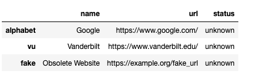
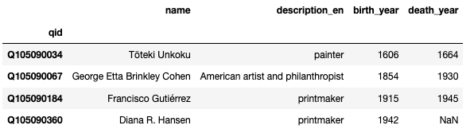
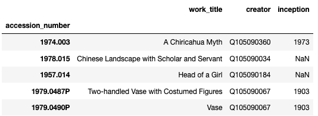
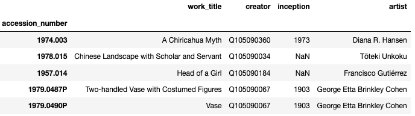

Previous lesson: [DataFrame manipulation](../009a)

# Extracting and changing DataFrame data

The common theme in this lesson is passing integer ranges or boolean Series into the `.loc[]` or `.iloc[]` indexers to select multiple rows or columns of a DataFrame. This allows you to change many cells within the DataFrame in a single operation without needing to iterate through the rows. In some circumstances where this vectorized approach is not possible, the `.iterrows()` method can be used to iterate through the rows and perform operations on the rows one at a time.

**Learning objectives** At the end of this lesson, the learner will:
- slice rows using the `.head()` or `.tail()` method.
- slice rows using a range or list of label indices.
- slice a rectangular selection of a DataFrame by specifying both row and column ranges.
- slice columns by specifying no upper or lower bounds in the row range of a rectangular selection.
- delete rows or columns using `.drop()` and the `.index` or `.columns` attributes of a slice.
- slice rows based on logical conditions by passing a boolean Series into `.loc[]`.
- slice columns based on logical conditions by passing a boolean Series into `.loc[]` as the column selector and specifying no upper or lower bounds in the row range.
- change particular cell values in a DataFrame based on boolean conditions applied to a column.
- use the `.iterrows()` method to perform operations on rows in a DataFrame one at a time.

Total video time: 25m 29s

## Links

[Lesson Jupyter notebook at GitHub](https://github.com/HeardLibrary/digital-scholarship/blob/master/code/codegraf/009/009b.ipynb)

[Lesson Colab notebook](https://colab.research.google.com/drive/1wG-wmvyIPbUaCt5EcKd9UqFx3hj7wHaB)

[Lesson slides](../slides/lesson009b.pdf)

# Introduction (1m02s)

<iframe width="1120" height="630" src="https://www.youtube.com/embed/va9KUu1krEY" frameborder="0" allow="accelerometer; autoplay; encrypted-media; gyroscope; picture-in-picture" allowfullscreen></iframe>

----

## Slicing rows (5m17s)

<iframe width="1120" height="630" src="https://www.youtube.com/embed/41QXKScIKbM" frameborder="0" allow="accelerometer; autoplay; encrypted-media; gyroscope; picture-in-picture" allowfullscreen></iframe>

**Slicing by head or tail methods**

The returned values from the `.head()` or `.tail()` methods can be assigned a name to slice rows from the top or bottom of the DataFrame.

```
table_end_slice = development.tail(12)
table_end_copy = development.tail(12).copy() # apply the copy method to turn the slice into a copy.
```

A negative value can be passed into `.head()` to designate the end of the slice relative to the bottom of the DataFrame

```
omit_end_rows = development.head(-12)
```

**Slicing by range or list**

A range of label indices can be passed into `.loc[]` or a range of integer positions can be passed into `.iloc[]` to slice a range of rows:

```
e_countries = development.loc['Ecuador':'Ethiopia']
integer_slice = development.iloc[1:4]
non_states = development.loc[ ['American Samoa', 'Puerto Rico', 'Virgin Islands (U.S.)'] ]
```

The beginning of the range can be omitted to start from the first column and the end of the range can be ommitted to go to the last column:

```
to_end = development.loc['Low income': ]
```

----

## Rectangular slices and slicing columns (2m25s)

<iframe width="1120" height="630" src="https://www.youtube.com/embed/Y2zk-1fhbdU" frameborder="0" allow="accelerometer; autoplay; encrypted-media; gyroscope; picture-in-picture" allowfullscreen></iframe>

Ranges for both rows and columns can be passed into `.loc[]` or `.iloc[]` to slice a rectangular selection of the DataFrame:

```
rectangular_slice = development.loc['first_row':'last_row', 'first_column': 'last_column' ]
work = development.iloc[218:225, 3:7]
```

As usual in Python, integer indexing starts with zero and the range does not include the last integer position.

Range and list selectors can be combined in a single `.loc[]` indexer:

```
female_values_by_income = development.loc['Low income':'High income', ['column2', 'column9', 'column3'] ]
```

Slicing columns is just a variation on creating a rectangular slice. In the row range, neither the starting nor the ending bounds are specified, causing the entire columns to be selected:

```
life_expectancy = development.loc[ :, 'male_life_expectancy': 'female_life_expectancy']
```


----

## Deleting a range of columns or rows (2m53s)

<iframe width="1120" height="630" src="https://www.youtube.com/embed/FsnYYZSycr4" frameborder="0" allow="accelerometer; autoplay; encrypted-media; gyroscope; picture-in-picture" allowfullscreen></iframe>

The same row selection strategies used in slicing can be used to generate row index slices from the `.index` attribute. Those row index slices can be passed into the `.drop()` method to delete multiple rows. 

```
schools_df = schools_df.drop(schools_df.loc['starting_row':'ending_row'].index) # assign the slice back to the original DataFrame
```

Deleting a range of columns is similar except that the `.columns` attribute is sliced to generate the selector. An `axis='columns'` argument must also be passed into the `.drop()` method to drop columns rather than rows.

```
schools_df = schools_df.drop(schools_df.loc[:, 'starting_column':'ending_column'].columns, axis='columns')
```

----

## Slicing rows by boolean condition (7m00s)

<iframe width="1120" height="630" src="https://www.youtube.com/embed/8cbDPWhQwlo" frameborder="0" allow="accelerometer; autoplay; encrypted-media; gyroscope; picture-in-picture" allowfullscreen></iframe>

**Slicing rows**

Slicing rows using logical conditions is similar to slicing by range or list, except that the row selector is a boolean Series rather than an label range or list of labels. Typically the boolean Series is generated by applying logical operators or methods to a particular column in the table. This vectorized operation generates a Series whose length is the same as the number of rows in the table. If the value in a particular position in the Series is `True`, the corresponding row will be included in the slice. If the value in a position in the Series is `False`, the corresponding row will be omitted from the slice.

The usual Python boolean operators `==`, `>`, `<`, `>=`, and `<=` may be used. `not` and `!` aren't used for negation for vectorized boolean operations in pandas, nor are the keywords `and` and `or`. Instead these operators are used:

```
| pandas operator | boolean | evaluation |
| --------------- | ------- | -------- |
| & | and | `True` if all `True` |
| \| | or | `True` if any `True` |
| ~ | not | opposite value |
```

Examples of slicing by condition:

```
north_star_state = states_df.loc[states_df['name'] == 'Alaska'] # selection based on valuse in the name column
not_arizona = states_df.loc[ ~(states_df['capital']=='Phoenix') ] # select states whose capital is not Phoenix
```

There are many pandas methods that produce booleans as a vectorized operation two are `.isnull()` and `.notnull()`.

```
high_schools = schools_df.loc[ schools_df['Grade 12'].notnull() ]
```

**Slicing columns**

Slicing columns by boolean condition is probably less common than slicing rows, but may be useful in large dataframes with many columns. Selection conditions work the same way as selecting rows by booleans and the boolean slicing operation is done the same way as slicing columns by list or range: the row range has no specified upper or lower bound.

```
states_df.loc[:, states_df.loc['PA'] == 'Harrisburg']
```

In this example, the selection boolean Series is based on the row values in the `PA` row. 

----

## Changing individual values by boolean condition (2m41s)

<iframe width="1120" height="630" src="https://www.youtube.com/embed/bQulpPz7xdc" frameborder="0" allow="accelerometer; autoplay; encrypted-media; gyroscope; picture-in-picture" allowfullscreen></iframe>

Selective replacement of values in a dataframe can be done by making an assignment to a slice of the dataframe that is specified by boolean conditions. In the following example, rows in the `Native Hawaiian` column with `NaN` (missing) values are selected using the vectorized expression 

```
ethnicity['Native Hawaiian'].isnull()
```

The selected rows in the `Native Hawaiian` column are then replaced with zeros by assignment:

```
ethnicity.loc[ethnicity['Native Hawaiian'].isnull(), 'Native Hawaiian'] = 0
```

----

## Iterating through DataFrame rows (4m11s)

<iframe width="1120" height="630" src="https://www.youtube.com/embed/4x6C2VLtDoU" frameborder="0" allow="accelerometer; autoplay; encrypted-media; gyroscope; picture-in-picture" allowfullscreen></iframe>

Typically, we don't want to iterate through rows in a pandas DataFrame because it's faster and more efficient to make changes to an entire column of the table using vectorized operations. However, there are some cases where it is difficult or impossible to do this and it's necessary to operate on one row at a time. Examples of such situations include:

- operations involving a complex sequence of operations or conditions involving multiple cells in a row.
- operations on row cells that involve retrieving data from somewhere outside of the DataFrame.
- operations that involve output calculated from row values to somewhere outside of the dataframe.

The `.iterrows()` method creates an iterable object from the DataFrame. With each iteration, a tuple is generated that contains the label index as its first item and a series containing row data as the second item. The row data series has the column headers as the series label indices and the row values as the series values. 

Values in the row series can be referenced as shown [in this lesson](../008/#introduction-to-pandas-series-5m59s), either by direct indexing:

```
row_series['column_header']
```

or by passing the series label (the column header) into `.loc[]`:

```
row_series.loc['column_header']
```

In the following example, data must be retrieved from a remote web server in order to calculate the values to be added to a column in the DataFrame. (The `requests` library that makes the HTTP GET call to the remote server is not part of the Python standard library, but is installed by default on Colab and in Anaconda installations of Jupyter notebooks. Stand-alone installations of Python or Jupyter notebooks may need to install this library using PIP before using this code.) After each URL is checked, the status response of the web server is added to the `status` column of the DataFrame.

DataFrame used in example:



```
import requests

# Create a simple DataFrame about websites
websites = {
    'name': {'alphabet': 'Google', 'vu': 'Vanderbilt', 'fake': 'Obsolete Website'}, 
    'url': {'alphabet': 'https://www.google.com/', 'vu': 'https://www.vanderbilt.edu/', 'fake': 'https://example.org/fake_url'},
    'status': {'alphabet': 'unknown', 'vu': 'unknown', 'fake': 'unknown'}
           }
websites_df = pd.DataFrame(websites)

# Iterate through the rows of the DataFrame and extract the GET status response for each URL
for label_index, website_series in websites_df.iterrows():
    response = requests.get(website_series['url'])
    if response.status_code == 200:
        websites_df.loc[label_index, 'status'] = 'OK'
    elif response.status_code == 404:
        websites_df.loc[label_index, 'status'] = 'not found'
    else:
        websites_df.loc[label_index, 'status'] = 'other'

# Display the edited DataFrame
print(websites_df)
```

----

# Looking up values (optional)

**Looking up values by matching row label indices**

Sometimes we have a DataFrame that serves as a lookup table. In this example, each row of the following table provides information about some artists. The row label index is a unique identifier for each artist (the artist's Wikidata Q ID).

DataFrame named `artists`:



A second table with information about artworks refers to artists by their unique ID (essentially a foreign key to the lookup table). 

DataFrame named `works`:



If we want to add a column for the artist's name to the artwork table, we need to look the name up in the artist table using the artist's unique ID. The value of the name for each artwork row can be located using this expression:

```
artists.loc[works['creator'], 'name']
```

The row label index in the artist table is specified by the Q ID value in the `creator` column in the `works` table. The value of the name is located in the `name` column of the artists table. The value returned from this expression is a Series, with the artist unuque ID (Q ID) as label index and the artist name as the value.

Since the resulting series is the same length as the number of rows in the `works` table, we should be able to just add the series as another column to the `works` table. However, the label indices of the resulting series and of the `works` table rows don't match. We can strip out the series label indices by converting the series to a list, and then assigning it to the `works` table as a column called `artist`:

```
works['artist'] = list(artists.loc[works['creator'], 'name'])
```

Here's the resulting DataFrame




**Looking up values by matching values in a column in the table**

The strategy for looking up a value by a regular column value rather than a row label index is similar but slightly more complicated. Let's consider the case of looking up the artist birth year for an artwork by matching with values in the artist name column in the artwork DataFrame rather than rather than the artist unique ID (the label index).

In that case, the row corresponding to an artist with a particular name would be found by a boolean condition rather than a direct lookup by the label index:

```
artists.loc[artists['name']==name_of_artwork_artist, 'birth_year']
```

The result is a series. If the artist names are unique in the artist lookup table, there will only be one item in the series. However, if there are several artists with the same name, the series will have more than one value. If we assume the artist names in the DataFrame are unique, we can just extract the first (integer position=0) value:

```
artist_birth = artists.loc[artists['name']==name_of_artwork_artist, 'birth_year'][0]
```

If we want to find the artist birth year for every row in the artwork table, we can set up a loop to look up the artist birth year for each row:

```
for accession_number, work in works.iterrows():
    artist_birth = artists.loc[artists['name']==work['artist'], 'birth_year'][0]
    # Add the birth year in a new column called "artist_birth" in the works DataFrame
    works.loc[accession_number, 'artist_birth'] = artist_birth
print(works)
```


----

# Practice exercises

Under construction

----

Optional lesson: [Summarizing and rearranging DataFrames](../009c)

Next regular lesson: [Introduction to plotting](../010)

----
Revised 2022-11-14
