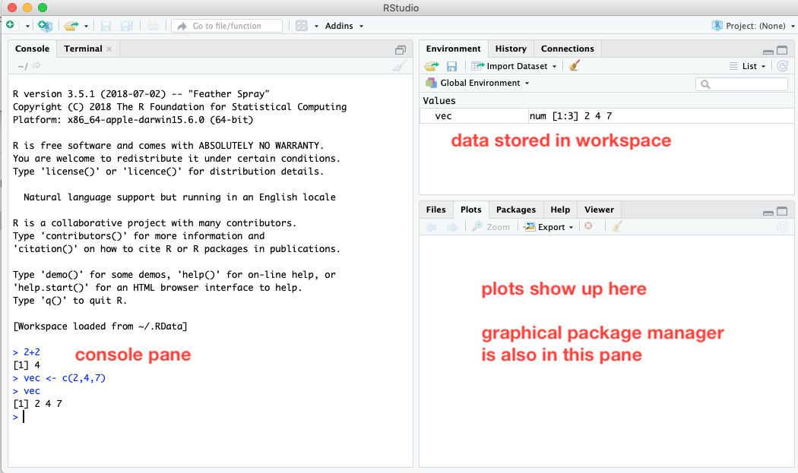
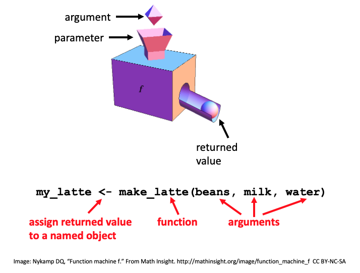
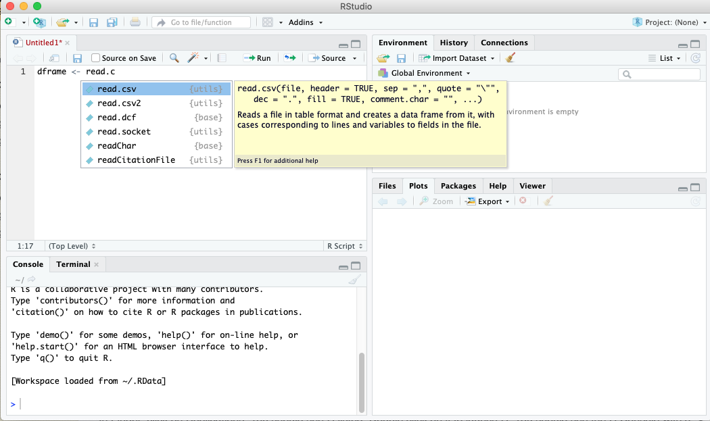
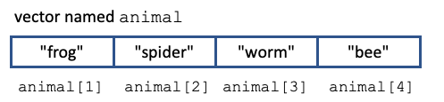
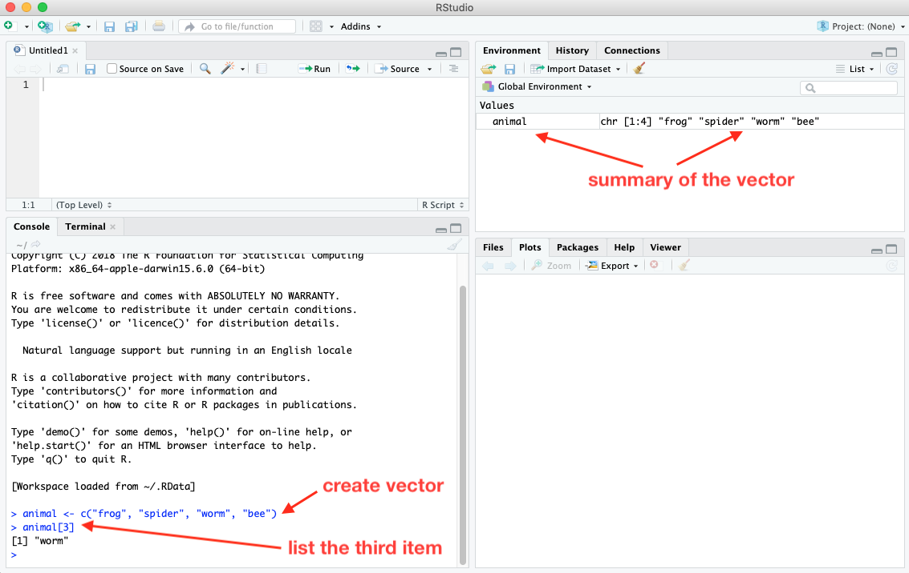
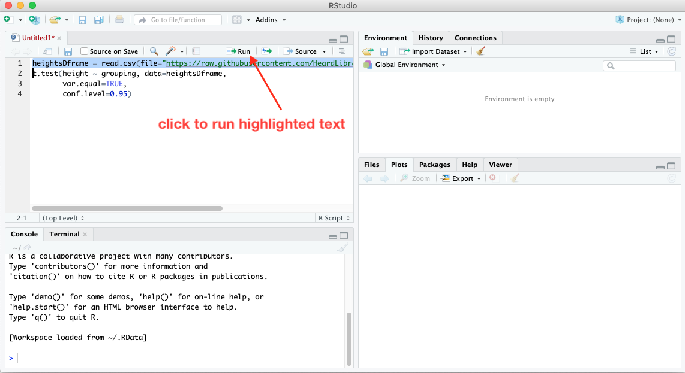
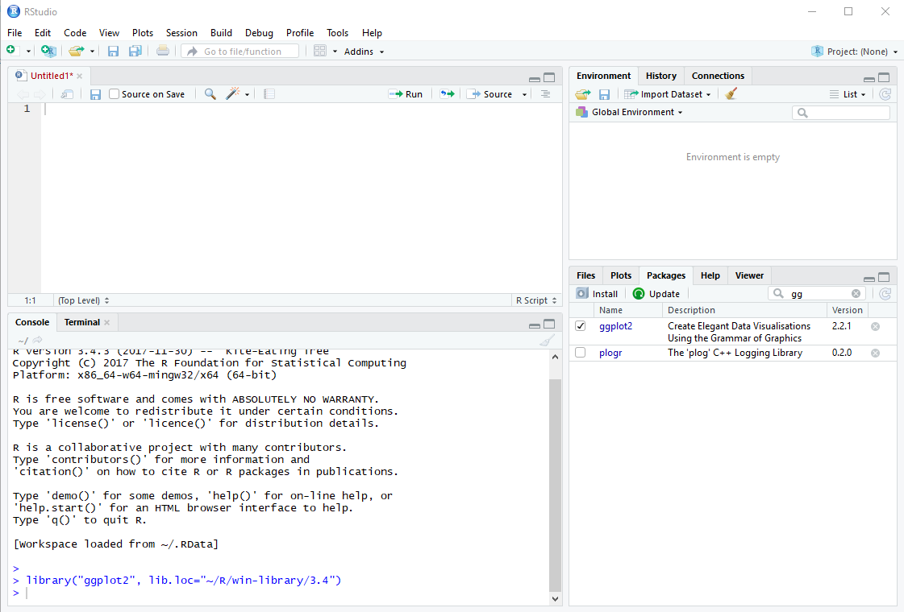
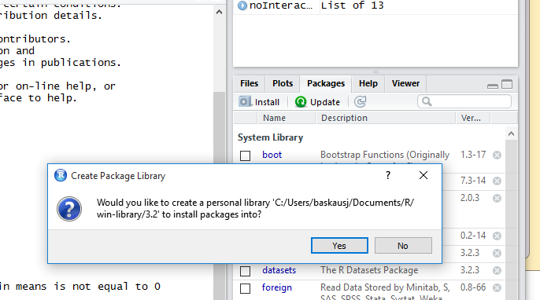
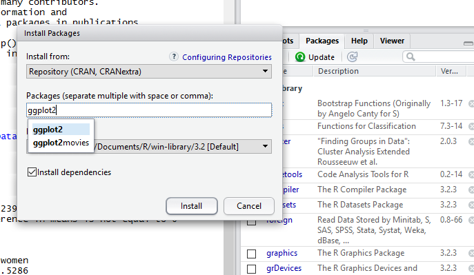

Previous lesson: 

If you weren't sure how you were going to be running your code: [Installing a programming environment](../003)

If you wanted to start coding R as quickly as possible: [Quickstart guide for running R in Posit Cloud](../003b)


# R programming basics: Vectors, vectorized computing, and packages

This lesson is focused on the fundamental data structure in R, vectors. The lesson will also cover how to make additional functions available to your environment by loading packages.

**Learning objectives** At the end of this lesson, the learner will:
- list three basic types of data in R and describe how they are written
- create a meaningful object name using snake case
- use the assignment operator `<-` to assign a data value to a named object
- list three ways that functions are made available in R
- use the `c()` function to generate a vector and assign it to a named object
- write the expression for a sequence of numbers using the `:` notation
- use a function to determine the length of a vector or type of data containend in a vector
- describe how vectorized computing works when a function or operation is applied to a single vector
- describe how vectorized computing works when a function or operation is applied to two vectors
- load a package by issuing the `library()` command or using the graphical interface
- install a package by issuing the `load.packages()` command or using the graphical interface

Total video time: 44 m 41 s

## Links

[Lesson R script at GitHub](https://github.com/HeardLibrary/digital-scholarship/blob/master/code/codegraf/011/011.R)


[Lesson slides](../slides/lesson011.pdf)

If you are a Vanderbilt user, you should be able to use your VUNet ID and password for free access to O'Reilly for Higher Education resources.  To access them, click [this link](http://www.library.vanderbilt.edu/eres?id=1676), then log in.  Sometimes it is necessary to close your browser, or clear your cookies to get access, so if you have problems, you can try that. It is also possible to navigate there by going to <https://www.library.vanderbilt.edu/>, select `DATABASES A-Z`, click on `O`, then select `O'Reilly for Higher Education`.

In this lesson, I'll reference some sections of the book, *R Cookbook, 2nd Edition*, which you can find by searching at the O'Reilly site, or try [this direct link to the book](https://learning-oreilly-com.proxy.library.vanderbilt.edu/library/view/r-cookbook-2nd/9781492040675/). The direct links in the text might work, otherwise navigate to the correct section by number.

# Vectors

**Note:** Comments can be added to R scripts to make them more understandable.  A comment starts with the `#` character and R simply ignores everything on the line after it.  Here's an example:

```
# simple script to demonstrate assignment
x <- c(1,2)  # the "arrow" points to the left to show the direction of the assignment
```

## R objects (9m40s)

<iframe width="1120" height="630" src="https://www.youtube.com/embed/Ll_x2FKlVyE" frameborder="0" allow="accelerometer; autoplay; encrypted-media; gyroscope; picture-in-picture" allowfullscreen></iframe>

Notice that in R, the assignment operator is `<-`, designed to look like a leftward pointing arrow since the data on the right is passed into the variable on the left. (One can also use the symbol `=` as the assignment operator, but using `<-` is more typical.)

To run R statements one at a time, you can use the console pane. After you type each statement and press `Enter`/`Return`, the result (if any) shows up in the next line. Changes to the environment also show up in the Global Environment (upper right pane).



----

## Function review (4m07s)

<iframe width="1120" height="630" src="https://www.youtube.com/embed/2QcGw6OS6VQ" frameborder="0" allow="accelerometer; autoplay; encrypted-media; gyroscope; picture-in-picture" allowfullscreen></iframe>



To review functions, see [this video](../002/#functions-8m24s)

----

## Loading an R script

Watch if you haven't already viewed it in the posit.cloud quickstart lesson.

<iframe width="1120" height="630" src="https://www.youtube.com/embed/otIwmZdviKc" frameborder="0" allow="accelerometer; autoplay; encrypted-media; gyroscope; picture-in-picture" allowfullscreen></iframe>

**Important note:** The second method for loading a script works as demonstrated on desktop RStudio. However, using in with Posit Cloud requires an extra step. After downloading the script from GitHub, you need to upload it into the filespace of your project's cloud server. You can do this by going to the `Files` tab in the lower right pane, then selecting `Upload`. Leave the Target directory at its default. After selecting your file and clicking OK, you can then use the Open command as demonstrated in the video. Unless you have a strong reason to use this method, it's probably easier just to use the first method (copy and paste). 

The editor pane in the upper left of RStudio opens when you either select `New File` from the `File` menu, then select `R Script` or if you open an existing file.



As you work in the editor pane, suggestions will pop up as you type, as shown in the screenshot above. 

----

## Vectors (12m43s)

<iframe width="1120" height="630" src="https://www.youtube.com/embed/keDHZ9EsVmk" frameborder="0" allow="accelerometer; autoplay; encrypted-media; gyroscope; picture-in-picture" allowfullscreen></iframe>



R Cookbook [section 2.5](https://learning-oreilly-com.proxy.library.vanderbilt.edu/library/view/r-cookbook-2nd/9781492040675/ch02.html#recipe-id038)

A *vector* is a one-dimensional data structure consisting of items of the same kind. This would be analogous to a column of data in a spreadsheet.  Vectors have a name that is used to refer to that particular instance of a vector.  The individual items in the vector can be referenced using their position in the vector, as shown in the diagram above.  Note: R is "one based", meaning that we start counting items at 1.  This is in contrast to Python, which is "zero based" (counting starts at 0).

We can construct a vector by explicitly entering its values using the `c()` (for "combine") function, like this:

```
animal <- c("frog", "spider", "worm", "bee")
```



The screenshot above shows what happens when we create a vector in the console pane, then display the third item in the vector.

You can run code that’s in the editor pane one line at a time, or all at once. To run a single line of code, highlight it (or simply place the cursor somewhere on the line). Then click the `Run` button at the top of the pane. The statement line will appear in the console, then execute.



To run several lines at once, highlight the ones you want to run, then click the `Run` button. To run the entire script, highlight all of it, then click `Run`.

To determine the **number of items** in a vector, use the `length()` function:
```
length(vector)
```

To determine the **type of items** that the vector contains, use the `mode()` function:

```
mode(vector)
```

**Sequences**

A sequence is a vector that contains a sequence of numbers that step by one. To generate a sequence, separate the range of integers by a colon:

```
numbers <- 3:9
```

Ranges can decrease and can include negative numbers. For example:

```
countdown <- 5:-3
```


**Referencing parts of vectors**

To reference a single item in a vector, use its index:

```
animal[3]
```

To reference a range of items in a vector (a subvector), use a range of indices:

```
subset <- animal[2:4]
```

Reminder to Python users: R is one-based and ranges include the final item, so the range 2:4 would include the second through the fourth item.

----

## Vectorized computing (7m38s)

<iframe width="1120" height="630" src="https://www.youtube.com/embed/O5JM-3gKC98" frameborder="0" allow="accelerometer; autoplay; encrypted-media; gyroscope; picture-in-picture" allowfullscreen></iframe>

----

## Using packages (10m33s)

<iframe width="1120" height="630" src="https://www.youtube.com/embed/AcQyEgaeAV0" frameborder="0" allow="accelerometer; autoplay; encrypted-media; gyroscope; picture-in-picture" allowfullscreen></iframe>

To review package managers, see [this video](../002/#package-managers-5m28s)

The RStudio package manager is a tab in the lower right pane.



In the search box, start typing the name of the package you want to load.  As you type, packages with matching names will be screened. If you see the package you want, click the checkbox to the left of its name.  When you check the box, RStudio will run the `library` function for you in the console pane, and load the package. 

If the package does NOT show up in the list, then it isn't yet installed on your computer.  Click the **Install** button.  If prompted to create a personal library, click **Yes**.



An Install Packages window will pop up.  You can leave the **Install from:** option at its default "Repository (CRAN..".  In the Packages box, type the name of the package in the popup window and press `Install`.



A bunch of lines will scroll up the console window.  When it says "The downloaded binary packages are in…" you're done.  The package should now appear in the list of packages in the Packages pane in the lower right, where you can check its box.

----

# Practice assignment

The practice assignment is [here](https://github.com/HeardLibrary/digital-scholarship/blob/master/code/codegraf/011/r_practice_assignment_1.R). You will need to load it into the editor pane of RStudio -- see the "Loading an R script" instructions above if you need help.

It is best to try to complete each problem on your own before resorting to watching the solution videos below.

----

Problem 1 solution

<iframe width="1120" height="630" src="https://www.youtube.com/embed/7nn2Z9Oioig" frameborder="0" allow="accelerometer; autoplay; encrypted-media; gyroscope; picture-in-picture" allowfullscreen></iframe>

----

Problem 2 solution

<iframe width="1120" height="630" src="https://www.youtube.com/embed/pOjT4L9NJ6A" frameborder="0" allow="accelerometer; autoplay; encrypted-media; gyroscope; picture-in-picture" allowfullscreen></iframe>

----

Problem 3 solution

<iframe width="1120" height="630" src="https://www.youtube.com/embed/Lz5t-SKyM1s" frameborder="0" allow="accelerometer; autoplay; encrypted-media; gyroscope; picture-in-picture" allowfullscreen></iframe>

----

Problem 4 solution

<iframe width="1120" height="630" src="https://www.youtube.com/embed/Ov3WITBnbXM" frameborder="0" allow="accelerometer; autoplay; encrypted-media; gyroscope; picture-in-picture" allowfullscreen></iframe>

----

Problem 5 solution

<iframe width="1120" height="630" src="https://www.youtube.com/embed/VNUVD9Q5bOU" frameborder="0" allow="accelerometer; autoplay; encrypted-media; gyroscope; picture-in-picture" allowfullscreen></iframe>

----

Problem 6 solution

<iframe width="1120" height="630" src="https://www.youtube.com/embed/xI5H7Q_aAss" frameborder="0" allow="accelerometer; autoplay; encrypted-media; gyroscope; picture-in-picture" allowfullscreen></iframe>

----

Next lesson: [Lists and dataframes](../012)

----
Revised 2023-08-17
