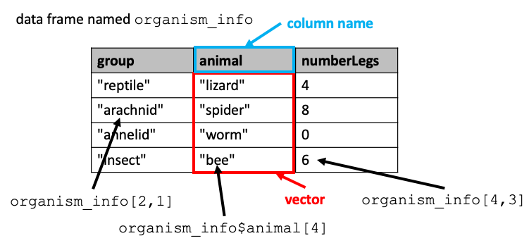

Previous lesson: [Vectors and packages](../011)

# R programming basics: Lists, data frames, and tibbles

This lesson is focused on another important data structure in R: data frames. It shows how the structure of data frames are related to the simpler R data structures, vectors and lists. It also introduces a variation on the traditional data frame: tibbles.

**Learning objectives** At the end of this lesson, the learner will be able to:
- create a list using the `list()` function.
- reference a list item using its name or index number.
- create a data frame from equal length vectors using the `data.frame()` function.
- refer to a column of a data frame using the `$` notation.
- refer to a cell in a data frame by its row and column index or by its row name and row position.
- load a CSV file from a path, file-choosing dialog, or URL.
- view the first 6 or last 6 rows of a data frame using `head()` and `tail()`.
- load an Excel file from you computer's hard drive.
- load a CSV or TSV file into a tibble.
- perform a one-vector operation on the column of a data frame.
- perform a two-vector operation on two columns of a data frame.

Total video time: 40 m 26 s

## Links

[Lesson R script at GitHub](https://github.com/HeardLibrary/digital-scholarship/blob/master/code/codegraf/012/012.R)


[Lesson slides](../slides/lesson012.pdf)

[Nashville schools data](https://github.com/HeardLibrary/digital-scholarship/blob/master/data/gis/wg/Metro_Nashville_Schools.csv)

In this lesson, I'll reference some sections of the book, *R Cookbook, 2nd Edition*, which you can find by searching at the O'Reilly site, or try [this direct link to the book](https://learning-oreilly-com.proxy.library.vanderbilt.edu/library/view/r-cookbook-2nd/9781492040675/). In order for the direct links to places in the book to work, you must be logged into the O'Reilly website. Sometimes the links don't work and you need to log directly into the website using VUNet ID and password at [this link](http://www.library.vanderbilt.edu/eres?id=1676).

# Lists

R Cookbook [section 5.6](https://learning-oreilly-com.proxy.library.vanderbilt.edu/library/view/r-cookbook-2nd/9781492040675/ch05.html#recipe-id053)

## What are lists? (6m27s)

<iframe width="1120" height="630" src="https://www.youtube.com/embed/yJfGLlaWW74" frameborder="0" allow="accelerometer; autoplay; encrypted-media; gyroscope; picture-in-picture" allowfullscreen></iframe>

A *list* is a one-dimensional data structure, like a vector.  However, unlike a vector, the items in a list can be heterogeneous (different types of items).  In the diagram above, we see that the values in the list consist of two strings (characters listed in quotes), one number (no quotes), and the vector `animal` that we created in the previous lesson (with its name given without quotes).  

I can create the list in the diagram using this command (assuming that I've already created the `animal` vector):

```
thing <- list(fruitKind="apple", euler=2.71828, vectorData=animal, curse="!@#$%")
```

Notice that as I add items to the list, I can also assign names to each item.  The items can be referenced by those names.  This allows an R list to behave like a dictionary in Python or a JSON object consisting of name:value pairs.  (Note: names can also be assigned to items in a vector, although that is often not particularly useful.)


The screenshot above shows what happens when I create the list in RStudio using the console.  After the list is created, it shows up in the workspace summary (**Environment** tab in upper right pane).  Because lists can be complicated, the items in the list aren't shown there.  If I want to see the details of the list, I can click on the list in the summary and a new tab will open in the upper left pane showing me what is contained in the list. Alternatively, I can get a more detailed view of the list in the summary if I click on the triangle button to the left of the list name. That drops down the details. Clicking again collapses the detailed listing.


As with vectors, you can refer to a particular item by its position in the list, like this:

```
thing[[2]]
```

Notice that when referring to an item in a list, you use two square brackets (vs. one square bracket for vectors).  You can also reference a list item by its name, for example:

```
thing$curse
```

----

# Data frames

R Cookbook [section 5.18](https://learning-oreilly-com.proxy.library.vanderbilt.edu/library/view/r-cookbook-2nd/9781492040675/ch05.html#recipe-id251)

## What are data frames? (5m18s)

<iframe width="1120" height="630" src="https://www.youtube.com/embed/3ummkARwUJM" frameborder="0" allow="accelerometer; autoplay; encrypted-media; gyroscope; picture-in-picture" allowfullscreen></iframe>

Data frames are two dimensional data objects and are one of the most widely used data types in R.  One can think of a data frame as a table with rows and columns, with the top row containing column headers that are names describing what's in the columns.  

It is helpful to think of a data frame as a sort of combination of lists and vectors. The values in a particular column are like a vector, with the column header for that column containing the vector's name.  The set of columns is like a list whose items are vectors.

We can actually create a data frame by first constructing a vector for each column:

```
group <- c("reptile", "arachnid", "annelid", "insect")  # vector of strings
animal <- c("lizard", "spider", "worm", "bee")
numberLegs <- c(4,8,0,6)  # vector of numbers
```

then loading the vectors into the data frame:

```
organismInfo <- data.frame(group, animal, numberLegs)
```

By default, R will use the name of each vector as the name for the column in the data frame.



We can refer to a particular cell in the table by listing its row followed by its column in brackets, like this:

```
organismInfo[2,1]
```

Because the columns of a data frame behave somewhat like list items, the notation for referring to list items by name (dollar sign followed by name) can also be used to refer to columns in a data frame:

```
organismInfo$animal
```

and items in that column can be referred to by their position from the top of the column:

```
organismInfo$animal[4]
```

**Referring to ranges within data frames**

To subset a range of rows or columns from a data frame, you can insert the range in the appropriate position using the square bracket notation. For example, to get only rows 2 through 5, use:

```
data_frame[2:5,]
```

To get only columns 4 through 8, use:

```
data_frame[,4:8]
```

You can combine ranges in both rows and columns to get a rectangular subset of the data frame:

```
data_frame[7:11,2:4]
```

----

## Tibbles (2m29s)

R Cookbook [section 5.4](https://learning-oreilly-com.proxy.library.vanderbilt.edu/library/view/r-cookbook-2nd/9781492040675/ch05.html#recipe-id051)

R for Data Science [Chapter 10](https://r4ds.had.co.nz/tibbles.html) (no login required)

<iframe width="1120" height="630" src="https://www.youtube.com/embed/TcYdBxI2hKo" frameborder="0" allow="accelerometer; autoplay; encrypted-media; gyroscope; picture-in-picture" allowfullscreen></iframe>

When data are read into a data frame, what happens to them depends on the type of data.  Numeric data remain as numeric data, but string data (e.g. non-numeric data enclosed in quotes) are converted into a special data type called *factor* when they are loaded into the data frame.  This format is useful when the data are intended to be used in statistical tests, and given that R was originally statistics-heavy, this automatic conversion makes some sense.  

**IMPORTANT NOTE: Starting with R 4.0, character data are no longer automatically loaded as factors by the `read.csv()` function!** When you start RStudio, look in the console window to see what version you are running. If the version starts with 3 or less, the conversion behavior will happen as described above. If the version starts with 4 or above, you will need to convert columns to factors manually using the `as.factor()` function. For example, in a dataframe named `df` with a character column named `words`, you can use `as.factor(df$words)` in functions that require the input to be factor rather than character.

More recently, the use of R has expanded far beyond statistics, so automatically trasforming data into a form that is optimal for statistics is no longer necessarily desirable in every case.  Another two-dimensional data structure, called a *tibble*, was developed to broaden the use of data frames.  When data are read into a tibble, there is never a conversion of data types (strings remain strings).  The rules for column names are also relaxed over traditional data frames.  

----

## Loading data frames from files (7m05s)

R Cookbook [section 4.8](https://learning-oreilly-com.proxy.library.vanderbilt.edu/library/view/r-cookbook-2nd/9781492040675/ch04.html#recipe-id027)

<iframe width="1120" height="630" src="https://www.youtube.com/embed/xYKLZhz6V2s" frameborder="0" allow="accelerometer; autoplay; encrypted-media; gyroscope; picture-in-picture" allowfullscreen></iframe>

The method of loading data into a data frame by manually entering the items as part of the script is not efficient for large data sets.  Large sets of tabular data are commonly saved as files in comma separated values (CSV) format.  All common spreadsheet applications (such as Microsoft Excel, OpenOffice Calc, and Libre Office Calc) provide a way to export spreadsheet data in CSV format, so that's the best way to get a dataset from a spreadsheet into R. If a spreadsheet contains multiple sheets, each one must be saved as a separate CSV file.  **To save an Excel sheet in CSV format, go to Save As… and select "CSV (Comma delimited) (*.csv)" from the "Save as type:" dropdown.** 

For more about CSV files, see [this video](../018/#csv-spreadsheets-4m38s)

**Important note:** R can be much more picky about file names than other applications.  Here is some general advice about naming CSV files:

1. Don't use really long file names.
2. Don't use file names with spaces in them.  It's better to use underscores (`_`) or dashes (`-`) instead.
3. Pay attention to whether you use upper or lower case letters in the file names.  Unless you are using a systematic capitalization system like camelCase, it's a good idea to use only lower case letters.

There are two convenient ways to load CSV data into a data frame: loading it from a file on your local computer, and loading it through the Internet using a URL.  

**Note about downloading text files from GitHub**

When you first get a Mac or PC, the file explorer hides the file extensions by default. Often this isn't a problem, but if the wrong application opens when you click on a file, or if a file fails to open when it should, it is difficult to troubleshoot without being able to see what the file extension is. To stop the hiding of file extension, see [these instructions for Windows](https://heardlibrary.github.io/digital-scholarship/computer/files-windows/#unhiding-file-extensions) or [these instructions for Mac](https://heardlibrary.github.io/digital-scholarship/computer/files-mac/#unhiding-file-extensions).

Because of the importance of file extensions in determining what files are for and how they are used, it is a problem if a file has the wrong file extension. This problem commonly occurs when files are downloaded from GitHub. When communicating with a web browser, GitHub always tells the browser that a raw text file is plain text. Often, this means that the browser will assign the downloaded file the extension `.txt` even if the file should have another extension like `.csv`. This problem is made worse if you computer is hiding the extensions from you and you don't realize that the problem has occurred. If you have downloaded a file from GitHub and you are having trouble getting it to work, first check that it has the correct file extension and correct the extension if it has been changed to `.txt`.

**From your hard drive**

To load a CSV file from your local hard drive, we'll make use of an R function that initiates a "file open" dialog: `file.choose()`.  When the file open dialog is executed, a popup window lets you navigate to and select the file that you want to open.  **Important note:**  occasionally, the popup window is hidden behind the RStudio window.  So if you run the script and it seems to have gotten stuck, minimize the RStudio window and see if the file open dialog window was hiding underneath.

The `file.choose()` function reads the CSV file into R, but the data that has been read in isn't in the form of a data frame.  The function `read.csv` is used to convert CSV-formatted raw data into the data frame data structure.  So the file open function and the CSV conversion function can be put together into a combined function that both opens the file and converts the CSV:

```
myDataFrame <- read.csv(file.choose())
```

To practice using this function, download and save the file [t-test.csv](https://raw.githubusercontent.com/HeardLibrary/digital-scholarship/master/data/r/t-test.csv) somewhere on your computer.  To do that, right click on the link in the previous sentence, and select **Save Link As...**.  After you have downloaded the file, paste the line in the example above into the Console pane of RStudio and press **Enter**.  The data frame `myDataFrame` should appear in the summary pane in the upper right, and if you click on its name, you can see the table in a tab in the upper left pane.  

**From a URL**

R Cookbook [section 4.10](https://learning-oreilly-com.proxy.library.vanderbilt.edu/library/view/r-cookbook-2nd/9781492040675/ch04.html#recipe-id031)

Sometimes a teacher, colleague, or a website might make a file available directly via a URL.  So an alternative to getting a CSV file from your computer's drive is to specify a URL that points to the file location at some place on the Internet.  One important consideration is that the URL must deliver the raw data file and not a web page.  You can see the distinction between the two by comparing:

<https://gist.github.com/baskaufs/1a7a995c1b25d6e88b45>

with

<https://gist.githubusercontent.com/baskaufs/1a7a995c1b25d6e88b45/raw/4bb17ccc5c1e62c27627833a4f25380f27d30b35/t-test.csv>

In the first case, the URL leads to a web page that displays the content of the CSV file formatted as an HTML table.  In the second case, the browser displays the actual characters that comprise the CSV file.  The second URL could be used to load the file as part of an R script, but the first URL would display an error. 

Here is the command that would read data from the file URL into a data frame:

```
myOtherDataFrame <- read.csv("https://gist.githubusercontent.com/baskaufs/1a7a995c1b25d6e88b45/raw/4bb17ccc5c1e62c27627833a4f25380f27d30b35/t-test.csv")
```

You can test this command by copying it and entering it into the Console pane of RStudio.  You should see the newly created data frame in the workspace summary pane (upper right) as in the previous example.  

If you have a GitHub account, creating a Gist is an easy way to make raw data available publicly through a URL.  Create the gist in the editing environment, then after creating a public Gist, click on the Raw button at the upper right of the screen.  Copy the URL from the browser's address box and paste it into the script between the quotes as shown in the example above.

----

## Variations on ways to load data frames (7m02s)

R Cookbook [section 4.11](https://learning-oreilly-com.proxy.library.vanderbilt.edu/library/view/r-cookbook-2nd/9781492040675/ch04.html#recipe-readexcel)

<iframe width="1120" height="630" src="https://www.youtube.com/embed/xoIvFDl46yY" frameborder="0" allow="accelerometer; autoplay; encrypted-media; gyroscope; picture-in-picture" allowfullscreen></iframe>

**Data from an Excel spreadsheet**

The `openxlsx` package can read an Excel file into a data frame.  

To load the package then read in the file:

```
library(openxlsx)
data_frame <- read.xlsx(xlsxFile = "my_file.xlsx", sheet = 'name_of_sheet')
```

The `sheet` argument is optional.

The `readxl` package can read from Excel files (both .xls and .xlsx) into a tibble. It is also included in the `tidyverse` package.

To load the package then read in the file:

```
library(readxl)
tibble_from_xl <- read_excel(file.choose())
```

As with read_csv, the grouping column contains characters, not factors.

You can also specify the sheet to use:

```
another_tibble_from_xl <- read_excel(file.choose(), sheet = "t-test")
```

For more details, see <http://www.sthda.com/english/wiki/reading-data-from-excel-files-xls-xlsx-into-r>.

**Commands for examining a data frame**

`head()` shows the first 6 rows

`tail()` shows the last 6 rows

`names()` returns the column names

`str()` describes the structure of the data frame with information about each column

----

## Basic operations on data frames (12m05s)

<iframe width="1120" height="630" src="https://www.youtube.com/embed/d_SoTx8w1Ys" frameborder="0" allow="accelerometer; autoplay; encrypted-media; gyroscope; picture-in-picture" allowfullscreen></iframe>

----

# Practice assignment

1. Use the code in the lesson script to load the Nashville schools dataset. What is the difference between how `read.csv()` (regular data frame) and `read_csv()` (tibble) treat spaces in column headers?
2. Display the values in the zip code column
3. How many values are there in the zip code column?
4. Calculate the total number of students in each school by adding the values in the male and female columns
5. Calculate the fraction of students that are white in each school
6. Try to load into a data frame some Excel file that you have on your local drive using the `read.xlsx()` function.

Next lesson: [basic statistics and plots](../013)

----
Revised 2021-06-13
