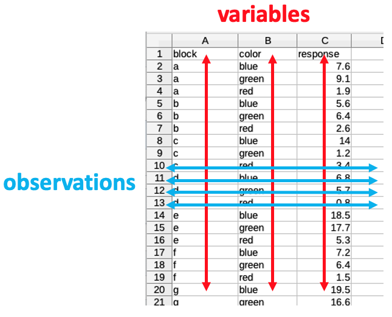

Previous lesson: [basic statistics and plots](../013)

# R programming basics: Tidy Data and basic data wrangling

In this lesson, we will examine the features of *tidy data* and consider how it differs from the way people often record data in spreadsheets. We will learn how to "tidy" a data frame and how to extract a subset of data from a tibble data frame. 

**Learning objectives** At the end of this lesson, the learner will be able to:
- describe the three features of *Tidy Data*.
- use the `pivot_longer()` function to transform a "wide" tibble to Tidy Data.
- use the `pivot_wider()` function to transform Tidy Data into the "wide" form.
- use the `filter()` function to subset rows from a tibble.
- use the `select()` function to subset columns from a tibble.
- use the `mutate()` function to create a new column in a tibble.
- use the `transmute()` function to create a new tibble from columns of another tibble.

Total video time: 31 m 11 s

# Links

[Lesson R script at GitHub](https://github.com/HeardLibrary/digital-scholarship/blob/master/code/codegraf/014/014a.R)

[Lesson slides](../slides/lesson014a.pdf)

[Tidy Data chapter from the *R for Data Science* book](https://r4ds.had.co.nz/tidy-data.html).

[Data transformation chapter from the *R for Data Science* book (covers the `dplyr()` function)](https://r4ds.had.co.nz/transform.html)

Data Carpentries unit *Data Analysis and Visualization in R for Ecologists*: ["Manipulating data" (dplyr) lesson](https://datacarpentry.org/R-ecology-lesson/03-dplyr.html)

[Cockroach electroretinogram videos](https://www.youtube.com/playlist?list=PLIHTZwh7pEFNrKoNT4pbmSOltapNGOcAE)

----

# Tidy data and the tidyr package

For more examples and practice involving tidying data, see this Software Carpentries lesson:
<http://swcarpentry.github.io/r-novice-gapminder/14-tidyr/index.html>

## Options for recording data (4m32s)

<iframe width="1120" height="630" src="https://www.youtube.com/embed/Pw5RffvMgHw" frameborder="0" allow="accelerometer; autoplay; encrypted-media; gyroscope; picture-in-picture" allowfullscreen></iframe>

*Experimental factors* are independent variables that the experimenter controls. *Measurements* are dependent variables that are responses to the experimental factors.

----

## What is Tidy Data? (4m14s)

<iframe width="1120" height="630" src="https://www.youtube.com/embed/R0VC_502Hd8" frameborder="0" allow="accelerometer; autoplay; encrypted-media; gyroscope; picture-in-picture" allowfullscreen></iframe>

*Tidy Data* has three main features:

1. Each variable must have its own column.
2. Each observation must have its own row.
3. Each value must have its own cell.



To read more about the features of Tidy Data, visit the [R for Data Science website](https://r4ds.had.co.nz/tidy-data.html).

----

## The pivot_longer() function (2m35s)

<iframe width="1120" height="630" src="https://www.youtube.com/embed/aHECwUOFpUo" frameborder="0" allow="accelerometer; autoplay; encrypted-media; gyroscope; picture-in-picture" allowfullscreen></iframe>

Use the `pivot_longer()` function to transform "wide" data into Tidy Data ("long" data).

The format of the `pivot_longer()` function is:

```
library("tidyr") # The tidyr library must be loaded if not already done

pivot_longer(wide_tibble_name, 
    cols = c("collapse_column1", "collapse_column2", "collapse_column3, etc.),
    names_to = "new_category_column", 
    values_to = "new_data_values_column")
```

Notice that you can make a function more readable by putting its arguments on separate lines and indenting.

Note: `pivot_longer()` replaces the older function `gather()`.

----

## Tidying and untidying data using R (5m30s)

<iframe width="1120" height="630" src="https://www.youtube.com/embed/G5NKzmdvKIc" frameborder="0" allow="accelerometer; autoplay; encrypted-media; gyroscope; picture-in-picture" allowfullscreen></iframe>

Use the `pivot_wider()` function to transform Tidy Data ("long" data) into "wide" data.

The format of the `pivot_wider()` function is:

```
pivot_wider(long_tibble_name, 
    names_from = "category_column_to_become_column_headers", 
    values_from = "data_column_to_become_table_cells")
```

Note: `pivot_wider()` replaces the older function `spread()`.

----

# Subsetting a tibble using the dplyr package

## Subsetting rows using filter() (6m03s)

<iframe width="1120" height="630" src="https://www.youtube.com/embed/oiBH_N7LCB8" frameborder="0" allow="accelerometer; autoplay; encrypted-media; gyroscope; picture-in-picture" allowfullscreen></iframe>

Notice that unlike "regular" data frames, tibbles allow spaces in column names. When tibble column names include spaces, in code the column names must be enclosed in backtics (`` ` ``).

The general form of the `filter()` function is:

```
filter(tibble_name, boolean_condition)
```

Code examples:

```
library("dplyr") # The dplyr library must be loaded if not already done

filter(schools_tibble, `Zip Code` == 37212) # filter rows by a particular value
filter(schools_tibble, !is.na(`Grade 12`)) # filter rows by a more complex boolean condition
high_schools_data <- filter(schools_tibble, `School Level` == "High School") # assigning the result of a filter operation to a new tibble
```

----

## Subsetting columns using select() (4m05s)

<iframe width="1120" height="630" src="https://www.youtube.com/embed/K0pnSiiW4Vk" frameborder="0" allow="accelerometer; autoplay; encrypted-media; gyroscope; picture-in-picture" allowfullscreen></iframe>

The `select()` function has several general forms:

```
select(tibble_name, col1, col2, col3, ...) # select by list of columns
select(tibble_name, start_column:end_column) # select by a range of columns
select(tibble_name, boolean_condition) # select by boolean condition
```

Code examples:

```
library("dplyr") # The dplyr library must be loaded if not already done

select(schools_tibble, Male, Female)
select(schools_tibble, `School Year`:`Zip Code`)
select(schools_tibble, starts_with("Grade"))
```

----

## Creating new columns with mutate() and transmute() (4m12s)

<iframe width="1120" height="630" src="https://www.youtube.com/embed/vtQZud_UXOA" frameborder="0" allow="accelerometer; autoplay; encrypted-media; gyroscope; picture-in-picture" allowfullscreen></iframe>

The `mutate()` function creates a new column at the end of an existing tibble. The column can be the result of a calcuation. The general form is:

```
mutate(existing_tibble, new_column_name = calculation)
```

Example:

```
library("dplyr") # The dplyr library must be loaded if not already done

mutate(schools_tibble, total_students = Male + Female)
```

The `transmutate()` column creates a new tibble from existing columns or calculations based on existing columns. The general form is:

```
transmute(existing_tibble, list_of_existing_or_calculated_columns)
```

Example:

```
transmute(schools_tibble, `School Name`, total_students = Male + Female, `Economically Disadvantaged`)
```

**Note:** In the case of both `mutate()` and `transmute()`, simply issuing the command displays the output, but doesn't actually put it anywhere unless you assign it to an object using the `<-` assignment operator. That object can be the original data frame if you want to replace the old version with the new one. For example

```
mod_sch_tibble <- transmute(schools_tibble, `School Name`, total_students = Male + Female, `Economically Disadvantaged`)
```

would create a new tibble called `mod_sch_tibble` that holds the result of the modification.

```
schools_tibble <- mutate(schools_tibble, total_students = Male + Female)
```

would replace the original `schools_tibble` tibble with the new one having the added column on the end.

----

# Practice assignment

The practice assignment is [here](https://github.com/HeardLibrary/digital-scholarship/blob/master/code/codegraf/014/r_practice_assignment_4.R). You will need to load it into the editor pane of RStudio.


Next lesson: [piping and more data wrangling](../014b)

----
Revised 2023-04-11
