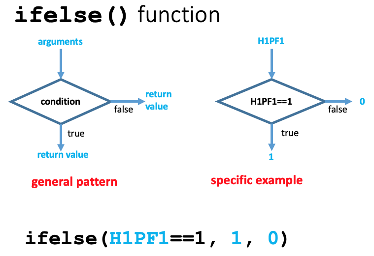

Previous lesson: [Tidy Data and data wrangling](../014a)

# R programming basics: More data wrangling and piping

In this lesson, we will continue exploring ways to transform data frames by using conditional replacement. We will also use the `ifelse()` function to select between two alternatives. The module will conclude with the introduction of **piping**, a clean way to link a series of functions that we want to use to transform our data.

**Learning objectives** At the end of this lesson, the learner will be able to:
- use the `replace()` function to change the value of a vector or data frame column
- use the ifelse()

Total video time: 46 m 16 s

# Links

[Lesson R script at GitHub](https://github.com/HeardLibrary/digital-scholarship/blob/master/code/codegraf/014/014b.R)

[Lesson slides](../slides/lesson014b.pdf)

----

# Conditional replacement

## The replace() function (8m07s)

<iframe width="1120" height="630" src="https://www.youtube.com/embed/kjBL9Gah934" frameborder="0" allow="accelerometer; autoplay; encrypted-media; gyroscope; picture-in-picture" allowfullscreen></iframe>

The general format of the `replace()` function is

```
replace(source_vector, boolean_vector, replacement_value)
```

where `source_vector` and `boolean_vector` are the same length. The `boolean_vector` is usually generated by testing some condition. When the value for `boolean_vector` is `TRUE` for a particular item, the corresponding item in the `source_vector` is replaced by `replacement_value`. The returned value is a vector with the same length as the `source_vector`.

----

## Problems with the replace() function (2m07s)

<iframe width="1120" height="630" src="https://www.youtube.com/embed/ZhE1WIN0syI" frameborder="0" allow="accelerometer; autoplay; encrypted-media; gyroscope; picture-in-picture" allowfullscreen></iframe>

In this example, the `replace()` function is inadequate because we want two possible replacements.

----

## Description of the ifelse() function (5m16s)

<iframe width="1120" height="630" src="https://www.youtube.com/embed/mz0rWxHhtWI" frameborder="0" allow="accelerometer; autoplay; encrypted-media; gyroscope; picture-in-picture" allowfullscreen></iframe>



The general form of the `ifelse()` function is 

```
ifelse(boolean_vector, value_if_true, value_if_false)
```

where `boolean_vector` is usually generated by testing some condition. The returned value is a vector with the same length as the `boolean_vector`. The diagram above shows the decision made for each value from a vector that is being tested for a condition. The returned value is a vector composed of a sequence made up from whichever of the two possible values corresponds to the evaluation of the condition for each position.

----

## R scripting using the ifelse() function (3m25s)

<iframe width="1120" height="630" src="https://www.youtube.com/embed/8wswSM0ln8I" frameborder="0" allow="accelerometer; autoplay; encrypted-media; gyroscope; picture-in-picture" allowfullscreen></iframe>

In this example, we directly control the output using a vector of booleans

```
boolean_vector <- c(TRUE, FALSE, FALSE, TRUE, TRUE)
ifelse(boolean_vector, "yay!", "what?")
```

More typically, the boolean vector is generated by testing some condition involving another vector

```
ifelse(grades$participation=="pass", 100, 50)
```

In this case, we compare each character string in the `participation` column to the character string `"pass"`.

----

## Changing tibbles with ifelse() (7m06s)

<iframe width="1120" height="630" src="https://www.youtube.com/embed/bTnTWBR6gaU" frameborder="0" allow="accelerometer; autoplay; encrypted-media; gyroscope; picture-in-picture" allowfullscreen></iframe>

In many functions, if a data frame is specified as the first argument, column names are assumed to correspond to that data frame.

```
mutate(grades, participation_numeric = ifelse(grades$participation=='pass', 100, 50)) # grades df specified in ifelse() function
mutate(grades, participation_numeric = ifelse(participation=='pass', 100, 50)) # grades df assumed in ifelse() function
```

When we carry out one of the replacement operations, we have choices about what do do with the output:

```
mutate(grades, participation_numeric = ifelse(participation=='pass', 100, 50)) # display in console
new_tibble <- mutate(grades, participation_numeric = ifelse(participation=='pass', 100, 50)) # assign to new tibble
grades <- mutate(grades, participation_numeric = ifelse(participation=='pass', 100, 50)) # assign back into the same tibble
grades <- mutate(grades, participation = ifelse(participation=='pass', 100, 50)) # replace the source column in the same tibble (change "in place")
```

----

# Piping

## Introducing data pipelines (6m30s)

<iframe width="1120" height="630" src="https://www.youtube.com/embed/8k7AbBkTh_Y" frameborder="0" allow="accelerometer; autoplay; encrypted-media; gyroscope; picture-in-picture" allowfullscreen></iframe>

----

## A description of piping (6m14s)

<iframe width="1120" height="630" src="https://www.youtube.com/embed/cZl2JKmGXA4" frameborder="0" allow="accelerometer; autoplay; encrypted-media; gyroscope; picture-in-picture" allowfullscreen></iframe>

In this example, the output of one function is stored temporarily in a data structure before being passed into the next function.

```
filename <- "https://gist.githubusercontent.com/baskaufs/ca8d32c1479de9e23cb93088ab8feef0/raw/1f94848c49f8b2e20e7bc93c890ac9caf5caa921/grades.csv"
grades <- read_csv(filename)
fixed_tests <- mutate(grades, tests = replace(tests, is.na(tests), 0))
fixed_participation <- mutate(fixed_tests, participation = ifelse(participation=='pass', 100, 50))
average_only <- transmute(fixed_participation, name, average = (tests + paper + participation)/3)
final_average <- filter(average_only, !is.na(average))
arrange(final_average, desc(average))
```

The output of the final function is sent to the console to be displayed to the user. Alternately, it could be assigned to a data frame by changing the last line to 

```
summary <- arrange(final_average, desc(average))
```

----

## Coding R with pipes (6m43s)

<iframe width="1120" height="630" src="https://www.youtube.com/embed/UYeeWZm94w0" frameborder="0" allow="accelerometer; autoplay; encrypted-media; gyroscope; picture-in-picture" allowfullscreen></iframe>

When data are piped into a function using the `%>%` pipe , the first argument specifying the input data object (often a data frame) doesn't need to be specified.

```
read_csv("grades.csv") %>%
  mutate(tests = replace(tests, is.na(tests), 0)) # no data frame name is specified
```

versus

```
grades <- read_csv(filename)
mutate(grades, tests = replace(tests, is.na(tests), 0)) # the "grades" data frame is specified
```

Somewhat surprisingly, the output of a pipe is assigned in the first line (not the last):

```
summary <- read_csv("grades.csv") %>%
  mutate(tests = replace(tests, is.na(tests), 0)) %>%
  mutate(participation = ifelse(participation=='pass', 100, 50)) %>%
  transmute(name, average = (tests + paper + participation)/3) %>%
  filter(!is.na(average)) %>%
  arrange(desc(average))
```

The last step in a pipe can write to a file. In that case the output goes to the file rather than being displayed on the console.

----

## Conclusion (0m48s)

<iframe width="1120" height="630" src="https://www.youtube.com/embed/pwYqJB5TjEk" frameborder="0" allow="accelerometer; autoplay; encrypted-media; gyroscope; picture-in-picture" allowfullscreen></iframe>

----

# Practice assignment

1. Start by loading the Nashville schools data into a tibble. The end of the R script for this lesson has the line of code necessary to read the CSV from the Internet into a tibble. Subset the data by pulling out only the rows that have "High School" as a value for `School Level`. Assign the result to a new tibble.

2. Add a totals column to the end of the tibble that is the sum of the `Male` and `Female` column. Assign the resulting tibble to a new data object.

3. Create two new columns that give the fraction of students that are economically disadvantaged and that have limited English proficiency (i.e. divide each of the original columns by the totals). 

4. Create a new tibble that has only the two columns you generated in the last problem, the totals column, and the `School Name` column. You can do this using the `select()` function on the output of the previous problem. Is there a way you could do both this problem and the previous one using a single function?

5. Sort the resulting tibble from the school with the most students to the school with the least.

6. Combine all of the steps in the previous problems into a single pipeline using the `%>% pipe operator. Assign the result to a tibble called `relative_high_school`. Verify that this tibble is the same as the result that you got after problem 5.

----

This is the last lesson in this module. Intermediate-level modules are planned for Statistics with R and Data visualization using ggplot. [Return to the CodeGraf landing page](../)

----
Revised 2020-09-30
