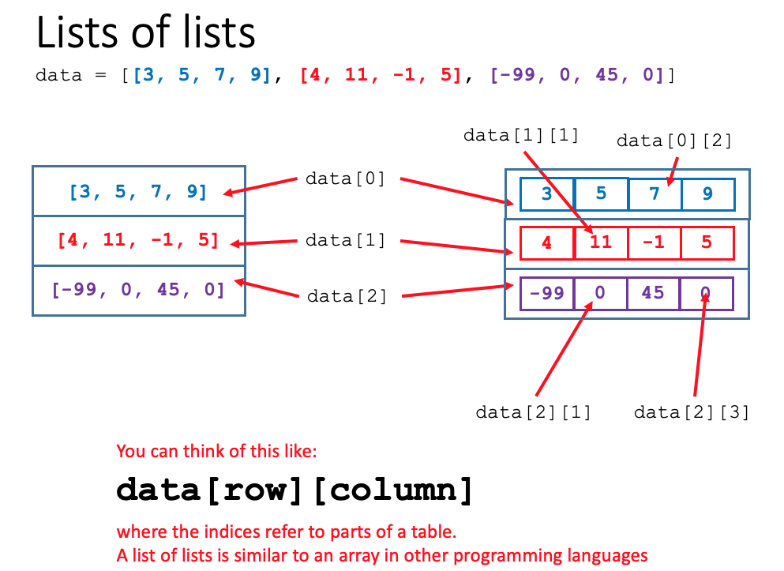
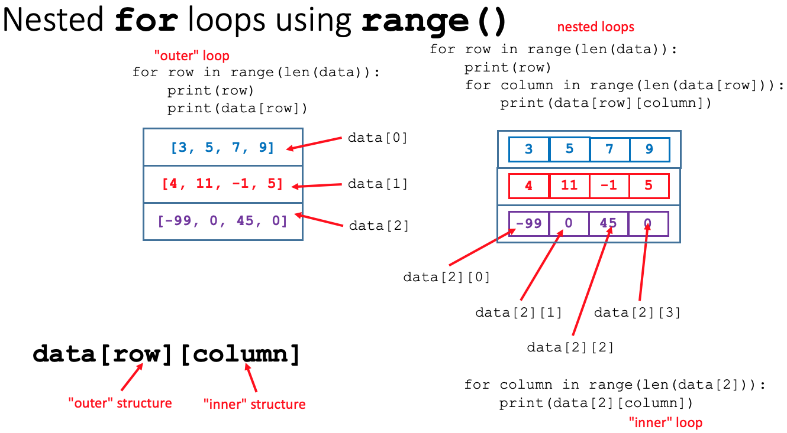
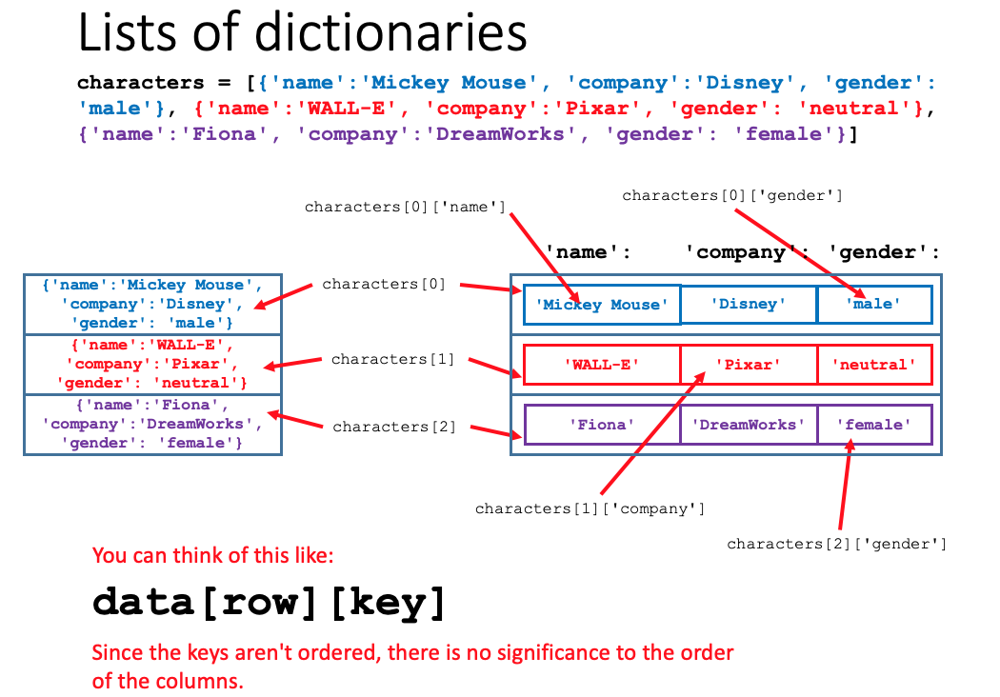
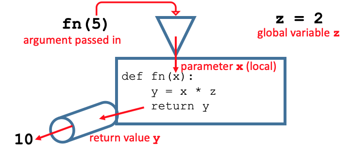

[CodeGraf landing page](../)

[Data from files](../020)

# Complex data structures and functions

In this lesson we will combine two basic Python data structures, lists and dictionaries, to create two dimensional data structures that can be used to store tabular data. We will see how nested for loops can be used to access all of the data in those tables. We will also learn how to make blocks of code reusable by creating our own functions.

**Learning objectives** At the end of this lesson, the learner will be able to:
- create a complex Python data structure by creating a list that contains lists or dictionaries as list items.
- describe how a list of lists can be compared to cells of a table.
- reference an item in a list of lists by correctly placing index numbers in square brackets.
- Use nested `for` loops to print all of the items in a list of list.
- Create nested `for` loops that iterate through the range of indices instead of the list objects themselves.
- describe how a list of dictionaries can be compared to cells of a table.
- reference an item in a list of dictionaries by correctly placing the row index number and column key string in square brackets.
- describe how ordering of columns differs between a list of lists and a list of dictionaries.
- write code to step through a list of dictionaries and check for a match of one of the character's dictionary items to the value of a search characteristic.
- write a function with one parameter and a return value.
- explain the difference between variables that are local to a function and global variables.
- explain the difference between a function definition and a function call in the code of a script.
- compare the *arguments* of a function call and the *parameters* of a function definition.

Total video time: 30 m 20 s

## Links

[Lesson Jupyter notebook at GitHub](https://github.com/HeardLibrary/digital-scholarship/blob/master/code/codegraf/021/021.ipynb)

[Lesson Colab notebook](https://colab.research.google.com/drive/1pM_sZW_gAbPNKAu)

----

# Complex data structures

## Lists of lists (5m05s)

<iframe width="1120" height="630" src="https://www.youtube.com/embed/UP3K-EiG9gU" frameborder="0" allow="accelerometer; autoplay; encrypted-media; gyroscope; picture-in-picture" allowfullscreen></iframe>

A list can contain any object, including other lists.  In some programming languages, there are two-dimensional structures called *arrays*.  To create an array-like structure in Python, we can make a list of lists.  Here's an example:

```python
firstRow = [3, 5, 7, 9]
secondRow = [4, 11, -1, 5]
thirdRow = [-99, 0, 45, 0]
data = [firstRow, secondRow, thirdRow]
```

An equivalent way to have created this list of lists would have been:

```python
data = [[3, 5, 7, 9], [4, 11, -1, 5], [-99, 0, 45, 0]]
```

We can think of a list of lists like a table where the first index represents the row and the second index represents the column.



To reference an item in a list of lists, first reference the outer list position, then the inner position.  For example, to refer to the first item in the third list, use `data[2][0]`. In the table model, we can think of the indexing as `data[column][row]`.

----

## Nested for loops (3m07s)

<iframe width="1120" height="630" src="https://www.youtube.com/embed/0QEAkL9nS_Y" frameborder="0" allow="accelerometer; autoplay; encrypted-media; gyroscope; picture-in-picture" allowfullscreen></iframe>

Example code:

```
for row in data:
    for column in row:
        print(column)
```

----

## Nested for loops with range() (4m14s)

<iframe width="1120" height="630" src="https://www.youtube.com/embed/qsht_LBKKTw" frameborder="0" allow="accelerometer; autoplay; encrypted-media; gyroscope; picture-in-picture" allowfullscreen></iframe>

Example code:

```
for row in range(len(data)):
    print('row:', row)
    for column in range(len(data[row])):
        print('column', column, ':', data[row][column])
```



----

## Lists of dictionaries (4m58s)

<iframe width="1120" height="630" src="https://www.youtube.com/embed/1w7Cuog4LbQ" frameborder="0" allow="accelerometer; autoplay; encrypted-media; gyroscope; picture-in-picture" allowfullscreen></iframe>

Example code:

```
characters = [{'name':'Mickey Mouse', 'company':'Disney', 'gender': 'male'}, {'name':'Daisy Duck', 'company':'Disney', 'gender': 'female'}, {'name':'Daffy Duck', 'company':'Warner Brothers', 'gender': 'male'},  {'name':'Fred Flintstone', 'company':'Hanna Barbera', 'gender': 'male'}, {'name':'WALL-E', 'company':'Pixar', 'gender': 'neutral'}, {'name':'Fiona', 'company':'DreamWorks', 'gender': 'female'}]
```



----

## Lists of dictionaries examples (5m40s)

<iframe width="1120" height="630" src="https://www.youtube.com/embed/6JnCBMK4srI" frameborder="0" allow="accelerometer; autoplay; encrypted-media; gyroscope; picture-in-picture" allowfullscreen></iframe>

Example code:

```
# Assign the list of dictionaries to a variable
characters = [{'name':'Mickey Mouse', 'company':'Disney', 'gender': 'male'}, {'name':'Daisy Duck', 'company':'Disney', 'gender': 'female'}, {'name':'Daffy Duck', 'company':'Warner Brothers', 'gender': 'male'},  {'name':'Fred Flintstone', 'company':'Hanna Barbera', 'gender': 'male'}, {'name':'WALL-E', 'company':'Pixar', 'gender': 'neutral'}, {'name':'Fiona', 'company':'DreamWorks', 'gender': 'female'}]

# Step through the list of characters to check if each one is a match
character_name = input("What's the character's name? ")
for character in characters:
    if character['name'] == character_name:
        print('The character ' + character['name'] + ' works for ' + character['company'] + '.')
```

More complex code example with case insensitivity, boolean `in` test, and flag to error trap for no match: 

```
characters = [{'name':'Mickey Mouse', 'company':'Disney', 'gender': 'male'}, {'name':'Daisy Duck', 'company':'Disney', 'gender': 'female'}, {'name':'Daffy Duck', 'company':'Warner Brothers', 'gender': 'male'},  {'name':'Fred Flintstone', 'company':'Hanna Barbera', 'gender': 'male'}, {'name':'WALL-E', 'company':'Pixar', 'gender': 'neutral'}, {'name':'Fiona', 'company':'DreamWorks', 'gender': 'female'}]
character_name = input("What's the character's name? ")
found = False
for character in characters:
    if character_name.lower() in character['name'].lower():
        found = True
        if character['gender'] == 'male':
            answer = 'He works'
        elif character['gender'] == 'female':
            answer = 'She works'
        else:
            answer = 'They work'
        answer = answer + ' for ' + character['company'] + '.'
        print(answer)
if not(found):
    print("I don't know that character.")
```

----

# Defining functions

## Defining your own function (5m34s)

<iframe width="1120" height="630" src="https://www.youtube.com/embed/xNpXwvP5fCU" frameborder="0" allow="accelerometer; autoplay; encrypted-media; gyroscope; picture-in-picture" allowfullscreen></iframe>

**What's going on inside a function?**
- *Parameters* are placeholder variables for arguments.
- The *scope* of variables assigned inside the function is *local*.
- Variables assigned in the main script are *global* and can be used in the function.



Features of user-defined functions:
- Functions are defined using the def statement.
- The def statement ends with a colon.
- The function can have zero to many parameters.
- The function code is an indented code block.
- The function can return one or more values or nothing.

----

## Example of defining a function (1m43s)

<iframe width="1120" height="630" src="https://www.youtube.com/embed/1X9a7ZoPzdw" frameborder="0" allow="accelerometer; autoplay; encrypted-media; gyroscope; picture-in-picture" allowfullscreen></iframe>

Example code:

```
def multiplication(first_number, second_number):
    answer = first_number * second_number
    return answer
```

`first_number` and `second_number` are *parameters* of the function. `answer` is the return value. Don't forget the colon at the end of the `def` statement and to indent the code block.

----

# Practice exercises

1\. In the [practice exercises when dictionaries were introduced](https://heardlibrary.github.io/digital-scholarship/script/codegraf/006a/#practice-exercise), one problem said to create two dictionaries: one with item names by catalog number and another with item prices by catalog number. Those dictionaries could look like this:

```
item_name = {'1008': 'widget', '2149': 'flange', '19x5': 'smoke shifter', '992': 'poiuyt'}
item_price = {'1008': 1.98, '2149': 14.99, '19x5': 0.49, '992': 250.00}
```

One problem with this way of organizing the information is that there is no way to step through all of the items in the catalog (for example to print a price list). Reorganize the data above into a list of dictionaries where each catalog item is one of the list items with a dictionary that provides the catalog number, name, and price for the item. Use a `for` loop to print a catalog showing the catalog number, name, and price for each item. Assuming that the prices are in dollars, prepend a dollar sign (`$`) in front of each price. 

2\. Starting with your script above, after presenting the catalog, allow the user to enter a catalog number. Confirm their choice by printing the name of the item, then ask the user how many they want to order. Calculate the total price of their order and print it for the user.

3\. Here is one of the examples of a list of dictionaries:

```python
characters = [{'name':'Mickey Mouse', 'company':'Disney', 'gender': 'male'}, {'name':'Daisy Duck', 'company':'Disney', 'gender': 'female'}, {'name':'Daffy Duck', 'company':'Warner Brothers', 'gender': 'male'},  {'name':'Fred Flintstone', 'company':'Hanna Barbera', 'gender': 'male'}, {'name':'WALL-E', 'company':'Pixar', 'gender': 'neutral'}, {'name':'Fiona', 'company':'DreamWorks', 'gender': 'female'}]
characterName = input("What's the character's name? ")
found = False
for character in characters:
    if character['name'] == characterName:
        found = True
        if character['gender'] == 'male':
            answer = 'He works'
        elif character['gender'] == 'female':
            answer = 'She works'
        else:
            answer = 'They work'
        answer = answer + ' for ' + character['company'] + '.'
        print(answer)
if not(found):
    print("I don't know that character.")
```

Because we have `if` inside of `if` inside of a `for` loop, the code is too complicated and requires paying careful attention to the indentation.  It is probably better in a circumstance like this to create a function for part of the code.  That makes the code more readable because you only have to think about small bits of the code at a time.  Re-write the code so that this section:

```
found = True
if character['gender'] == 'male':
    answer = 'He works'
elif character['gender'] == 'female':
    answer = 'She works'
else:
    answer = 'They work'
```
is moved into a function called `checkGender()`. Pass the dictionary for the character into the function as an argument. The function should return the `answer` string. Use your new function to rewrite the example script with fewer indentation levels. You should also have your script print "Matching character: " followed by the character's name before it prints the statement about who they work for.

4\. **Dealing cards** Here is some code that generates a deck of cards as a list:

```
suits = ['hearts', 'spades', 'clubs', 'diamonds']

# generate the deck of cards
deck = []
for suit in suits:
    deck.append('A ' + suit)
    for num in range(2,11):
        deck.append(str(num) + ' ' + suit)
    deck.append('J ' + suit)
    deck.append('Q ' + suit)
    deck.append('K ' + suit)
```

Turn this code into a function called `make_deck()` that has no arguments and that returns a list containing the strings for each card. The `random` module has a function `shuffle()` that takes a list as it's argument. It does not return a value; rather it randomizes the items in the list and replaces the original list with the randomized items. Use your function to generate a "deck of cards" list and print it. Then apply the `shuffle()` function to the list and print it again. Now modify your function so that the deck is shuffled before it is returned.

5\. Use the function you made in the last problem along with your to write a script that “deals” a five card poker hand by printing five cards from the deck. As you print each card, add it to another list called `hand`. 

6\. Use your code from above and nested `for` loops to check each hand to see if anyone got a flush. (A *flush* is a hand where all of the cards are from the same suit.) The outer loop can loop through the list of four suits and the inner loop can loop through the cards in the hand using the `if ... in ...` boolean test. You probably will need a flag called something like `differs` to keep track of whether a card differs from the suit you are checking.

7\. Create a list of lists where the outer list is the player and the inner lists are the player's hand of cards. You can start by hard-coding the script to deal 5 cards to 4 players. One challenging aspect of this is that when you deal cards after the first player, you need to make sure that they don't get cards that have already been given to the first player. One easy way to do this is to modify the deck after each card is dealt by removing the dealt card from the deck. If necessary, review [this page](../006a/#modifying-a-list-4m20s) to see how to remove items from a list. After dealing the cards, print the list of list so you can see what was dealt.

----

Next lesson: [Reading and writing CSV files](../022)

----

Revised 2020-10-15
