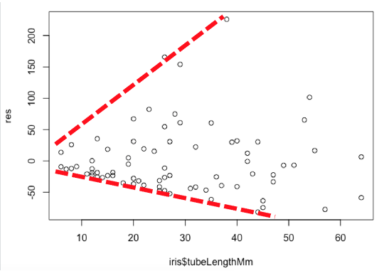

Previous lesson: [Transformations and non-parametric tests](../027)

# R Intro to stats: Continuous bivariate data

The statistical methods used to analyze data with two continuous variables varies depending on the nature of the data and what you want to do with it. In this lesson, we'll learn how to test for significant relationships between the variables and how to create a model from the data that can be used for prediction.

**Learning objectives** At the end of this lesson, the learner will be able to:
- decide whether linear regression or correlation is more appropriate for the data.
- explain the difference between using linear regression for prediction and linear regression as a statistical test
- find the slope and intercept of the best fit line from R's model summary.
- describe what r-squared tells us about a dataset
- perform a linear regression using the `lm()` function.
- display the outcome of a linear regression by printing the model and using the `summary()` function.
- describe how a linear regression test tells us whether there is a significant relationship between X and Y.
- list four assumptions of linear regression as a statistical test.
- describe *residuals*.
- explain how heterogeneity of variance can be detected from a plot of residuals.
- when the model is input as an argument of the `plot()` function, use the output to assess the normality of the residuals.
- test for normality of residuals using the Shapiro-Wilkes test.
- describe the difference between a positive and a negative correlation.
- describe what the *correlation coeficient* `R` tells us about two variables.
- list the two assumptions of correlation.
- use the MVN library to test for bivariate normality.
- perform a non-parametric correlation test using the Kendall rank correlation test.

Total video time: 47 m 09 s

# Links

[Lesson R script at GitHub](https://github.com/HeardLibrary/digital-scholarship/blob/master/code/codegraf/028/028.R)

[Lesson slides](../slides/lesson028.pdf)

----

# Linear regression for prediction

## Analyzing two continuous variables (3m16s)

<iframe width="1120" height="630" src="https://www.youtube.com/embed/xO2s3bllW0k" frameborder="0" allow="accelerometer; autoplay; encrypted-media; gyroscope; picture-in-picture" allowfullscreen></iframe>

**What test should I use?**

1\. Am I assuming cause and effect? 
- Yes: linear regression as a test
- No: go to 2

2\. What do I want to know?
- strength of the relationship: correlation
- prediction: linear regression as a model for prediction

----

## What is linear regression? (4m32s)

<iframe width="1120" height="630" src="https://www.youtube.com/embed/_HEOl0RUk4c" frameborder="0" allow="accelerometer; autoplay; encrypted-media; gyroscope; picture-in-picture" allowfullscreen></iframe>

Linear regression determines the straight line that best fits a set of points by minimizing the distance between it and each point (least squares method). The equation of that line and statistics associated with it are referred to as the *linear model*.

Data on Women and Development downloaded from the World Bank Data Catalog at <http://wdi.worldbank.org/table/WV.5> 

To get the first 217 rows of a data frame, use this syntax:

```
data_frame[1:217,]
```

----

## Creating the linear model (3m44s)

<iframe width="1120" height="630" src="https://www.youtube.com/embed/Lwj_7ewoazE" frameborder="0" allow="accelerometer; autoplay; encrypted-media; gyroscope; picture-in-picture" allowfullscreen></iframe>

Create a linear model

```
model <- lm(Y ~ X)
```

where Y and X are vectors or columns from a data frame. To display the slope and intercept, just print

```
model
```

To print all statistics associated with the model

```
summary(model)
```

To plot the data and the best fit line:

```
plot(Y ~ X)
abline(model)
```

----

## Predictions with the linear model (1m14s)

<iframe width="1120" height="630" src="https://www.youtube.com/embed/YWq1ojQ4i58" frameborder="0" allow="accelerometer; autoplay; encrypted-media; gyroscope; picture-in-picture" allowfullscreen></iframe>

To predict the value of Y, insert the coefficient of the X variable (i.e. the slope) and the intercept:

```
Y = coef_X * X + intercept
```

----

## R-squared (3m31s)

<iframe width="1120" height="630" src="https://www.youtube.com/embed/YVRooNEIZrY" frameborder="0" allow="accelerometer; autoplay; encrypted-media; gyroscope; picture-in-picture" allowfullscreen></iframe>

R<sup>2</sup> is a measure of how tightly the points fit around the best fit line.

R<sup>2</sup> tells us the fraction of the variance explained by the model.

The predictive ability of a line depends on the R<sup>2</sup> value.

----

# Linear regression as a statistical test

## What a linear regression tests (1m56s)

<iframe width="1120" height="630" src="https://www.youtube.com/embed/ajhBCIwlQ1Q" frameborder="0" allow="accelerometer; autoplay; encrypted-media; gyroscope; picture-in-picture" allowfullscreen></iframe>

Linear regression tests for a significant effect of X on Y by determining whether the best fit line has a slope that differs significantly from zero.

P assesses the probability that random variability is causing the slope to differ from zero.

----

## Example linear regression test (3m21s)

<iframe width="1120" height="630" src="https://www.youtube.com/embed/DhWF0F7kUE8" frameborder="0" allow="accelerometer; autoplay; encrypted-media; gyroscope; picture-in-picture" allowfullscreen></iframe>

Example data from Whitlock and Schluter (2nd ed.) chapter 17. <https://whitlockschluter.zoology.ubc.ca/r-code/rcode17>

----

## Assumptions of linear regression (2m57s)

<iframe width="1120" height="630" src="https://www.youtube.com/embed/Y3_GISEH2YA" frameborder="0" allow="accelerometer; autoplay; encrypted-media; gyroscope; picture-in-picture" allowfullscreen></iframe>

The assumptions of a linear regression are:
1. X and Y are independent (examine the design)
2. The relationship is linear (vs. some other curve; examine the data)
3. The residuals are normally distributed
4. The variance of the residuals are the same for all values of X

To retrieve the residuals from a model, use

```
residuals(model)
```

The residuals can be plotted against X. We can also check their distribution using a histogram or normal quantile (Q-Q) plot.

----

## Testing the residuals (4m52s)

<iframe width="1120" height="630" src="https://www.youtube.com/embed/okRGT2v3b0M" frameborder="0" allow="accelerometer; autoplay; encrypted-media; gyroscope; picture-in-picture" allowfullscreen></iframe>

Example of non-homogeneous residuals:



For an in-depth analysis of residuals, pass the model into the `plot()` function, then click on the console and press Enter/Return after each plot is generated. The first plot is a plot of the residuals. The second plot is a normal quantile plot of the residuals.

A Shapiro-Wilkes test can be used to test whether the residuals are normally distributed:

```
shaprio.test(residuals(model))
```

----

## Transformation and regression (3m57s)

<iframe width="1120" height="630" src="https://www.youtube.com/embed/f7bVB1VitoQ" frameborder="0" allow="accelerometer; autoplay; encrypted-media; gyroscope; picture-in-picture" allowfullscreen></iframe>

For data with counts for Y values, the square root transformation may be appropriate.

```
iris$transformed_grains <- sqrt(iris$grainsDeposited)
```

This example also illustrates a simple way to add a column to a data frame.

----

## Non-parametric linear regression (1m44s)

<iframe width="1120" height="630" src="https://www.youtube.com/embed/mshye8N7eR4" frameborder="0" allow="accelerometer; autoplay; encrypted-media; gyroscope; picture-in-picture" allowfullscreen></iframe>

The Siegel nonparametric linear regression is done using the mblm package.

```
library(mblm)
model <- mblm(Y ~ Y, data = data_frame)
summary(model)
```

----

# Correlation

## Correlation example (2m59s)

<iframe width="1120" height="630" src="https://www.youtube.com/embed/sFh_G2UEUIs" frameborder="0" allow="accelerometer; autoplay; encrypted-media; gyroscope; picture-in-picture" allowfullscreen></iframe>

`R` is the correlation coefficent. A positive value of `R` indicates a positive correlation (Y goes up when X goes up) and a negative value of `R` indicates a negative correlation (Y goes up when X goes down).

The example comes from the Washington Post <https://www.washingtonpost.com/business/2020/10/23/pandemic-data-chart-masks/>.

To run a correlation test:

```
cor.test(variable_1, variable_2)
```

where `variable_1` and `variable_2` are vectors or columns of a data frame.

----

## Testing assumptions of correlation (2m33s)

<iframe width="1120" height="630" src="https://www.youtube.com/embed/tkVa4y-JN4s" frameborder="0" allow="accelerometer; autoplay; encrypted-media; gyroscope; picture-in-picture" allowfullscreen></iframe>

Assumptions of correlation:

1\. Random sample

2\. Bivariate normal distribution
- linear X/Y relationship
- scatterplot is elliptical
- X and Y distributions are separately normal

To test for bivariate normality use the MVN package:

```
result <- mvn(data = data_frame, mvnTest = "royston", univariatePlot = "qqplot")
```

The last argument can have a value of `qqplot` or `histogram` depending on which kind of plot you want to see. The returned value from the function can be printed to see whether the data are overall multivariate normal and also whether each of the variables is separately normal.

```
result
```

----

## Non-parametric correlation (6m33s)

<iframe width="1120" height="630" src="https://www.youtube.com/embed/l3MTYUkCOoY" frameborder="0" allow="accelerometer; autoplay; encrypted-media; gyroscope; picture-in-picture" allowfullscreen></iframe>

Kendall rank correlation test is probably the best non-parametric alternative to correlation. It is run by modifying the regular correlation test by adding a `method` argument with a value of `kendall`.

```
cor.test(variable_1, variable_2, method="kendall")
```

Another commonly used test (Spearman rank correlation) can be run if the `method` argument has a value of `spearman`.

----

# Practice assignment

1. Use the World Bank Data on Women and Development to create a linear model that would allow you to predict the percentage of women who have bank accounts from the percentage of women who are employed. Don't forget to remove the missing value rows before doing the regression. Express the model as the equation of a line. Assess the usefulness of this prediction by commenting on the R<sup>2</sup> value.

2. Whitlock and Schluter provide data from an experiment where the stability of biomass in a prairie was measured under circumstances where there were different numbers of species present. 
The data are available here: <http://www.zoology.ubc.ca/~schluter/WhitlockSchluter/wp-content/data/chapter17/chap17e3PlantDiversityAndStability.csv>. Test whether there is a significant effect of number of species on biomass stability using a linear regression. Test the assumptions of the regression and transform the data or use a non-parametric test as necessary.

3. In question 3 of [this practice assignment](../013/#Practice-assignment), we compared the fraction of students in schools that were economically disadvantaged with the fraction that had limited English proficiency using a regression. Since we do not know cause and effect, it would be better to compare them using correlation. Prepare the data by excluding missing values and calculating the fractions for each category (use the totals of male and female as the total number of students). Create a scatterplot, then carry out the correlation analysis.

4. Check the data for multivariate normality. If the data are not normal, try a transformation to improve the multivariate normality. If that doesn't work, use the Kendall rank correlation test.

Next lesson: [extending t-test and regression](../029)

----
Revised 2020-11-03
