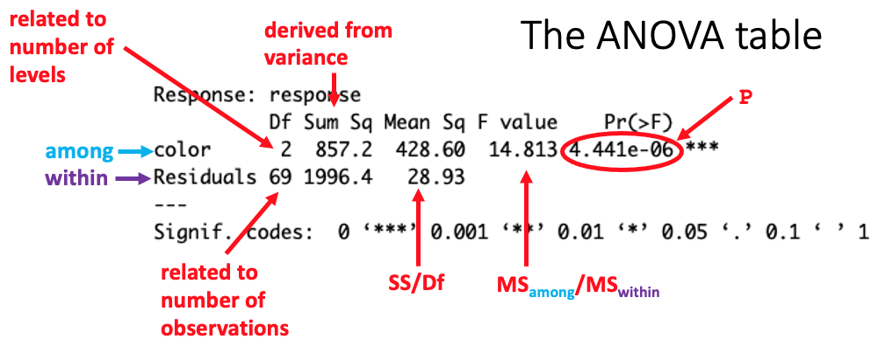

Previous lesson: [Continuous bivariate data](../028)

**Note: still under construction**

# R Intro to stats: Extending t-test and regression

Two analyses based on the general linear model extend the simple t-test of means and linear regression. Analysis of variance (ANOVA) can assess differences among more that two levels of a factor. Multiple regression extends the linear regression model to more than one independent variable. 

**Learning objectives** At the end of this lesson, the learner will be able to:
- describe how variance among and within groups (levels) is used in ANOVA to assess whether differences are significant.
- list three assumptions of ANOVA
- list conditions under which an ANOVA is robust to violations of its assumptions.
- perform Bartlett's test to determine whether the residuals in an ANOVA are normally distributed.
- state the preferred test for determining whether variance among groups is heterogeneous.
- describe the relationship between a t-test of means and a single-factor ANOVA with two levels.
- explain why the cutoff level of P for significance must be adjusted for post-hoc pairwise comparisons.
- perform a Tukey honestly significant difference (HSD) test for pairwise comparisons.
- perform a Kruskal-Wallis non-parametric alternative to a single-factor ANOVA.

Total video time:  m  s

# Links

[Lesson R script at GitHub](https://github.com/HeardLibrary/digital-scholarship/blob/master/code/codegraf/029/029.R)

[Lesson slides](../slides/lesson029.pdf)

----

# One-factor Analysis of Variance (ANOVA)

## Introduction to ANOVA (2m26s)

<iframe width="1120" height="630" src="https://www.youtube.com/embed/Q9c76livoEw" frameborder="0" allow="accelerometer; autoplay; encrypted-media; gyroscope; picture-in-picture" allowfullscreen></iframe>

----

## How an ANOVA works (7m51s)

<iframe width="1120" height="630" src="https://www.youtube.com/embed/5iIlXImiaJU" frameborder="0" allow="accelerometer; autoplay; encrypted-media; gyroscope; picture-in-picture" allowfullscreen></iframe>



The within group variance is the variance of the residuals.

See [this page](https://www.datanovia.com/en/lessons/anova-in-r/#basics) for a diagram illustrating among and within group variation. 

----

## ANOVA format and assumptions (2m38s)

<iframe width="1120" height="630" src="https://www.youtube.com/embed/v9eq3nFLfvQ" frameborder="0" allow="accelerometer; autoplay; encrypted-media; gyroscope; picture-in-picture" allowfullscreen></iframe>

The commands to carry out a single-factor ANOVA are:

```
model <- lm(Y ~ X, data = data_frame)
anova(model)
```

The `data =` argument can be omitted if vectors or explicitly specified columns are used.

See [this reference](https://doi.org/10.3758/s13428-017-0918-2) for more details about the robustness of ANOVA to violations of the homogeneous variance assumption. 

----

## Testing assumptions of ANOVA (5m07s)

<iframe width="1120" height="630" src="https://www.youtube.com/embed/nCklxs7qnpQ" frameborder="0" allow="accelerometer; autoplay; encrypted-media; gyroscope; picture-in-picture" allowfullscreen></iframe>

Inputting the model as an argument of the `plot()` function generates plots showing the distribution of residuals and a normal quantile (Q-Q) plot of the residuals as was the case for linear regression. The residuals are grouped on the X axis by the predicted group means for Y.

The Shaprio-Wilkes test (used previously in other contexts) can be applied in ANOVA to test whether the residuals are normally distributed:

```
resid <- residuals(model)
shapiro.test(resid)
```

Bartlett's test is often considered an overly conservative test for heterogeneity of variance. Levene's test is the generally preferred alternative.

The `car` package provides access to the `leveneTest()` function:

```
leveneTest(log ~ color, data=ergDframe, center = mean)
```

Dropping the `center =` argument performs the Brown-Forsythe test (a variant that uses medians instead of means) instead of Levene't test. See [this page](https://en.wikipedia.org/wiki/Levene%27s_test#Comparison_with_the_Brown%E2%80%93Forsythe_test) for information about the situations where the Brown-Forsythe test might be preferred to Levene's test.

----

## Analyzing the transformed data (3m55s)

<iframe width="1120" height="630" src="https://www.youtube.com/embed/P893Dq3rLHI" frameborder="0" allow="accelerometer; autoplay; encrypted-media; gyroscope; picture-in-picture" allowfullscreen></iframe>

----

## ANOVA vs. t-test of means (2m44s)

<iframe width="1120" height="630" src="https://www.youtube.com/embed/IYOIOGrl4xY" frameborder="0" allow="accelerometer; autoplay; encrypted-media; gyroscope; picture-in-picture" allowfullscreen></iframe>

A t-test of means and a single factor ANOVA with two levels produces an identical value of *P*. The calculated value of *F* in the ANOVA will be the same as the square of the calculated value of *t* in the t-test of means.

----

## Post-hoc pairwise comparisons (4m03s)

<iframe width="1120" height="630" src="https://www.youtube.com/embed/7sF8BVKET9A" frameborder="0" allow="accelerometer; autoplay; encrypted-media; gyroscope; picture-in-picture" allowfullscreen></iframe>

To use the Tukey honestly significant difference (HSD) or Tukey-Kramer tests for post-hoc pairwise comparisons, you must first create an ANOVA object and pass it into the function:

```
anova_object <- aov(model)
TukeyHSD(anova_object)
```

For more details, see [this page](https://rpubs.com/aaronsc32/post-hoc-analysis-tukey).

----

## Kruskal-Wallis non-parametric alternative (2m31s)

<iframe width="1120" height="630" src="https://www.youtube.com/embed/pp8xuGx_xbs" frameborder="0" allow="accelerometer; autoplay; encrypted-media; gyroscope; picture-in-picture" allowfullscreen></iframe>

To perform the non-parametric Kruskal-Wallis alternative to single-factor ANOVA, use:

```
kruskal.test(Y ~ X, data=data_frame)
```

----

# Practice assignment

1. Use the 

Next lesson: [x](../030)

----
Revised 2020-11-03
