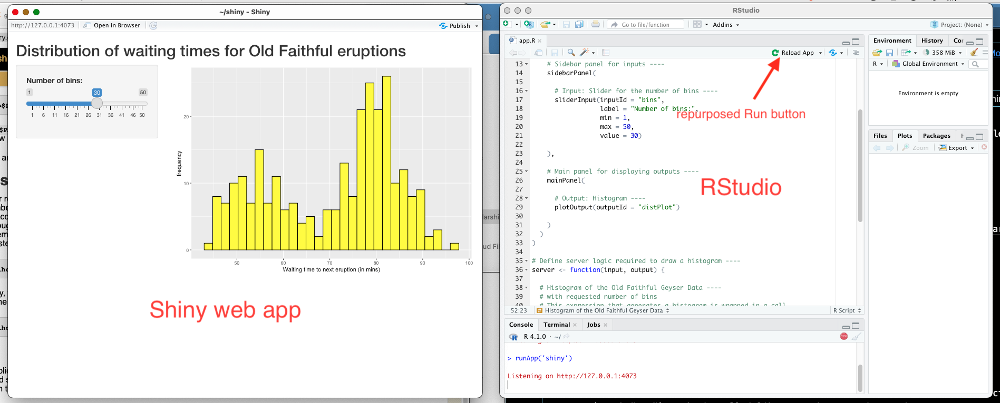
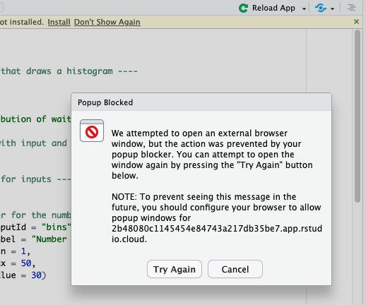
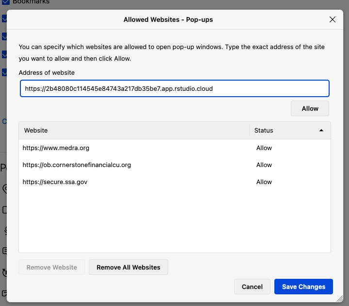
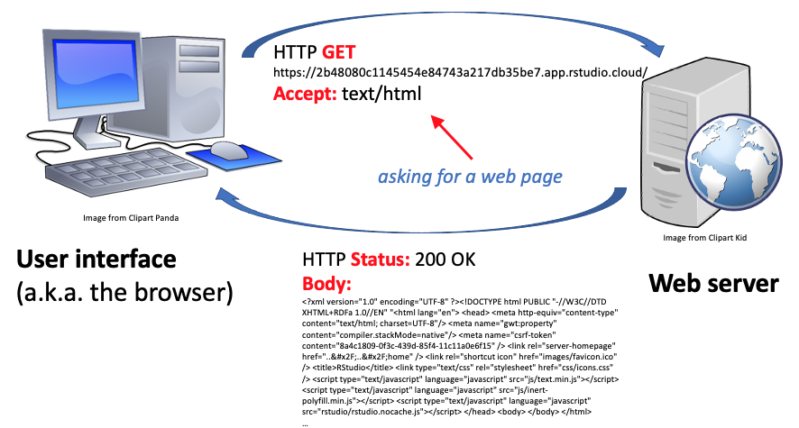

Previous lesson: [Controlling plot dimensions](../036)

# R viz using ggplot: Creating interactive ggplots using Shiny

Previously, we have made plots that are static. That is, once plotted they do not change and there is no way for the user to interact with them. In this lesson, we will combine ggplot with Shiny, the R-based system for creating web pages that allow you to interact with visualizations.

**Learning objectives** At the end of this lesson, the learner will be able to:
- describe the two main components of a Shiny app.
- hack an existing Shiny app to use their own visualization and input widget.
- run a Shiny app using a local installation of RStudio or RStudio Cloud.
- deploy a Shiny app to [shinyapps.io](https://www.shinyapps.io/).

Total video time: n/a

# Links

[Lesson R script at GitHub](https://github.com/HeardLibrary/digital-scholarship/blob/master/code/codegraf/037/037.R)

[Lesson slides]()

[First lesson of Shiny tutorial](https://shiny.rstudio.com/tutorial/written-tutorial/lesson1/)

----

# What is Shiny?

Shiny is an R package that can be used to build web pages that are interactive (a web "app"). It's installed like any other R package. 

## Running Shiny in RStudio

There are some conventions on how the parts of a shiny application are named and saved as files. If these conventions are followed, RStudio knows how to "run" the app. It will change the normal `Run` button to a `Run App` or `Reload App` button. When you run the app using a local installation of RStudio, a separate window will pop up. 



This window is essentially a stripped down browser that is displaying a web page generated by a localhost server on your computer (if you are running RStudio locally). If you don't know what this means, but want to, see [this lesson](https://heardlibrary.github.io/digital-scholarship/computer/command-unix/#localhost-web-servers) for more information. (The 127.0.0.1 address shown at the top of the popup window is the standard loopback address also known as `localhost:`.)

You can run Shiny using RStudio Cloud. However, it requires opening a popup window. So if your browser settings block popup windows, you will have to create an exception for the web address used by RStudio Cloud. For example, RStudio Cloud generates this warning when I use it in Firefox:



To fix it, I have to go to the security settings and laboriously type in the long UUID for the subdomaion of `rstudio.cloud`. 



After clicking `Allow` and saving the change, I can return to the `Popup Blocked` warning and click `Try Again`. The Shiny app window should then appear.

# Components of a Shiny app



There are two parts of the Shiny app that need to be created for each app. They are defined as R functions. One part defines the user interface (UI), which is the interactive web page displayed in the browser. The other part defines the web server that is generating the content behind the scenes. These two components are shown in the diagram above. If you are using RStudio Cloud, the server generating the visualization will be at some remote location (wherever rstudio.cloud is hosted). If you are using a local installation of RStudio Cloud, the server generating the visualization is running inside your local computer just like the browser. 

In either case, the Shiny code is broken into two parts, the function that tells the server how to generate the visualization, and the function that tells the UI (browser) how to display it. Here is a skeleton showing the main parts of the code (we will fill in the details later):

```
library(shiny)
library(ggplot2) 

# Define UI for app that draws a histogram ----
ui <- fluidPage(

[ code describing the layout of the web page goes here ]

)

# Define server logic required to draw a histogram ----
server <- function(input, output) {

[ code describing how the server should generate the visualization goes here ]

}

# Start the Shiny app running
shinyApp(ui = ui, server = server)
```

It is very easy to take code from a Shiny app that is similar to what you want to do, copy its code, hack it to make the visualization that you want, and run it. You generally don't have to understand the details of how the UI and server code work.

The code used in the example below is hacked from the [first lesson of the Shiny tutorial](https://shiny.rstudio.com/tutorial/written-tutorial/lesson1/). The main change is that it has been modified to use ggplot rather than base R plotting.

## User interface code

Here is the user interface code copied nearly unmodified from the first lesson of the [Shiny tutorial](https://shiny.rstudio.com/tutorial/written-tutorial/lesson1/):

```
# Define UI for app that draws a histogram ----
ui <- fluidPage(
  
  # App title ----
  titlePanel("Distribution of waiting times for Old Faithful eruptions"),
  
  # Sidebar layout with input and output definitions ----
  sidebarLayout(
    
    # Sidebar panel for inputs ----
    sidebarPanel(
      
      # Input: Slider for the number of bins ----
      sliderInput(inputId = "bins",
                  label = "Number of bins:",
                  min = 1,
                  max = 50,
                  value = 30)
    ),
    
    # Main panel for displaying outputs ----
    mainPanel(
      # Output: Histogram ----
      plotOutput(outputId = "distPlot")
    )

  )
)
```

Let's drill down on the two key parts of the UI: `sidebarPanel()` and `mainPanel()` functions. 


The `sidebarPanel` (left side of web page) defines the kind of controller that you use to generate the input that is sent to the server. In this case, the controlable feature input into the visualization is the number of bins. So the controller used to generate that input is a slider generated by the `sliderInput()` function:

```
      sliderInput(inputId = "bins",
                  label = "Number of bins:",
                  min = 1,
                  max = 50,
                  value = 30)   
    ),
```

The arguments passed into the `sliderInput` function control the features of the slider itself, but also specify the identifier for the slider: `inputId`, which has a value of `bins`. That identifier is important, because it's the way that we access the input data (in this case, the number of bins) when we tell the server how to generate the visualization. 

There are a lot of other pre-built controllers ("widgets") besides sliders. You can see them in [this lesson](https://shiny.rstudio.com/tutorial/written-tutorial/lesson3/).

The `mainPanel` (right side of web page) specifies what should go in the part of the UI that displays the results of the visualization. In this case, it's not complicated:

```
    mainPanel(
      plotOutput(outputId = "distPlot")
    )
```

In this case, we only have a single plot that's included in the output and it's identified using `outputId`, which has a value of `distPlot`. If there were several plots in the output, each one would have a different `outputId`.

## Server code

Here is the server code, hacked significantly from the first lesson of the [Shiny tutorial](https://shiny.rstudio.com/tutorial/written-tutorial/lesson1/):

```
server <- function(input, output) {
  
  # Histogram of the Old Faithful Geyser Data ----
  # with requested number of bins
  # This expression that generates a histogram is wrapped in a call
  # to renderPlot to indicate that:
  #
  # 1. It is "reactive" and therefore should be automatically
  #    re-executed when inputs (input$bins) change
  # 2. Its output type is a plot
  output$distPlot <- renderPlot({
    
    ggplot(faithful, aes(waiting)) + 
      geom_histogram(bins = input$bins, fill = "yellow", color = "black") +
      labs(
        x = "Waiting time to next eruption (in mins)",
        y = "frequency"
      )
    
  })
}
```

`renderPlot()` is a function that generates a reactive plot that changes with input sent from the UI. If the server detects changes in the input variable, it redraws the plot using the new information. 

The plot is generated the way we would generate any kind of output in R. In the tutorial example, the output was generated using the base R `hist()` function. Since I want to use ggplot instead, I substituted the code for the way we learned to build a histogram in ggplot:

```
    ggplot(faithful, aes(waiting)) + 
      geom_histogram(bins = input$bins, fill = "yellow", color = "black") +
      labs(
        x = "Waiting time to next eruption (in mins)",
        y = "frequency"
      )
```

The output of the function generating the plot is assigned to a part of the output that's specified by the identifier that follows the `$` character:

```
output$distPlot <- renderPlot({ ...
```

In this case, the identifier is `distPlot`, the same one that we used in the UI to indicate where the plot should go on the web page:

```
plotOutput(outputId = "distPlot")
```

If the server generated several plots, each one would be associated with its own `output` identifier.

Just as there can be several parts to the output passed from the server to the UI, there can be several parts to the input passed from the UI to the server. Each part of the input from the UI is identified in the plotting code by appending its ID after `input$`. In the code example, the number of bins in the `geom_histogram` geom was specified like this:

```
      geom_histogram(bins = input$bins, fill = "yellow", color = "black")
```

The input ID `bins` indicates that the function should use the value associated with the `bins` sent from the UI in the slider code:

```
      sliderInput(inputId = "bins",
...
```

In other words, what ever value gets set for `bins` by sliding the slider gets inserted into the ggplot geom in place of `input$bins`. 

# Running the Shiny app

Once the code has been hacked to fit into the structure defined above, you need to save the R code in a file named `app.R`. Once you have done that, RStudio will know that you are trying to run a Shiny app and the `Run` button will magically turn into a `Run App` button, which you can click to launch the app. As mentioned at the first section of this page, if you are using RStudio Cloud, you may have to enable popups from the subdomain from which the server is sending the HTML to create the web pages. 

## Getting real data into the app

The example above works for anyone who has installed R because the `faithful` dataframe is automatically included with the language as canned data. In order to create the visualization using your own data, you need to be able to load it from either a drive that is local to the RStudio installation, or from somewhere on the web via a URL. See [this lesson](https://heardlibrary.github.io/digital-scholarship/script/codegraf/012/#loading-data-frames-from-files-7m05s) if you don't know how to load data into an R script from a file. 

If you are running a local RStudio installation, you can just put the file you are loading into the working directory and open it by name, or specify the path to the directory when you load the file. NOTE: loading the file interactively using `file.choose()` is not an option since you can't interact directly with the server. 

If you are running RStudio Cloud, you will need to upload the file into the cloud server using the `Files` tab in the lower right pane of the web interface.

Another good alternative is to put the data on GitHub, either in a standard GitHub repository or as a GitHub Gist. For more on Gists, see [this lesson](https://heardlibrary.github.io/digital-scholarship/script/codegraf/012/#loading-data-frames-from-files-7m05s). In order to use the file on GitHub, you need to use the "raw" text URL for the file, not the URL of the web page displaying the file. This is obviously not an option if the data are confidential, proprietary, or under embargo.

## Learning more

To learn more, go to the [Shiny website](https://shiny.rstudio.com/tutorial/) where there are video tutorials and written lessons. There is also a book called "Mastering Shiny" that can be accessed by Vanderbilt users using the Vanderbilt Libraries' subscription to [O'Reilly for Higher Education](http://www.library.vanderbilt.edu/eres?id=1676). 

# Sharing the Shiny app with others

Sharing a Shiny app is really easy. All you have to do is save the `app.R` file and give it to someone else. However, the app code itself will not include any data required to generate the visualization. One way to provide access to the data is to put them on the web (see the notes about GitHub in the previous section) and load them through a URL. Another option is to package the data along with the app using an R package. See [this page](https://mastering-shiny.org/scaling-packaging.html) for more details.

# Putting your Shiny app online

Since Shiny is built from the ground up using the server/client model (i.e. server and web browser UI), a Shiny app can easily be put online for others to use without actually having to set anything up. You could set up your own installation in the cloud, but you'd need to know how to do it and how to properly set up all of the security, etc.

Fortunately, there is a website called [shinyapps.io](https://www.shinyapps.io/) that will deploy Shiny projects where they can be accessed via a URL. This platform allows 5 applications and 25 active hours per month for the free tier and higher limits for paid plans.

To deploy, go to <https://www.shinyapps.io/> and create a free account. When you first log in, a "getting started" page will open with instructions on how to set things up.

1\. In RStudio, install the `rsconnect` package. You can enter 

```
install.packages('rsconnect')
```

directly in the console window at the lower left pane of RStudio. Once you've done that, you need to authorize RStudio to talk to the shinyapps.io API. 


2\. Click on the `Copy to clipboard` button. The popup will ask you to copy using `ctrl-c` (Windows) or `command-c` (Mac). You can then paste the copied text into the console window and press `Enter`. 

3\. Load the rsconnect library by entering this in the console:

```
library(rsconnect)
```

4\. Once you have authorized RStudio, you can deploy any Shiny app you've written. The default structure is to have the `app.R` file in a directory that is meaningfully named based on what the app does, along with other files that the app needs. You can then deploy the app using the following command, where `path` is the path to the directory where the app lives (not the path to the app itself), in quotes. 

```
rsconnect::deployApp(path)
```

After some time, the deployment process will complete and a browser tab will open with the app displayed. The URL path will be in this form:

```
https://username.shinyapps.io/app_folder_name/
```

where `username` is the [account name](https://www.shinyapps.io/admin/#/account/settings) you chose when you signed up and `app_folder_name` is the name of the directory in which you stored the app. For example: <https://baskaufs.shinyapps.io/shiny/> will load my unimaginatively named app called "shiny". 

----

# Practice assignment

1. Load th


----
Revised 2021-10-03
