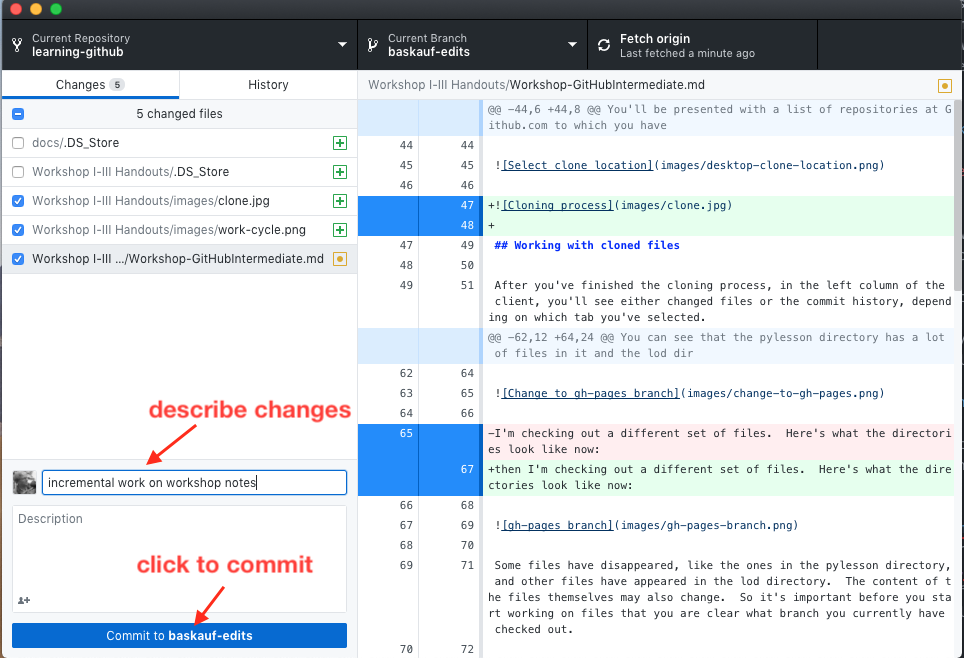
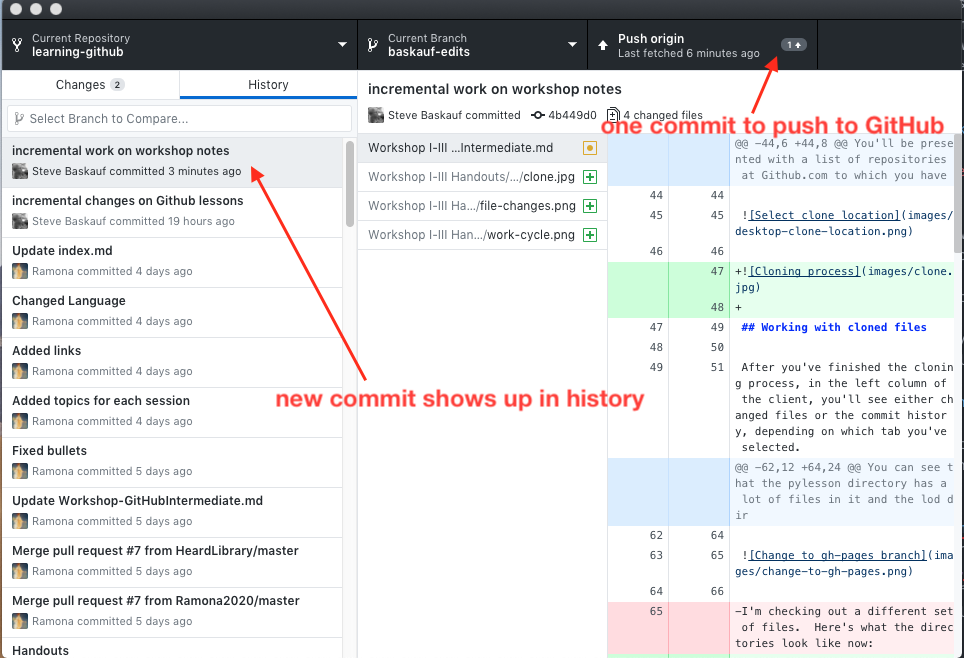

To get to this page, go to <https://tinyurl.com/>

Previous lesson: 

[Setting up VS Code to use Jupyter notebooks and GitHub Copilot](../003c)

# Background - EES 2580

This lesson will provide you with the background necessary to run Jupyter notebooks, and to upload and download files to GitHub.

**Learning objectives** At the end of this lesson, the learner will:
- define "literate programming".
- list some components of a programming environment.
- describe how cross-cell persistence of the environment affects the order in which cells in a programming notebook can be run.
- list two roles that lines starting with the hash character ("#") can play in the VS Code editor.
- explain the difference between clearing output and resetting the environment in a notebook.
- use GitHub Desktop to commit and push a change to GitHub.
- find the URL of a notebook pushed to GitHub.

## Links

[Example Jupyter notebook at GitHub](https://github.com/HeardLibrary/digital-scholarship/blob/master/code/codegraf/003/example.ipynb)

[lesson slides](ees0.pdf)

# Jupyter notebooks

## Literate programming paradigm (9m04s)

<iframe width="1120" height="630" src="https://www.youtube.com/embed/jY5kaT35db0" frameborder="0" allow="accelerometer; autoplay; encrypted-media; gyroscope; picture-in-picture" allowfullscreen></iframe>

The examples in this video are shown running the notebook in a web browser. We will use an environment running in VS Code instead. But the basic concepts of a notebook are the same in both platforms.

*Literate programming* presents human-readable text, embedded runable code, and displayed output in the same document. It is a useful way to document the thought process and flow of the code. 

For an introduction to using Markdown to format text, see [this lesson](../016/#markdown-3m22s)

## Programming environments (6m33s)

<iframe width="1120" height="630" src="https://www.youtube.com/embed/4JLaZLAqOlg" frameborder="0" allow="accelerometer; autoplay; encrypted-media; gyroscope; picture-in-picture" allowfullscreen></iframe>

A programming *environment* keeps track of:
- values of defined variables
- available functions
- computer-wide parameters such as the current position in the computer's file structure.

Other terms that mean roughly the same thing as "environment" are *kernal* (used with Jupyter notebooks) and *runtime* (used with Colab notebooks). 

Integrated development environments (IDEs) and notebook environments often have a way of displaying what's going on in their environment (defined variables and their values).

## Coding notebook basics

1. When you first run a cell in a code notebook, there may be some delay caused by starting up the environment. In a Colab notebook, this is simple an extra-long delay. In the VS Code environment, you will need to select an available environment if you didn't specify one before running the notebook. Once the environment is running, the execution of cells will be a lot faster.
2. Running a code cell is accomplished in different ways depending on the platform. In VS Code and Colab, there is a "run" button (symbolized by a triangle) at the left of the cell. In web browser-based Jupyter notebook systems, you select a cell and click on the `Run` button at the top of the page. When a cell is running there is some indicator showing that it has not yet finished. In Colab, the run button turns into a spinning circle. In VS Code, a spinning circle appears below the cell. In a browser Jupyter notebook, a star appears at the left of the cell. In each system, there is also an indication that the code in the cell is finished running. In Colab, the spinning circle turns back into the start triangle. In VS Code, a checkmark appears below the cell. In a browser Jupyter notebook, a number appears to the left of the cell.
3. Cells in a notebook are not independent. The state of the environment persists when you switch from one cell to another. Therefore, the order in which cells are run makes a difference. If a cell needs the value of a variable that is set in a previous cell, it will throw an error if the previous cell is not run first. Typically, cells are run in order from the top of the notebook downwards. Depending on the code, you may be able to re-run a cell, or go up one or more cells to re-run previous cells.
4. If the last line in a cell is a single variable or expression, it will be evalutated and displayed below the cell. The results of any `print` statements will also be displayed below the cell in the order they are executed. A single variable or expression that is not at the end of a cell will be ignored.
5. Each notebook system has a mechanism for clearing the output below cells. However, note that clearing the output does not delete any information that is "known" by the environment. To clear the environment, you need to restart or reset it. (Clearing the environment does not clear the output, either. The two functions are independent.) In the VS Code platform, the output of all cells can be cleared by selecting the `Clear All Outputs` option at the top of the page. To clear all values in the notebook environment, select the `Restart` option at the top of the page. 

To see videos showing how these things work in the Jupyter browser and Colab environments, see the "Colab architecture" and "Jupyter architecture" of [this lesson page](https://heardlibrary.github.io/digital-scholarship/script/codegraf/003a/).

# GitHub

## What is GitHub?

<iframe width="1120" height="630" src="https://www.youtube.com/embed/xDabhZxxo20" frameborder="0" allow="accelerometer; autoplay; encrypted-media; gyroscope; picture-in-picture" allowfullscreen></iframe>

[GitHub website](https://github.com/)

Although GitHub is a cloud-based system similar to systems like Dropbox, Box, OneDrive, and Google Drive that can synchronize local files with copies in the cloud, it is different in a very fundamental way. When you make changes on your local computer, they are not automatically synched. Instead, synching files requires a three-stage process: staging, committing, and pushing. In command line Git, each of these steps requires issuing a separate command. In GitHub Desktop, they are accomplished by checking boxes and clicking on buttons.

## Setting up a repository and cloning it with GitHub Desktop

The complete instructions, with videos, for this subject is at [this web page](https://heardlibrary.github.io/digital-scholarship/script/codegraf/016/). 

## Stage, commit and push in GitHub Desktop

When you have made a change in a cloned repository, the changed files will show up under the `Changes` tab. You can decide whether a particular change should be documented by "staging it for commit". Changes that are staged have a checkmark in the checkbox to the left of their name. Changes whose checkbox are unchecked will be not be documented until they are staged (checked). 

Once changes reach the point where the state of the project needs to be documented, you need to make a commit. Describe the changes in the box.

Commit your changes by clicking the button.  You'll then see the new commit in the history and as a change that's ready to push up to GitHub.

Click on the `Push origin` button to push your changes from the desktop client to GitHub. 

## Getting the URL of a file to share it

If you check the web interface, you should see the changes recorded in the GitHub cloud. Go to the URL of your GitHub account and select the repository where you are documenting the project. If there are subfolders, navigate to the one where the file is saved. Click on the filename.

The URL at the top of the browser can be copied and shared. Jupyter notebooks will be rendered on the page so that its contents can be viewed, although it is not runnable.

----

Next lesson: [Python programming basics](../ees1)

----
Revised 2024-02-15
