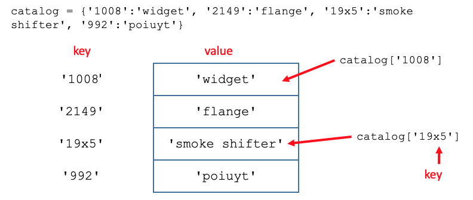

Previous lesson: [Code libraries and lists](../ees2)

# Dictionaries and loops - EES 2580

In this lesson we introduce a second complex object: *dictionaries*. A dictionary is a one-dimensional data structure like a list, but its elements are referenced by name using a *key* rather than by index number. 

We can build more complex objects by nesting one object inside another. Two examples we examine are lists of lists and lists of dictionaries.

We also introduce two kinds of *loops*, which are ways to step through *iterable* objects like lists or to repeat an action many times.

**Learning objectives** At the end of this lesson, the learner will be able to:
- create a dictionary by specifying the items it contains.
- add or change dictionary values.
- remove a dictionary value.
- create a complex Python data structure by creating a list that contains lists or dictionaries as list items.
- describe how a list of lists can be compared to cells of a table.
- reference an item in a list of lists by correctly placing index numbers in square brackets.
- describe how a list of dictionaries can be compared to cells of a table.
- reference an item in a list of dictionaries by correctly placing the row index number and column key string in square brackets.
- describe how ordering of columns differs between a list of lists and a list of dictionaries.
- print the items on a list using a `for` loop.
- explain how an *indented code block* is used to define sections of code.
- use a `range()` object to perform action a fixed number of times.
- iterate through a `range()` object using a `for` loop and use the value in a calculation.
- describe how a `while` loop ends when it has an indefinite number of iterations.
- set up a `while` loop to perform actions in an indented code block.
- describe how an empty string can be generated by the enter/return key.
- build a string by repeatedly concatenating additional strings to an empty string.
- build a list by repeatedly appending additional items to an empty list.
- describe the actions that occur when several methods are attached sequentially.

Total video time: m s

## Links

[Lesson Colab notebook](https://colab.research.google.com/drive/1SCvpoi9bp_NiZ4tg0aroI6x1hYg6L4cP?usp=sharing)


# Dictionaries



## Introduction to dictionaries (6m51s)

<iframe width="1120" height="630" src="https://www.youtube.com/embed/DjOhhv6LHAI" frameborder="0" allow="accelerometer; autoplay; encrypted-media; gyroscope; picture-in-picture" allowfullscreen></iframe>

Dictionaries are written as a series of key:value pairs, separated by commas, within curly brackets.

```
catalog = {'1008':'widget', '2149':'flange', '19x5':'smoke shifter', '992':'poiuyt'}
```

An empty dictionary can be created using curly brackets with nothing inside them

```
traits = {}
```

Both creating and changing a value in the dictionary are done by assigning a value by designated key

```
traits['height'] = 12
```

An item can be removed using the del command

```
del traits['eye color']
```

----

# Complex data structures

For a more detailed look at this topic that repeats some of this content, go to [this page](../021/)

## Lists of lists (5m05s)

<iframe width="1120" height="630" src="https://www.youtube.com/embed/UP3K-EiG9gU" frameborder="0" allow="accelerometer; autoplay; encrypted-media; gyroscope; picture-in-picture" allowfullscreen></iframe>

A list can contain any object, including other lists.  In some programming languages, there are two-dimensional structures called *arrays*.  To create an array-like structure in Python, we can make a list of lists.  Here's an example:

```python
firstRow = [3, 5, 7, 9]
secondRow = [4, 11, -1, 5]
thirdRow = [-99, 0, 45, 0]
data = [firstRow, secondRow, thirdRow]
```

An equivalent way to have created this list of lists would have been:

```python
data = [[3, 5, 7, 9], [4, 11, -1, 5], [-99, 0, 45, 0]]
```

We can think of a list of lists like a table where the first index represents the row and the second index represents the column.


To reference an item in a list of lists, first reference the outer list position, then the inner position.  For example, to refer to the first item in the third list, use `data[2][0]`. In the table model, we can think of the indexing as `data[column][row]`.

----

## Lists of dictionaries (4m58s)

<iframe width="1120" height="630" src="https://www.youtube.com/embed/1w7Cuog4LbQ" frameborder="0" allow="accelerometer; autoplay; encrypted-media; gyroscope; picture-in-picture" allowfullscreen></iframe>

Example code:

```
characters = [{'name':'Mickey Mouse', 'company':'Disney', 'gender': 'male'}, {'name':'Daisy Duck', 'company':'Disney', 'gender': 'female'}, {'name':'Daffy Duck', 'company':'Warner Brothers', 'gender': 'male'},  {'name':'Fred Flintstone', 'company':'Hanna Barbera', 'gender': 'male'}, {'name':'WALL-E', 'company':'Pixar', 'gender': 'neutral'}, {'name':'Fiona', 'company':'DreamWorks', 'gender': 'female'}]
```


---

# Loops

## for loops (5m46s)

<iframe width="1120" height="630" src="https://www.youtube.com/embed/uAlD1Y5e4Ao" frameborder="0" allow="accelerometer; autoplay; encrypted-media; gyroscope; picture-in-picture" allowfullscreen></iframe>

A very common task in Python is to repeat some code multiple times.  For example, suppose we want to do something with every item in a list.  A list is *iterable*, meaning that you can step through the list and operate on each of the items in the sequence.  Here's an example:

```
basket = ['apple', 'orange', 'banana', 'lemon', 'lime']
for fruit in basket:
    print('I ate one ' + fruit)
print("I'm full now!")
```

Each time the script iterates to another item in the list, it repeats the indented code block below the `for` statement and the value of the iterator (`fruit` in this case) changes to the next item.  Strings are also iterable:

```
word = 'supercalifragilisticexpialidocious'
print('Spell it out!')
for letter in word:
    print(letter)
print('That wore me out.')
```


----

## Iterating over a range object (10m28s)

<iframe width="1120" height="630" src="https://www.youtube.com/embed/WeoJz01w1ww" frameborder="0" allow="accelerometer; autoplay; encrypted-media; gyroscope; picture-in-picture" allowfullscreen></iframe>

You can generate an iterable range of numbers using a `range()` object.  The form of the numbers we use in `range()` is similar to the numbering in slices, although we separate them with commas.  The first number is the starting number and the second number is one more than the ending number. An optional third number can specify the step (e.g. 2 would generate every second number).  The step can also be negative.

We can use a `for` statement to iterate through a range.  Here are examples:

```python
for count in range(1,11):
    print(count)
```

```python
print('Prepare to launch!')
for count_down in range(10, 0, -1):
    print(count_down)
print('Lift off!')
```

Notice how we need to be careful that our second number goes one step beyond our intended range.  

```python
cheer = ''
for skipper in range(2, 10, 2):
    cheer = cheer + str(skipper) + ', '
cheer = cheer + 'who do we appreciate?'
print(cheer)
```

Notice in this example that if we wanted to treat the integer that we generated as a string, we needed to convert it to a string using the `str()` function. That allows us to do a clever trick of starting the `cheer` object as an empty string, then concatenating more strings to its end each time the code block is executed in the loop.

Ranges are often used to index list items when we want to iterate through a list, but have access to the index number.  Here is an example:

```python
basket = ['apple', 'orange', 'banana', 'lemon', 'lime']
print("Here's a list of the fruit in the basket:")
for fruit_number in range(0, len(basket)):
    print(str(fruit_number + 1) + ' ' + basket[fruit_number])
print('You can see that there are ' + str(len(basket)) + ' fruits in the basket.')
```

Notice several things:
1. Because the number of items in the list `len(basket)` (5) is one more than the index of the last item in the list `basket[4]`, the range covers the entire list, since ranges must end one number greater than the range you want.
2. I had to add 1 to the `fruit_number` as it iterated because Python counts starting from zero and I wanted to start numbering from one.
3. I had to use the `str()` function each time I wanted to concatenate one of the integer numbers to other strings. I also could have printed the numbers by passing them into the `print()` function as several arguments separated by commas. That would not have required converting them from integers to strings.


----

## while loops (10m44s)

<iframe width="1120" height="630" src="https://www.youtube.com/embed/UU1i2KhFg9I" frameborder="0" allow="accelerometer; autoplay; encrypted-media; gyroscope; picture-in-picture" allowfullscreen></iframe>

Example:

```
power = 0 # must have an initial value
exponent = 0
print('exponent\tpower') # \t is the escaped tab character
while power < 100:
    power = 2**exponent  # exponentiation is done with **
    exponent += 1 # incrementing is critical for the loop to end
    print(exponent, '\t', power)
print("Those are the powers of two.")
```

Pressing the return/enter key without entering any text generates an empty string (`''`). We can use this as a way for a user to indicate that they are done entering items.

```
print('Enter your list items and press Enter when done')
item = 'something'
word_list = []

while item != '': # check for the empty string
    item = input('Next item: ')
    word_list.append(item)

# remove the final empty string
del word_list[len(word_list)-1]
#word_list = word_list[:len(word_list)] # alternate way to remove by slicing
print('Your list is:', word_list)
```

**Notes:**
1. Here we use a similar trick to the one we saw earlier where we built upon an empty string. In this example, we start with an empty list, then add list items one at a time until the user indicates that they are done by pressing the enter key.
2. Because the `while` loop tests the condition at the start of the loop, the empty string entered by the user gets added to the list during the execution of the indented code block. So when the loop is finished, we need to remove the extra empty string that got added to the end of the list. The script uses the `del` command, but an alternate method is in the commented-out line. That alternate method generates a slice of the list from the first item to the next to last item, then replaces the original list with the slice.


----

## Aside: Applying methods sequentially (6m17s)

This optional section describes two approaches to carring out methods sequentially.

<iframe width="1120" height="630" src="https://www.youtube.com/embed/Lx0HGUmfX-g" frameborder="0" allow="accelerometer; autoplay; encrypted-media; gyroscope; picture-in-picture" allowfullscreen></iframe>

Applying several methods sequentially in a single statement results in very compact code. But the code becomes less understandable than when the methods are carried out in separate statements.

**Note:** In order to apply methods sequentially as shown here, the return value of a method must be an object that is of the correct type to be operated upon by the next method. In this example, `my_sentence` is a string, which can be operated upon by the `.lower()` method. The `.lower()` method returns a string, which can be operated upon by the `.split()` method. The `.split()` method returns a list, which can be operatied upon by the `.count()` method. The `.count()` method returns an iteger and that is the type of the output of the entire sequence of methods.

In some cases, it makes sense to just pile up several methods. For example, if we just want a line of code that generates a ISO 8601 dateTime string to be used for a timestamp, it's convenient to just put the code on one line like this:

```
import datetime
# Generate an ISO 8601 dateTime string
wholeTimeStringZ = datetime.datetime.utcnow().isoformat() # form: 2019-12-05T15:35:04.959311
```

This basically serves as a utility for us and documenting how all of its pieces work isn't really that important for understanding the code.

----

# Practice

**Practice exercises (without video help)**

**Instructions:** Go to the [practice assignment Colab notebook](https://colab.research.google.com/drive/1wOBPS-Bn17J0YKtXjRcwf-_y8qZHGaj4?usp=sharing) and make a copy in your own drive as you did the practice notebook. Put you name in the first text cell and save the notebook.

1. Create a dictionary where the keys are the names of months and the values are the number of days in that month. Allow a user to enter the name of a month and print the number of days in that month. Create appropriate prompts and print statements so the user knows what to do and can interpret the response.
2. Copy the statement that creates the dictionary that is a catolog of items. Create another dictionary with exactly the same items and keys, but for which the values are prices as decimal numbers. Let the user type in a catalog number, then print the name of the item and its price. Prepend a dollar sign `$` to the price before printing, but don't include the dollar sign in the dictionary.
3. Modify the last program to convert the price of the selected item to euros (you may need to look up the exchange rate). Add an additional statement to print the price in euros, prepending the Unicode string for the euro sign (`\u20AC`) to the numeric price. Can you make the print statement work so that there is no space between the euro sign and the price?
4. Create a list that contains the days of the week. Using a `for` loop, print the days of the week.
5. Use `range()` with a `for` loop that counts by 10 from 10 to 200. Make sure that your first number is 10 and your last number is 200.
6. Create two lists. The first list should contain the names of the month in order and the second list should contain the number of days in each month in order. Create a `for` loop using `range()` that will step through the numbers 0 to 11. As you iterate through each number, print the corresponding name and number of days for each month, using the index of the list item (for example `name[month_number]` where `month_number` is the iterated index number).
7. Using the list of month names from the previous exercise, use a `for` loop to print the index number generated by `range()` and following it, the month name. (In other words, generate a numbered list of months.) Make sure that your numbered list numbers January as 1 and December as 12. Now let ask the user to enter the number of the month they want to choose. Convert what they input into an integer, then print the name of the month and the number of days in that month. Make your script user friendly so that the user knows what they are supposed to do and also make the final printout say something like `March has 31 days.` rather than just printing a name and a number.
8. Create an empty list called `friends`. Set the value of the variable `counter` to zero. Using a `while` loop, ask the user to enter the name of a friend. In each loop, append the name of the friend to the `friends` list and increment (add one to) the `counter` variable. End the `while` loop when the user presses the `Enter` (or `Return`) key without entering a name. When the loop ends, use a `for` loop to print the list of the user's friends and also tell the user the total number of friends that they have.

**Optional practice with video help (See videos below for live coding)**

These practice problems are a bit more challenging, so there are video "walk-thoughs" for each one.

1. Improve the list entry example by making it produce an alphabetized list.
2. Improve the list entry script by making its alphabetizing case-insensitive.
3. Have the list entry script print each of the items on the list on a separate line.
4. Alphabetize the list of files in your current working directory, then print each file name on a separate line.
5. In [a famous story](http://wbilljohnson.com/journal/math/gauss.htm), the young mathematician Karl Gauss’s teacher assigned him the task of adding all of the numbers from 1 to 100, with the intention of keeping him busy for a while. It didn’t work because in a few moments, Gauss calculated the answer, 5050, using some clever thinking. However, if Gauss were in school now, he could just write a Python script to do the calculation. Write a script using range() to add all the numbers from 1 up to any number that you choose. Note: if you use the input() function to get the person’s number, you’ll need to use the int() function to turn the entered string into an integer number.
6. The game Yatzee involves rolling five dice and trying to get “poker hands” like three of a kind, a straight, etc. You can simulate the rolling of a die using a function from the random module:

```
randomNumber = r.randrange(1, 7)
```
Simulate the rolling of five dice as follows:

 - create an empty list
 - run a for loop five times
 - each loop, generate a random number and append it to the list
 - print the list.

----

## Practice live coding

**Practice problem 1** (1m48s)

<iframe width="1120" height="630" src="https://www.youtube.com/embed/tzKr4GD4Zro" frameborder="0" allow="accelerometer; autoplay; encrypted-media; gyroscope; picture-in-picture" allowfullscreen></iframe>

----

**Practice problem 2** (4m04s)

<iframe width="1120" height="630" src="https://www.youtube.com/embed/CjnEB4Q-P6Y" frameborder="0" allow="accelerometer; autoplay; encrypted-media; gyroscope; picture-in-picture" allowfullscreen></iframe>

----

**Practice problem 3** (2m33s)

<iframe width="1120" height="630" src="https://www.youtube.com/embed/yym2lYOsH_Q" frameborder="0" allow="accelerometer; autoplay; encrypted-media; gyroscope; picture-in-picture" allowfullscreen></iframe>

----

**Practice problem 4** (3m21s)

<iframe width="1120" height="630" src="https://www.youtube.com/embed/Y399DyeXB4s" frameborder="0" allow="accelerometer; autoplay; encrypted-media; gyroscope; picture-in-picture" allowfullscreen></iframe>

----

**Practice problem 5** (9m47s)

<iframe width="1120" height="630" src="https://www.youtube.com/embed/K7_8JNartQU" frameborder="0" allow="accelerometer; autoplay; encrypted-media; gyroscope; picture-in-picture" allowfullscreen></iframe>

----

**Practice problem 6** (6m09s)

<iframe width="1120" height="630" src="https://www.youtube.com/embed/JQn8n0P8Kvc" frameborder="0" allow="accelerometer; autoplay; encrypted-media; gyroscope; picture-in-picture" allowfullscreen></iframe>

----

Next lesson: [Contitional execution](../ees4)


----

Revised 2022-03-18
