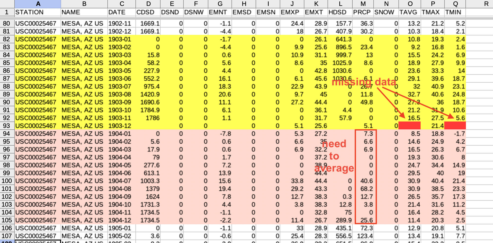
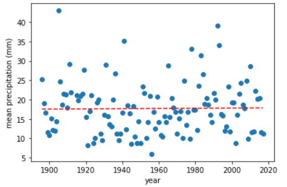

# EES 2580 Python data visualization project

## Project learning objectives:

The learner will:
- acquire data from a tabular data source and load it into a Python data structure (pandas DataFrame).
- extract necessary data from the data structure and wrangle it into a form usable in their analysis.
- use the basic Python statements they have learned: `if`, `for`, assignment, use a function from a module, apply methods to an object.
- create a simple visualization using `matplotlib.pyplot`. 

## Overall goals

Monthly average climate data in tabular form is available from the National Centers for Environmental Information <https://www.ncdc.noaa.gov/cdo-web/> for a number of locations around the U.S. We will be analyzing data for Mesa, Arizona from 1896 through 2017. The data have been extracted and stored in GitHub [here](https://github.com/HeardLibrary/digital-scholarship/blob/master/data/codegraf/mesa2880172.csv). The data look like this:



In order to visualize these data, we need to summarize it by averaging values by year or by month. We also will need to deal with situations where values are missing.

In the end, we want one Series containing the time values to be plotted (the X values) and another Series with the average values of yearly averages for precipitation (in mm) that correspond to those time values (the Y values). 

We can then visualize these data using Matplotlib. Here is an example for the data above:



## Specific requirements

Each plot must have descriptive axis labels, including units if appropriate. 

1. Create an XY scatter plot of mean precipitation by year. Add a linear trendline (first-order polynomial) fit to the data.
2. Create an XY scatter plot of mean temperature by year. Add a linear trendline (first-order polynomial) fit to the data.
3. Create a bar plot of mean precipitation by month. 
4. Create an error bar plot of the mean temperature by month with the error bars representing the mean maximum and mean minimum values for each month.

Much of the data wrangling code can be reused with modification after you complete the first plot. 

# Tasks and subtasks

1 Acquire data and wrangle the dates<br/>
1\.1 Use the `pd.read_csv()` function to load CSV from URL to a pandas DataFrame.<br/>
1\.2 Split the YYYY-MM date strings into separate year and month columns<br/>
1\.3 Create a list of intervals for the desired time range<br/>

2 Calculate means for desired quantity (rainfall or temperature)<br/>
2\.1 Create an empty table<br/>
2\.2 Step through all of the time intervals and calculate the mean<br/>
2\.2.1 Slice the DataFrame to include only the current time interval<br/>
2\.2.2 Calculate the mean for the slice<br/>
2\.2.3 Skip missing data<br/>
2\.2.4 Add the calculated data to the table<br/>
2\.3 Turn the table into a pandas DataFrame<br/>

3 Visualize data<br/>
3\.1 Create subplot<br/>
3\.2 Plot data using appropriate style (scatterplot, bar, error bars)<br/>
3\.3 Add trendline if appropriate<br/>
3\.3.1 Fit linear polynomial to summary data<br/>
3\.3.2 Add polynomial data to plot<br/>
3\.4 Label axes<br/>

## Task details

1 **Acquire data.**
 
The URL for loading the CSV of raw data is: <https://raw.githubusercontent.com/HeardLibrary/digital-scholarship/master/data/codegraf/mesa2880172.csv>

1\.1 Use the `pd.read_csv()` function to load the CSV from URL to a pandas DataFrame

1\.2 In order to pull out the mean temperatures for a particular month or year, we need "grouping variable" columns. We can generate these by splitting the date strings in the `DATE` column into separate year and month columns. If we were using the procedural apprach, we could step through each row and use the `.split()` method to split the date string into a list of strings. However, it is simpler to use the vectorized approacn and use the `.str` attribute of the column to apply the `.slice()` method to the entire column at once. The expression looks like this: `climate_data['DATE'].str.slice(0, 4)` to get the year, which inludes the first four characters of the string. To assign this expression to a new column in the DataFrame called "YEAR", we can use this code:

```
climate_data['YEAR'] = climate_data['DATE'].str.slice(0, 4)
```

The code for the month is similar. Note that since the date is a string, the slices will also be strings, even though they look like numbers.

1\.3 **Create a list of years.** It would be possible to calculate the mean precipitation for each and generate an output table in a single vectorized expression. However, that involves more complicated pandas than we have learned. Instead, we will use a loop to step through each year and calculate the mean precipition for that year. 

In order to do that, we need to create a list of years to loop through. We can use the `range()` function to generate a list of years from 1896 to 2017 by starting with an empty list, then looping through `range(1896, 2018)` and appending each year to the list.

2 **Calculate the mean rainfall for each year.**

The strategy we will use is to create a list of dictionaries to represent a table. Each dictionary will represent a row for a year, with the keys being the column names "year" and "precipitation". We will then use the `pd.DataFrame()` function to turn the list of dictionaries into a DataFrame.

2\.1 Create an empty list to use to build the table.

2\.2 **Step through all of the years and calculate the mean precipitation for each year.**

Set up a `for` loop to step through each year in the list of years you created. 

2\.2.1 **Slice the DataFrame to include only the iterated year**

We can slice a dataframe based on a condition by imposing a boolean condition on a particular column. For example, to slice the dataframe to include only the rows where the year is 1896, we can use this expression:

```
climate_data[climate_data['YEAR'] == '1896']
```

where `climate_data['YEAR'] == '1896'` is a vectorized boolean condition that is applied to the entire column. The result is a slice of the dataframe that includes only the rows where the condition is true. 

We will have to be a little careful here because the year in the YEAR column that we created in step 1.2 is a string, while the list of years we are looping through is a list of integers. We can convert the year to a string in the condition by using the `str()` function:

```
climate_data[climate_data['YEAR'] == str(year)]
```

2\.2.2 **Calculate the mean for the slice.**

We learned in the lesson on pandas DataFrames that the `.mean()` method could be used to calculate the mean of a column as a vectorized operation. So we can use the `.mean()` method on the slice of the DataFrame to calculate the mean precipitation for that year.

2\.2.3 We are now ready to create the dictionary for the year row. However, we don't want to add a row to the table if there is no data for that year. We can use an `if` clause to skip the year if there is no data, which will be indicated if the calculated mean produced a NumPy `NaN` (Not a Number) value. The test for `NaN` is `np.isnan()`, so the `if` expression will look like this:

```
if not np.isnan(mean_precip):
```

2\.2.4 **Add the calculated data to the table**

If the mean precipitation is not `NaN`, we can create a dictionary with the key `year` and the `year` loop value, and the key `precipitation` and the calculated mean precipitation. We can then append this dictionary to the list of dictionaries.

2\.3 **Turn the table into a pandas DataFrame**

The list of dictionaries can be passed directly into the `pd.DataFrame()` function to create a DataFrame.

**3 Visualize data**

The plot setup should be fairly straightforward and be similar to examples we did in class.

3\.1.1 **Create up subplot**

We should only need a single subplot (`ax`) within each figure.

**3\.2 Plot data using appropriate style (scatterplot, bar, error bars)**

Each plot will differ in details, but the first argument (x) of the plot will be the timepoints and the second argument (y) will be the quantity averaged (precipitation or temperature).

**3\.3 Add trendline if appropriate**

A trendline is generally appropriate for scatterplots. A linear trendline (best-fit line) is appropriate if we want to assess whether changes over time increase or decrease over the time interval being visualized. 

**3\.3.1 Fit linear polynomial to summary data<br/>
3\.3.2 Add polynomial data to plot**

Follow the examples from the lesson. It may be clearer to make the trendline be a different color than the scatterplot points. You can controll this several ways.

**3\.1.2 Label axes**

Each axis should be labeled with both the quantity represented on that axis and the units of that quantity.

## Project rubric:

| possible points | feature |
| --------------- | ------- |
| 10 | User input with an informative prompt |
| 10 | At least one `if` clause |
| 20 | extract data from, or store data in one or more of the basic Python data structures (list, dictionary, tuple) |
| 10 | a `for` or `while` loop as appropriate for the task |
| 10 | use a function to perform a calculation based on multiple values from the dataset |
| 20 | a visualization using the `matplot.pyplot` module |
| 20 | "does it work" points (i. e. to what extent does the script actually do the required task?) |

----
Revised: 2024-03-06