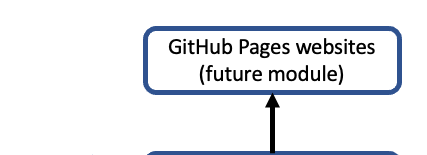
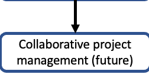

# CodeGraf - GitHub modules

The following modules are currently available or under construction. More modules will be available in the future.

<!-- Save for Web Slices (github.psd) -->

	

		
	

	

		
	

	

		
	

	

		
	

	

		
	

	

		
	

	

		
	

	

		
	

<!-- End Save for Web Slices -->

# GitHub modules

[Introduction to GitHub module](intro)

Collaborative project management (future module, perhaps fall 2021) - see [this page](../../../manage/control/github/branch/) for notes on the subject.

GitHub pages websites (future module, perhaps fall 2021)

----

Revised 2021-01-31

If you have any questions about these lessons, please contact Steve Baskauf at [steve.baskauf@vanderbilt.edu](mailto:steve.baskauf@vanderbilt.edu)
