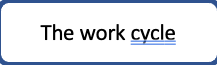
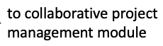
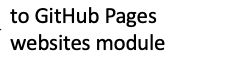

# CodeGraf - Introduction to GitHub module

This module teaches you how to use the GitHub Desktop Client to create a personal version control and backup system using GitHub.

Total video time: 1h 42m

<!-- Save for Web Slices (githubintro.png) -->

	

		
	

	

		
	

	

		
	

	

		
	

	

		
	

	

		
	

	

		
	

	

		
	

	

		
	

	

		
	

	

		
	

	

		
	

	

		
	

	

		
	

	

		
	

	

		
	

	

		
	

	

		
	

	

		
	

	

		
	

	

		
	

<!-- End Save for Web Slices -->

## Lessons included in the module:

[Background](../../015) 17 minutes

[Setting up a repository](../../016) 16 minutes

[Markdown basics, commits, pull from/push to GitHub](../../017) 28 minutes

[The work cycle](../../018) 43 minutes

[Using GitHub to recover from disasters](../../019) 18 minutes

**Note:** The modules shown on the diagram are planned for the future

Collaborative project management (future module, perhaps fall 2021) - see [this page](../../../../manage/control/github/branch/) for notes on the subject.

GitHub pages websites (future module, perhaps fall 2021)

----

Revised 2021-01-31

If you have any questions about these lessons, please contact Steve Baskauf at [steve.baskauf@vanderbilt.edu](mailto:steve.baskauf@vanderbilt.edu)
