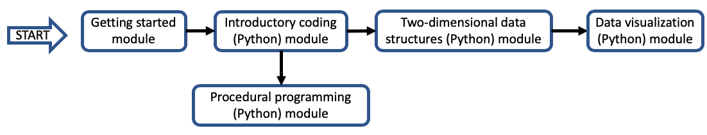
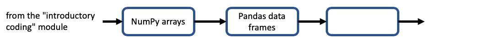

# CodeGraf

A short link to this page is [vanderbi.lt/codegraf](http://vanderbi.lt/codegraf)

## What is CodeGraf?

CodeGraph is a program to allow you to choose your own path through learning to code. Depending on your needs, you can learn different skills and focus on different programming languages. The "Graf" part of the name comes from the concept of a mathematical graph where items are linked and you can follow any path through the network of connections. As CodeGraf is built, you'll be able to focus on either Python or R and learn basic coding, data wrangling, data visualization, web interfacing, and managing your code and data using GitHub.

## Getting started

Begin with the START entry point and work your way through the lessons. Each lesson page includes a series of topics explained with a short video (typically 3-7 minutes). There may also be explanatory text, do-it-yourself code examples, and links to external resources. If you already feel confident about one of the topics, you can skip to the next one. You can always come back to a topic to review.

[Video from introductory session](https://vanderbilt.app.box.com/v/maymesterpython1)

[Slides from introductory session](slides/intro-sesson.pdf)

[Link to additional book and online resources](https://heardlibrary.github.io/digital-scholarship/script/python/#for-more-information)

----

## Getting started with coding module

This is a general introduction to both Python and R, although much of the video is focused on the variety of ways to code in Python. 

Total video time: 1h 36m

**Lessons included in the module:**

[Basic terminology](001) 18 minutes

[Programming environments](002) 51 minutes

[Installing an environment](003) 27 minutes

From here, continue with the Python or R modules

----

# Python Modules

The following modules are currently available or under construction. More modules will be available in the future.

----

## Introductory coding (Python) module

This module covers many basic Python concepts through one-dimensional data structures. It provides background for several intermediate level modules. 

**Recommended reference:** Introducing Python (2nd Edition) by Bill Lubanovic [via the Vanderbilt Libraries' catalog](https://catalog.library.vanderbilt.edu/permalink/01VAN_INST/6ll2l/alma991043641691203276) / [direct link to O'Reilly (VUNet login required)](https://learning-oreilly-com.proxy.library.vanderbilt.edu/library/view/introducing-python-2nd/9781492051374/).

Total video time: 3h 07m

**Lessons included in the module:**

[Python programming basics](004) 67 minutes

[Using code libraries](005) 34 minutes

[List objects](006a) 25 minutes

[Loops](006b) 61 minutes

----

## Two-dimensional data structures (Python) module

This module introduces two kinds of two-dimensional data structures used in data science with Python: NumPy arrays and Pandas data frames. It also shows how to load data from a local file and to perform basic manipulation of the data.

**Recommended reference:** Python for Data Analysis, 2nd Edition by Wes McKinney [via Vanderbilt's catalog](https://catalog.library.vanderbilt.edu/permalink/01VAN_INST/6ll2l/alma991043601866403276) / [direct link to O'Reilly (VUNet login required)](https://learning.oreilly.com/library/view/python-for-data/9781491957653/). [Free online version of documentation via pandas website](https://pandas.pydata.org/).

Total video time: 3h 09m

**Lessons included in the module:**

[NumPy arrays](007) 53 minutes

[Pandas data frames](008) 61 minutes

[Data wrangling](009) 75 minutes

----

## Data visualization (Python) module

[Introduction to plotting](010) 63 minutes

Other lessons may be added at some point in the future.

----

## Procedural programming (Python)

This module has not been created. However, you could learn about this subject by starting with [this lesson](../python/basics/). Some of the content repeats what was covered in the *Introductory coding (Python)* module, but new content is also included.

----

# R Modules

The following modules are currently available or under construction. More modules will be available in the future.

----

# GitHub Modules

The following modules are currently available or under construction. More modules will be available in the future.

[Introduction to GitHub module](#introduction-to-github-module)

----

## Introduction to GitHub module

This module teaches you how to use the GitHub Desktop Client to create a personal version control and backup system using GitHub.

Total video time: xh xm

**Lessons included in the module:**

[Background](015) 17 minutes

[Setup a repository](016) 16 minutes

[Markdown basics, commits, pull from/push to GitHub](017) 28 minutes

----

----
Revised 2020-08-31

If you have any questions about these lessons, please contact Steve Baskauf at [steve.baskauf@vanderbilt.edu](mailto:steve.baskauf@vanderbilt.edu)
