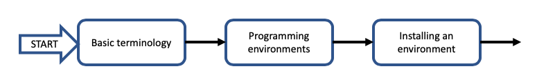

# CodeGraf

A short link to this page is [vanderbi.lt/codegraf](http://vanderbi.lt/codegraf)

## What is CodeGraf?

CodeGraph is a program to allow you to choose your own path through learning to code. Depending on your needs, you can learn different skills and focus on different programming languages. The "Graf" part of the name comes from the concept of a mathematical graph where items are linked and you can follow any path through the network of connections. As CodeGraf is built, you'll be able to focus on either Python or R and learn basic coding, data wrangling, data visualization, web interfacing, and managing your code and data using GitHub.

## Getting started

Begin with the START entry point and work your way through the lessons. Each lesson page includes a series of topics, each explained with a short video (typically 3-7 minutes). There may also be explanatory text, do-it-yourself code examples, and links to external resources. If you already feel confident about one of the topics, you can skip to the next one. You can always come back to a topic to review.

# Modules

## Terminology and getting started

[Basic terminology](001)

[Programming environments](002)

[Installing an environment](003)

----
Revised 2020-05-08
