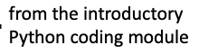
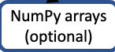
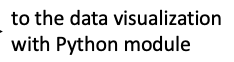

# Files and tables in Python module

This module shows how to load data from and save data to a local file or file in Google Drive as well as how to retrieve data on the web. It discusses how simple Python data structures like lists and dictionaries can be combined to create tabular data structures. It also introduces a workhorse two-dimensional data structure used in data science with Python: pandas DataFrames. 

This module includes an optional lesson that introduces another commonly used Python multidimensional data structure: NumPy arrays.

**Recommended reference:** Python for Data Analysis, 2nd Edition by Wes McKinney [via Vanderbilt's catalog](https://catalog.library.vanderbilt.edu/permalink/01VAN_INST/6ll2l/alma991043601866403276) / [direct link to O'Reilly (VUNet login required)](https://learning.oreilly.com/library/view/python-for-data/9781491957653/). [Free online version of documentation via pandas website](https://pandas.pydata.org/).

Total video time: 5h 25m for all parts, but most users will spend about 4h

<!-- Save for Web Slices (filestables.psd) -->

	

		
	

	

		
	

	

		
	

	

		
	

	

		
	

	

		
	

	

		
	

	

		
	

	

		
	

	

		
	

	

		
	

	

		
	

	

		
	

	

		
	

	

		
	

	

		
	

	

		
	

	

		
	

	

		
	

	

		
	

	

		
	

	

		
	

	

		
	

	

		
	

	

		
	

	

		
	

	

		
	

	

		
	

<!-- End Save for Web Slices -->

**Lessons included in the module:**

[Data from files](../../020) estimated 55 minutes

[Complex data structures and functions](../../021) 30 minutes

[Reading and writing CSV files](../../022) 34 minutes

[optional lesson on NumPy arrays](../../007) 53 minutes

[Pandas series and data frames](../../008) 61 minutes but not all videos apply to all users

[DataFrame manipulation](../../009a) 40 minutes

[Rearranging and combining DataFrames](../../009b) 35 minutes

----

Revised 2021-01-31

If you have any questions about these lessons, please contact Steve Baskauf at [steve.baskauf@vanderbilt.edu](mailto:steve.baskauf@vanderbilt.edu)
