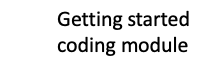

# CodeGraf - Python modules

The following modules are currently available or under construction. More modules will be available in the future.

<!-- Save for Web Slices (python.psd) -->

	

		
	

	

		
	

	

		
	

	

		
	

	

		
	

	

		
	

	

		
	

	

		
	

	

		
	

	

		
	

	

		
	

	

		
	

	

		
	

	

		
	

	

		
	

	

		
	

	

		
	

	

		
	

<!-- End Save for Web Slices -->

[Introductory Python coding module](intro)

[Two-dimensional data structures in Python module](twod)

[Data visualization with Python module](viz)

[Procedural programming with Python](procedural)

----

Revised 2021-01-29

If you have any questions about these lessons, please contact Steve Baskauf at [steve.baskauf@vanderbilt.edu](mailto:steve.baskauf@vanderbilt.edu)
