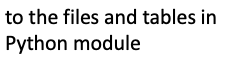

# Introductory Python coding module

This module covers many basic Python concepts through one-dimensional data structures. It provides background for several intermediate level modules. 

**Recommended reference:** Introducing Python (2nd Edition) by Bill Lubanovic [via the Vanderbilt Libraries' catalog](https://catalog.library.vanderbilt.edu/permalink/01VAN_INST/6ll2l/alma991043641691203276) / [direct link to O'Reilly (VUNet login required)](https://learning-oreilly-com.proxy.library.vanderbilt.edu/library/view/introducing-python-2nd/9781492051374/).

Total video time: 3h 30m

<!-- Save for Web Slices (intropython.png) -->

	

		
	

	

		
	

	

		
	

	

		
	

	

		
	

	

		
	

	

		
	

	

		
	

	

		
	

	

		
	

	

		
	

	

		
	

	

		
	

	

		
	

	

		
	

	

		
	

	

		
	

	

		
	

	

		
	

	

		
	

	

		
	

	

		
	

<!-- End Save for Web Slices -->

## Lessons included in the module:

[Python programming basics](../../004) 67 minutes

[Using code libraries](../../005) 34 minutes

[List and dictionary objects](../../006a) 32 minutes

[Loops](../../006b) 33 minutes (lesson videos only, 61 minutes with live coding examples)

[Conditional execution](../../006c) 44 minutes

----

Revised 2021-01-31

If you have any questions about these lessons, please contact Steve Baskauf at [steve.baskauf@vanderbilt.edu](mailto:steve.baskauf@vanderbilt.edu)
