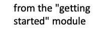
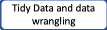
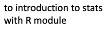
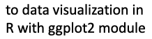

# CodeGraf - R programming basics module

This module introduces the RStudio interface and basic programming concepts of R

Total video time: 3h 27m

<!-- Save for Web Slices (rbasics.psd) -->

	

		
	

	

		
	

	

		
	

	

		
	

	

		
	

	

		
	

	

		
	

	

		
	

	

		
	

	

		
	

	

		
	

	

		
	

	

		
	

	

		
	

	

		
	

	

		
	

	

		
	

	

		
	

	

		
	

	

		
	

	

		
	

	

		
	

<!-- End Save for Web Slices -->

## Lessons included in this module:

[Vectors, vectorized computing, and packages](../../011) 50 minutes

[Lists and dataframes, tibbles](../../012) 40 minutes

[Basic stats and plots, missing data](../../013) 47 minutes

[Tidy Data and data wrangling](../../014a) 31 minutes

[More data wrangling and piping](../../014b) 46 minutes

----

Revised 2021-01-31

If you have any questions about these lessons, please contact Steve Baskauf at [steve.baskauf@vanderbilt.edu](mailto:steve.baskauf@vanderbilt.edu)
