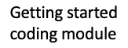
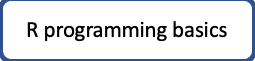
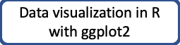

# CodeGraf - R modules

The following modules are currently available or under construction. More modules will be available in the future.

<!-- Save for Web Slices (r.psd) -->

	

		
	

	

		
	

	

		
	

	

		
	

	

		
	

	

		
	

	

		
	

	

		
	

	

		
	

	

		
	

	

		
	

	

		
	

	

		
	

<!-- End Save for Web Slices -->

## R modules

[R programming basics](basics)

[Introduction to stats with R](stats)

[Data visualization in R with ggplot2](ggplot)

----

Revised 2021-01-31

If you have any questions about these lessons, please contact Steve Baskauf at [steve.baskauf@vanderbilt.edu](mailto:steve.baskauf@vanderbilt.edu)
