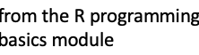
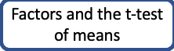
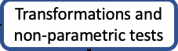
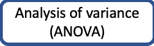
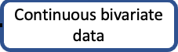

# CodeGraf - Introduction to stats with R module

This module demonstrates how to perform statistical tests on a variety of experimental data using R. It also focuses on the assumptions of each test and gives non-parametric alternatives for cases where assumptions are not met.

Total video time: not yet determined

<!-- Save for Web Slices (rstats.psd) -->

	

		
	

	

		
	

	

		
	

	

		
	

	

		
	

	

		
	

	

		
	

	

		
	

	

		
	

	

		
	

	

		
	

	

		
	

	

		
	

	

		
	

	

		
	

	

		
	

	

		
	

	

		
	

	

		
	

<!-- End Save for Web Slices -->

## Lessons included in this module:

[Factors and the t-test of means](../../026) 33 minutes

[Transformations and non-parametric tests](../../027) 25 minutes

[Continuous bivariate data](../../028) 47 minutes

[Analysis of variance (ANOVA)](../../029) 63 minutes

Multiple regression (under construction)

Tests with discontinuous Y (under construction)

----

Revised 2021-01-31

If you have any questions about these lessons, please contact Steve Baskauf at [steve.baskauf@vanderbilt.edu](mailto:steve.baskauf@vanderbilt.edu)
