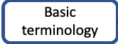
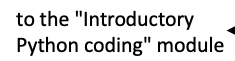

# CodeGraf - Getting started coding module

This is a general introduction to both Python and R, although much of the video is focused on the variety of ways to code in Python. 

Total video time: 1h 36m

<!-- Save for Web Slices (getstart.psd) -->

	

		
	

	

		
	

	

		
	

	

		
	

	

		
	

	

		
	

	

		
	

	

		
	

	

		
	

	

		
	

	

		
	

	

		
	

	

		
	

	

		
	

	

		
	

	

		
	

	

		
	

	

		
	

<!-- End Save for Web Slices -->

**Lessons included in the module:**

[Basic terminology](../001) 18 minutes

[Programming environments](../002) 51 minutes

[Installing an environment](../003) 27 minutes

From here, continue with the Python or R modules

----

Revised 2021-01-29

If you have any questions about these lessons, please contact Steve Baskauf at [steve.baskauf@vanderbilt.edu](mailto:steve.baskauf@vanderbilt.edu)
