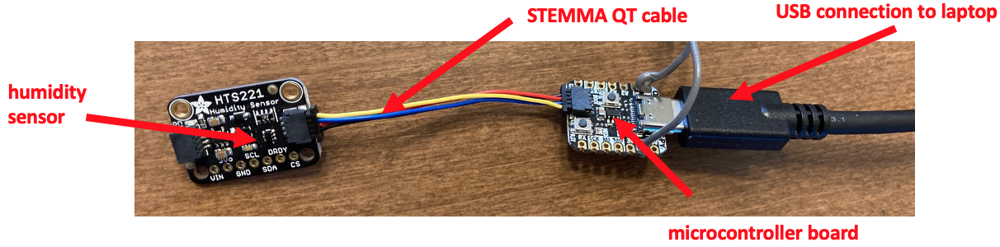
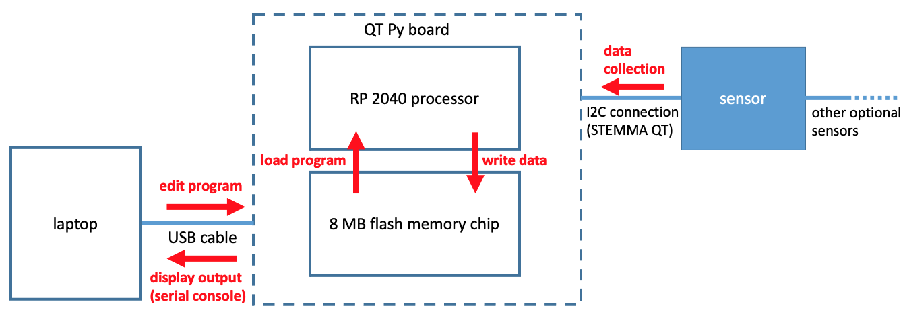
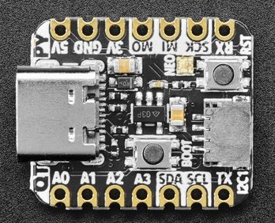
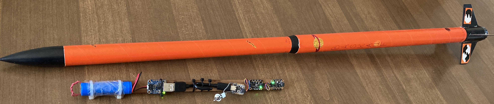

# DiSC/SEL QT Py Computer Workshop Series: Microcontrollers with CircuitPython

A shortened link to this page is [vanderbi.lt/circuitpython](http://vanderbi.lt/circuitpython).

## About the series

Are you interested in learning how to program a tiny computer to read a sensor? Join us in this three-session workshop series, and we’ll go through with you how to program a microcontroller (QT Py RP2040) the size of your thumbnail with CircuitPython, leading to a rocket launch with the microcontroller! 

In these workshops, we’ll demonstrate the versatility of this small computing hardware. No experience is required to attend. We encourage anyone interested in learning more about how hardware and code communicate with one another to register, and there will be plenty of time for questions. On the surface, this workshop event aims to teach CircuitPython for microcontrollers. However, the events are structured to get more people to learn about computing and digital making, and to use that knowledge to increase their comfort level with computers. 

Each session is structured to function as a stand-alone workshop, but we recommend attending all three if possible as they supplement one another. Open to Vanderbilt faculty, staff, students, and postdocs. **Separate registration is required for each session.** See each session below for a registration link.

**Instructors:** Steve Baskauf [steve.baskauf@vanderbilt.edu](mailto:steve.baskauf@vanderbilt.edu) and Francisco Juarez [francisco.d.juarez@vanderbilt.edu](mailto:francisco.d.juarez@vanderbilt.edu).

This workshop series is sponsored by the [Digital Scholarship and Communications Office (DiSC)](https://www.library.vanderbilt.edu/scholarly/) and the [Sarah Shannon Stevenson Science and Engineering Library](https://www.library.vanderbilt.edu/science/) of the [Jean and Alexander Heard Libraries](https://www.library.vanderbilt.edu/) at [Vanderbilt University](https://www.vanderbilt.edu/). There is no cost associated with the workshops.

The DiSC office also provides [lessons for learning Python](http://vanderbi.lt/py) at least once per semester.

----

## Session 1 - Microcontroller board and Python background (lesson format)

**Time:** Friday, April 1 from 1:00 - 2:00 PM Central (US) Time. 

**In-person venue:** Stevenson Science and Engineering Library seminar room (SC3211). 

[Registration](https://vanderbilt.zoom.us/meeting/register/tJElf-GhqzkvGtCYdMWPHqaZlP7DskJ_2E3B)

[Lesson web page](../../codegraf/038/)

The first session will introduce the hardware and CircuitPython, providing a succinct description of the equipment involved in this event to better prepare the attendees for the following sessions. This session will provide the necessary background information for the minimum coding knowledge you’ll need to start playing with the microcontrollers.  

----

## Session 2 - Connecting a microcontroller board and programming with CircuitPython (hands-on format)

**Time:** Friday, April 8 from 1:00 - 2:00 PM Central (US) Time. 

**In-person venue:** Stevenson Science and Engineering Library seminar room (SC3211). 

[Registration](https://forms.gle/SU6UgxnnttLfiAZ26)

[Lesson web page (Windows)](../../codegraf/039a)

[Lesson web page (Mac)](../../codegraf/039b)

The second session is hands-on and in-person. Participants will set up and program the microcontrollers themselves by connecting the boards to their laptops via USB. This session will demonstrate and provide attendees with the opportunity to program the microcontrollers in real-time and supports Mac and Windows. We will provide the necessary hardware, but please bring your laptop to this session. 

**NOTE: this session is limited to 20 participants.**

----

## Session 3 - Launch a rocket with a microcontroller and record flight data (in-person demonstration)

**Time:** Friday, April 15 TBA Central (US) Time. 

**In-person venue:** TBA. 

[Registration](https://forms.gle/F9KSEAVeH1uynugG9)

[Lesson web page](../../codegraf/040/)

The third session is an in-person practical field demonstration of the microcontroller outside on Vanderbilt campus. In this session, we will launch a rocket containing a battery-powered microcontroller. We will use two sensors to record altitude and motion, saving data to the onboard memory for later analysis.

----
Revised 2022-04-03
