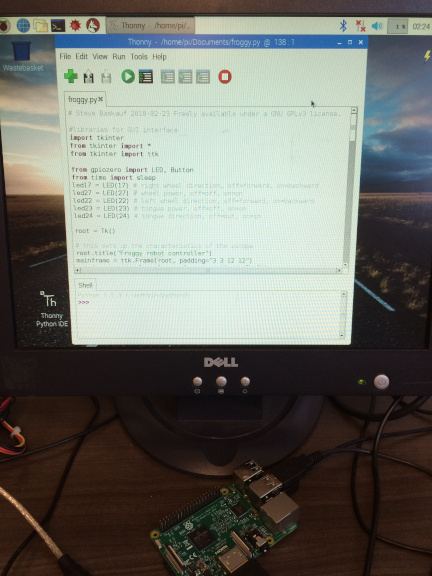

# Getting Started with the Thonny IDE

Thonny is an Integrated Development Environment (IDE) designed to make it easier for beginners to create and run Python Code.  If you install Thonny, it will also install Python 3 if you don't already have it on your system.

Thonny comes pre-installed if you install the Raspbian operating system on a Raspberry Pi computer.

## Installing Thonny on a Mac

1. Go to the website <https://thonny.org/> and click on the Mac link in the upper right corner.

2. A file named something like thonny-3.0.8.dmg will be downloaded to the normal place on your browser.  Here's where it goes on Chrome.

3. Double-click the file to open it.  You will see a window like the one above.  

4. Drag the Thonny.app icon into your Applications folder.  You can now run Thonny by doublc-clicking on it in your Applications folder or by opening it in Launchpad.

5. The first time you open the Thonny application, you may get a message something like the one above.  Click Open.

